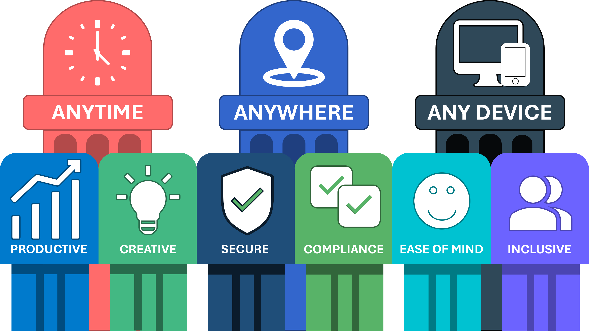

# Dennis Westerman

### Lead ICT Architect · Digital Workplace · Cloud & Security · Governed AI

**People first. Technology second. Architecture connects the two.**

**English** · [Nederlands](README.nl.md)

[Explore the interactive architecture →](https://denniswesterman.github.io/denniswesterman/) · [Architecture library ↓](#architecture-library) · [LinkedIn](https://www.linkedin.com/in/denniswesterman/)

---

## Architecture library

Three connected themes: retain control of organizational knowledge and AI use, preserve meaning throughout value delivery, and make the resulting human value visible. Start with the UCF executive paper for the governance perspective; the original technical architecture paper remains available as supporting detail.

**[Open the non-persistent Value Delivery Thread demo →](https://denniswesterman.github.io/denniswesterman/)**

<!-- publication-navigation:start -->
<table width="100%">
  <tr>
    <td width="33%" align="center">
      <a href="publications/en/universal-context-foundation-executive.md"><strong>01 · Universal Context Foundation</strong></a> 
      Using AI without losing control 
      <a href="publications/en/universal-context-foundation-example.md">Structure and application example</a>
    </td>
    <td width="33%" align="center">
      <a href="publications/en/value-delivery-thread.md"><strong>02 · Value Delivery Thread</strong></a> 
      Customer promise → delivery evidence
    </td>
    <td width="34%" align="center">
      <a href="publications/en/workplace-vision.md"><strong>03 · Workplace Vision</strong></a> 
      Human purpose → digital experience
    </td>
  </tr>
</table>
<!-- publication-navigation:end -->

<strong>How the three themes connect</strong>

1. **Universal Context Foundation** organizes knowledge, rules, execution, assessment, and accountability so the organization can retain control when technology changes. Its added value must be demonstrated in a bounded application.
2. **Value Delivery Thread** connects that governed meaning to product release, pricing, quotation, delivery, operational reality, experience, and deliberate improvement.
3. **Workplace Vision** makes the human outcome explicit: a workplace that gives people freedom, confidence, clarity, and inclusive access.

Together they form a traceable path from **governed context → demonstrable delivery → human value**.

## Architecture with a human purpose

Technology only creates lasting value when people can use it confidently, securely, and without unnecessary friction.

I work at the intersection of strategy, architecture, engineering, security, adoption, and operations. My focus is not technology for its own sake, but the design of digital environments that help people collaborate, create, make decisions, and adapt as their organization evolves.

A good architecture should therefore do more than describe platforms. It should make intent traceable from a strategic principle to a governed design, a deliberate configuration, and ultimately a better daily experience.

## From intent to experience

I use three connected layers to turn vision into an operational reality:

| Layer | Purpose | Central question |
|---|---|---|
| **Governance** | Establishes purpose, ownership, policy, risk boundaries, and accountability. | **What must be achieved, and why?** |
| **Design** | Translates principles into coherent architecture, services, journeys, and controls. | **How should it work and feel?** |
| **Configuration** | Implements, operates, measures, and continuously improves the design. | **How does it become a reliable daily reality?** |

This structure creates clear accountability without disconnecting strategy from implementation. It also makes change safer: a principle, design choice, configuration, and operational outcome can be reviewed as one traceable chain.

## My workplace vision

My workplace vision starts with a simple principle: **people come first, technology comes second**. The digital workplace should provide freedom without losing control, security without unnecessary obstruction, and consistency without excluding individual needs.

  

The vision is built on nine connected pillars:

**Anytime · Anywhere · Any Device · Productive · Creative · Secure · Compliance · Ease of Mind · Inclusive**

Together, they describe a workplace in which technology adapts to people, security is naturally integrated, compliance is understandable, and continuous improvement is driven by real experience.

**[Read the complete Workplace Vision →](publications/en/workplace-vision.md)**

## Publication spotlights

### Value Delivery Thread

**Customer value · Coherence · Release · Evidence**

The *Value Delivery Thread* (VDT) preserves one demonstrable line from intended customer outcome to product definition, product release, commercial commitment, delivery, operational service, experience, and improvement.

Within that thread, the **Product Delivery Catalogue (PDC)** is positioned as a federated product-release register. Pricing, legal, delivery, process management, and configuration management remain owners of their own facts. The PDC owns the compatibility and release of the exact combination; the VDT makes the complete relationship traceable in both directions.

The paper distinguishes definitions, releases, snapshots, and operational instances; explains where price books, quotation assets, delivery blueprints, runbooks, service models, and configuration items belong; and introduces separate decisions for sellability, generic deliverability, and customer-specific operational readiness.

> Do not centralize every fact. Centralize the demonstrability of the relationship between promise, decision, execution, and experience.

**Version 1.0 · 21 August 2026 · English**

**[Read Value Delivery Thread →](publications/en/value-delivery-thread.md)**

### Universal Context Foundation

**Knowledge · Ownership · Assessment · Accountability**

**Using AI without losing control** is the UCF paper for boards, executive leadership, management, CIOs, and CISOs. It starts with what the organization must arrange, not with a prescribed software or file structure.

UCF connects the assignment, permitted information, execution boundaries, assessment, and release. The organization retains responsibility for the conditions under which a result may be used, even when teams, applications, or suppliers change.

Four components describe what is managed: **knowledge and rules, functionality, user experience, and data structure**. Five steps describe how an assignment proceeds: **define the assignment, select information, prepare a draft, assess the result, and release**. These are not nine mandatory systems or documents.

The companion example brings those agreements together in one application overview for preparing a policy note. The example is fictional; it claims no achieved savings or validated implementation. The paper proposes a bounded trial, including comparison with a simpler AI setup under equivalent necessary quality and safety conditions.

> Technology may change. Accountability for its use must remain recognizably with the organization.

**Executive draft 0.3 · Application example 0.2 · 22 September 2026 · EN/NL**

**[Read the UCF executive paper →](publications/en/universal-context-foundation-executive.md)** · **[Open the structure and application example →](publications/en/universal-context-foundation-example.md)**

[Technical architecture paper, version 1.2 — supporting detail](publications/en/universal-context-foundation.md). The original technical publication remains unchanged; the executive draft is not a claim of independently verified software or results.

## Principles I work by

- **People before platforms.** Technology should support how people work, not force people to work around technology.
- **Security and compliance by design.** Controls should be explicit, proportionate, and integrated into the experience.
- **Ownership before automation.** A workflow is only governable when purpose, context, decisions, and accountability remain visible.
- **Portability before dependency.** Providers and products may change; organizational meaning and evidence should remain reusable.
- **Continuous improvement over static perfection.** Architecture becomes stronger through feedback, measurement, validation, and deliberate evolution.

## Connect

I enjoy exchanging ideas with architects, engineers, product leaders, security professionals, and other people working to make technology more useful, understandable, and sustainable.

**LinkedIn:** [linkedin.com/in/denniswesterman](https://www.linkedin.com/in/denniswesterman/)
