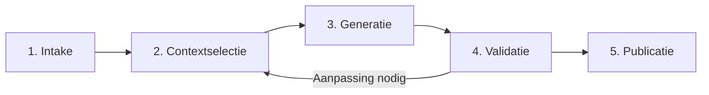

# Universeel Context Fundament

## Een bestuurbare, herhaalbare en vendor-onafhankelijke basis voor AI-workflows

**CONTEXT · WORKFLOW · GOVERNANCE · PORTABILITY**

**Toegankelijke GitHub-editie · publicatieversie 1.2 · 11 augustus 2026**

---

<a href="../readme.md">← Architectuuroverzicht</a>

<!-- publication-tabs:start -->
<table width="100%">
  <tr>
    <td width="33%" align="center">
      <a href="../workplace/Vision.md"><strong>01 · Workplace Vision</strong></a> 
      Menselijke bedoeling → digitale ervaring
    </td>
    <td width="33%" align="center">
      <a href="Value_Delivery_Thread.md"><strong>02 · Value Delivery Thread</strong></a> 
      Klantbelofte → leveringsbewijs
    </td>
    <td width="34%" align="center">
      <strong>03 · Universeel Context Fundament</strong> 
      Huidige paper · NL
    </td>
  </tr>
</table>
<!-- publication-tabs:end -->

## De kern in één minuut

AI kan in korte tijd overtuigende teksten, analyses en adviezen produceren. De echte uitdaging begint wanneer een organisatie moet kunnen uitleggen **waarom** een resultaat tot stand kwam, **welke informatie** is gebruikt, **welke regels** golden en **wie** het resultaat heeft beoordeeld.

Veel AI-initiatieven starten met een model, een prompt en toegang tot bedrijfsinformatie. Dat is voldoende voor een experiment, maar nog niet voor een betrouwbaar onderdeel van de bedrijfsvoering.

Het **Universeel Context Fundament (UCF)** brengt daarom niet het AI-model, maar de gecontroleerde context en workflow centraal onder beheer.

> **Kernboodschap:** niet het model, maar de gecontroleerde context en workflow vormen het duurzame fundament van een AI-toepassing.

Het model voert een taak uit. De organisatie blijft eigenaar van het doel, de gebruikte bronnen, de kwaliteitscriteria, de menselijke beoordeling en het besluit om een resultaat wel of niet te publiceren.

## Waarom een contextfundament nodig is

Binnen organisaties bevindt relevante context zich vaak verspreid over documenten, beleidsstukken, kennisbanken, tickets, gesprekken, applicaties en persoonlijke werkwijzen. Dat een AI-toepassing deze informatie technisch kan bereiken, betekent nog niet dat voor een specifieke opdracht ook de juiste informatie wordt gebruikt.

Zonder een duidelijke structuur ontstaan al snel fundamentele vragen:

- Is de gebruikte bron actueel en goedgekeurd?
- Is informatie gebruikt die voor dit doel niet nodig of niet toegestaan was?
- Welke regels en kwaliteitscriteria golden tijdens de uitvoering?
- Is het resultaat alleen gegenereerd, of ook daadwerkelijk beoordeeld?
- Wie heeft toestemming gegeven voor publicatie?
- Kan dezelfde werkwijze later met een ander model worden herhaald?

Wanneer context, prompts, regels en reviewstappen bovendien verborgen raken in één AI-platform of leverancier, wordt een overstap naar een andere oplossing onnodig complex. De organisatie bezit dan wel haar data, maar niet langer volledig de samenhang en werkwijze waarmee die data wordt gebruikt.

UCF verlegt daarom de centrale vraag van:

> **Welke informatie kan het model bereiken?**

naar:

> **Welke context is voor deze opdracht expliciet goedgekeurd?**

## Wat het Universeel Context Fundament is

UCF is een architectuurpatroon en een manier van werken voor AI-processen die controleerbaar, herhaalbaar en overdraagbaar moeten zijn.

Voor ieder onderwerp, product, proces of besluitvormingsvraagstuk kan een afzonderlijke **workspace** worden ingericht. Zo’n workspace is te vergelijken met een gecontroleerd digitaal dossier. Daarin worden onder meer vastgelegd:

- het doel van de opdracht;
- de eigenaar en verantwoordelijke reviewer;
- de toegestane en uitgesloten bronnen;
- de regels voor data, kwaliteit en publicatie;
- de stappen die moeten worden doorlopen;
- de gemaakte tussenresultaten en beoordelingen;
- het uiteindelijke publicatiebesluit en het bijbehorende bewijs.

Hierdoor blijft de betekenis van het proces begrijpelijk, ook wanneer het uitvoerende model, de leverancier, de applicatie of het betrokken team verandert.

## Vier vaste uitgangspunten

| Uitgangspunt | Betekenis |
|---|---|
| **Context** | Alleen doelgerichte, goedgekeurde en herkenbare informatie wordt voor een opdracht gebruikt. |
| **Workflow** | Iedere uitvoering volgt duidelijke stappen met een herkenbaar begin, resultaat en controlemoment. |
| **Governance** | Eigenaarschap, regels, beoordeling, uitzonderingen en publicatiebesluiten zijn expliciet vastgelegd. |
| **Portability** | Modellen, leveranciers en technische omgevingen kunnen veranderen zonder de betekenis van het proces opnieuw op te bouwen. |

Deze vier uitgangspunten horen bij elkaar. Context zonder workflow is moeilijk te controleren. Workflow zonder governance mist verantwoordelijkheid. Governance zonder portability kan alsnog volledig afhankelijk worden van één leverancier.

## Context als beheerd onderdeel van de organisatie

Binnen UCF is context geen toevallige verzameling informatie die aan een prompt wordt toegevoegd. Context wordt behandeld als een beheerd onderdeel met een duidelijk gebruiksdoel.

Van iedere relevante bron moet bekend zijn:

- wie verantwoordelijk is voor de inhoud;
- welke versie of momentopname is toegestaan;
- waar de informatie vandaan komt;
- welke gevoeligheid en bewaartermijn gelden;
- voor welke opdrachten de bron geschikt is;
- welk deel minimaal noodzakelijk is;
- hoe de bron later herkenbaar of citeerbaar blijft.

Ook het uitsluiten van informatie is belangrijk. Wanneer een bron verouderd, te gevoelig of niet noodzakelijk is, wordt niet alleen besloten deze niet te gebruiken; de reden van uitsluiting wordt eveneens zichtbaar gemaakt.

Dat ondersteunt dataminimalisatie, voorkomt onbedoeld gebruik en maakt achteraf duidelijk waarom een resultaat op een bepaalde informatiebasis tot stand kwam.

## Van opdracht naar publicatie in vijf stappen

Een UCF-workflow bestaat uit vijf vaste stappen. Iedere stap heeft een eigen doel en een duidelijk controlemoment.

### 1. Intake

De workflow begint niet met een prompt, maar met een duidelijke opdracht. Het gewenste resultaat, de doelgroep, de grenzen, de dataclassificatie, de verantwoordelijke eigenaar, de reviewer en de voorwaarden om te stoppen worden vooraf bepaald.

Zolang deze informatie niet compleet en beoordeeld is, begint de generatie niet.

### 2. Contextselectie

Vervolgens wordt bepaald welke bronnen en regels voor deze concrete opdracht gelden. Alleen goedgekeurde en noodzakelijke informatie wordt geselecteerd. Verouderde, irrelevante of te gevoelige bronnen worden uitgesloten en de reden daarvan blijft vastgelegd.

Hiermee wordt voorkomen dat een model standaard toegang krijgt tot alles wat technisch beschikbaar is.

### 3. Generatie

Het gekozen AI-model ontvangt uitsluitend de goedgekeurde opdracht, context en regels. Het resultaat is een **concept** en nog geen publicatie.

Een technisch succesvolle modelrespons betekent dus niet automatisch dat de inhoud juist, volledig of toegestaan is. Iedere nieuwe poging of uitvoering blijft herkenbaar als een afzonderlijk resultaat.

### 4. Validatie

Het concept wordt gecontroleerd aan de hand van vooraf vastgelegde kwaliteitscriteria. Dat kan bestaan uit automatische controles, broncontrole, feitencontrole, toetsing op verboden gegevens en menselijke beoordeling.

De reviewer beoordeelt altijd een concreet resultaat dat gekoppeld is aan een concrete set bronnen en regels. Wordt het resultaat afgewezen, dan kan een nieuwe contextselectie of een nieuwe generatie volgen. Het afgewezen concept blijft beschikbaar als onderdeel van het bewijs, maar mag niet worden gepubliceerd.

### 5. Publicatie

Alleen een gevalideerd en expliciet goedgekeurd resultaat mag naar het afgesproken publicatiekanaal. Daarbij blijft zichtbaar welk resultaat is gepubliceerd, waarop de goedkeuring was gebaseerd en hoe naar een eerdere geldige versie kan worden teruggekeerd wanneer later een fout wordt ontdekt.

**Gegenereerd is dus niet hetzelfde als goedgekeurd. Goedgekeurd is niet hetzelfde als gepubliceerd.**

## Menselijke verantwoordelijkheid blijft centraal

UCF automatiseert waar techniek voorspelbaar en herhaalbaar kan ondersteunen. Denk aan het controleren van verplichte informatie, het toepassen van vaste stappen, het bewaken van grenzen en het vastleggen van bewijs.

De inhoudelijke verantwoordelijkheid blijft echter bij mensen. Een systeem kan niet zelfstandig bepalen of een beleidsinterpretatie bestuurlijk acceptabel is, of een risico mag worden aanvaard, of een advies klaar is voor externe publicatie.

Daarom blijven minimaal de volgende keuzes bij de organisatie:

- het doel van de opdracht;
- de keuze en geschiktheid van bronnen;
- de betekenis van beleid en kwaliteitscriteria;
- de acceptatie van onzekerheden en risico’s;
- de uiteindelijke goedkeuring en publicatie.

UCF vervangt deze rollen niet. Het maakt hun verantwoordelijkheid juist zichtbaar en uitvoerbaar.

## Praktijkvoorbeeld: een gecontroleerde beleidsnotitie

Stel dat een beleidsafdeling een besluitnotitie wil laten voorbereiden over energiebesparende maatregelen voor kantoorgebouwen.

De notitie moet aansluiten op organisatiedoelen, relevante regelgeving en interne meetgegevens. Persoonsgegevens en ruwe sensorgegevens mogen niet naar het model. Juridische beoordeling is verplicht voordat de notitie wordt gepubliceerd.

Binnen UCF verloopt dit als volgt:

1. Het doel, de doelgroep, de eigenaar, de juridische reviewer en de gegevensgrenzen worden vooraf vastgelegd.
2. Actuele organisatiedoelen, een juridisch gereviewde samenvatting van regelgeving en geaggregeerde energiegegevens worden geselecteerd.
3. Ruwe sensordata wordt uitgesloten omdat deze niet noodzakelijk is. Een oude conceptstrategie wordt uitgesloten omdat een nieuwe goedgekeurde versie bestaat.
4. Het model maakt uitsluitend met de geselecteerde bronnen een conceptnotitie.
5. De tekst wordt gecontroleerd op bronverwijzingen, persoonsgegevens, aannames, onzekerheden en juridische juistheid.
6. Alleen de exact beoordeelde versie wordt gepubliceerd.

Dit voorbeeld laat zien dat UCF veel meer is dan promptbeheer. Het beheert de volledige beslisketen rondom de prompt: van opdracht en bronselectie tot beoordeling en publicatie.

## Vendor-onafhankelijkheid zonder verlies van controle

Een organisatie kan dezelfde beleidsworkflow eerst via een goedgekeurd cloudmodel uitvoeren en later voor vertrouwelijke toepassingen een lokaal model inzetten.

Binnen UCF blijven daarbij gelijk:

- het doel en eigenaarschap;
- de geselecteerde context;
- de gegevens- en beleidsgrenzen;
- de vijf workflowstappen;
- de kwaliteitscontroles;
- de menselijke beoordeling;
- de manier waarop bewijs en publicatie worden vastgelegd.

Alleen de technische verbinding met het uitvoerende model verandert.

Vendor-onafhankelijkheid betekent niet dat verschillende modellen exact hetzelfde antwoord zullen geven. Het betekent dat de organisatie haar eigen context, werkwijze en beoordelingskader behoudt en resultaten van verschillende modellen op een vergelijkbare manier kan beoordelen.

De leverancier levert de uitvoerende motor. De organisatie blijft eigenaar van betekenis, kwaliteit en verantwoordelijkheid.

## UCF als onderdeel van een complete toepassing

Een AI-toepassing bestaat uit meer dan alleen context. Zij heeft ook functionaliteit, een gebruikerservaring en vaak een database nodig. Binnen het beschreven architectuurpatroon blijven vier onderdelen bewust van elkaar gescheiden:

| Onderdeel | Verantwoordelijkheid |
|---|---|
| **UCF** | Doel, context, bronnen, regels, workflow, beoordeling en bewijs. |
| **Feature** | De concrete functionaliteit die een gebruiker kan uitvoeren. |
| **UI** | De manier waarop de gebruiker de toepassing ziet en bedient. |
| **Database** | De structuur waarin toepassingsgegevens gecontroleerd worden opgeslagen en ontwikkeld. |

Door deze onderdelen afzonderlijk te beheren, kan een ontwerpwijziging niet ongemerkt de betekenis van een workflow veranderen. Context hoeft niet in programmacode te worden verstopt en een databasewijziging blijft afzonderlijk beoordeelbaar.

De onderdelen kunnen onafhankelijk worden verbeterd, maar worden alleen samen gebruikt in een combinatie die bewust is gecontroleerd en goedgekeurd.

## Wat UCF organisaties oplevert

### Uitlegbaarheid

Een organisatie kan reconstrueren welk doel, welke bronnen, welke regels, welk modelresultaat en welke beoordeling bij een publicatie hoorden.

### Verantwoord datagebruik

Niet alle bereikbare informatie wordt standaard gebruikt. Alleen de noodzakelijke en goedgekeurde context gaat door naar de AI-uitvoering.

### Betere kwaliteitsbeheersing

Concept, beoordeling en publicatie blijven gescheiden. Daardoor wordt een overtuigend geformuleerd AI-resultaat niet automatisch als goedgekeurde waarheid behandeld.

### Duidelijk eigenaarschap

Voor iedere workflow is zichtbaar wie eigenaar is, wie beoordeelt en wie publicatie mag toestaan.

### Minder afhankelijkheid van leveranciers

Modellen, clouds en technische oplossingen kunnen veranderen zonder dat doel, bronnen, regels en reviewproces opnieuw moeten worden gereconstrueerd.

### Continuïteit en herstel

Een nieuwe versie vervangt de bestaande werkwijze pas nadat deze volledig is gecontroleerd. Bij fouten kan de vorige geldige situatie beschikbaar blijven of worden hersteld.

### Hergebruik zonder verlies van controle

Goedgekeurde regels, werkwijzen en technische verbindingen kunnen worden hergebruikt wanneer hun doel en gegevensgrenzen overeenkomen. Nieuwe doelen of gevoeligere informatie krijgen een eigen workspace en beoordeling.

## Vertrouwen ontstaat door bewijs

Een AI-resultaat is niet betrouwbaar alleen omdat het uit een bekende applicatie, cloud of URL komt. Vertrouwen ontstaat door een combinatie van:

- een goedgekeurd doel;
- herkenbare en vastgelegde bronnen;
- expliciete gegevens- en beleidsgrenzen;
- een controleerbare workflow;
- een concrete beoordeling;
- een aantoonbaar publicatiebesluit;
- een mogelijkheid tot herstel.

UCF verbindt deze onderdelen tot één samenhangende keten. Daardoor kan een organisatie niet alleen laten zien **wat** er is gepubliceerd, maar ook **waarom** dat resultaat gepubliceerd mocht worden.

## Wat UCF niet is

UCF moet niet worden gepresenteerd als een volledig autonome AI-omgeving waarin agents zonder begrenzing zelfstandig besluiten nemen en acties uitvoeren.

Het is primair bedoeld voor processen die:

- een duidelijk doel en eigenaarschap hebben;
- in herkenbare stappen kunnen worden uitgevoerd;
- menselijke of inhoudelijke beoordeling nodig hebben;
- herhaalbaar en auditbaar moeten zijn;
- bij fouten moeten kunnen stoppen of terugkeren.

UCF garandeert niet dat een model altijd een juist antwoord geeft. Het zorgt ervoor dat het antwoord binnen een gecontroleerde werkwijze wordt gemaakt, beoordeeld en verantwoord.

UCF vervangt ook niet de inhoudelijke eigenaar, reviewer, modelprovider of beheerorganisatie. Het geeft deze partijen een gezamenlijke en traceerbare structuur om hun verantwoordelijkheid uit te voeren.

## Invoering: begin met één beslisproces

Een succesvolle invoering begint niet met alle bedrijfsdata en ook niet met een organisatiebrede autonome agent. Kies één herkenbaar proces met een duidelijke bronset, eigenaar, output en bestaande review.

Een beleidsnotitie, klantadvies, risicoanalyse of gecontroleerd antwoord op een offerteaanvraag is doorgaans een geschikter startpunt.

De invoering kan vervolgens in zeven beheersbare stappen plaatsvinden:

1. **Definieer doel en governance.** Benoem doel, eigenaar, reviewer, gegevensclassificatie, gewenste output en stopvoorwaarden.
2. **Breng context en regels onder beheer.** Bepaal welke bronnen zijn toegestaan, wie eigenaar is en welke versies mogen worden gebruikt.
3. **Formaliseer de vijf stappen.** Maak per stap duidelijk welke input nodig is, welk resultaat wordt verwacht en wanneer mag worden doorgegaan.
4. **Verbind een model of systeem.** Kies pas daarna de technische uitvoerder en leg de toegestane voorwaarden vast.
5. **Voer een succesvolle én een mislukte test uit.** Bewijs niet alleen dat het proces werkt, maar ook dat ontbrekende context, afwijzing of provideruitval publicatie daadwerkelijk blokkeert.
6. **Maak de werkwijze overdraagbaar.** Zorg dat context, functionaliteit, ontwerp en gegevensstructuur onafhankelijk kunnen veranderen.
7. **Schaal via gecontroleerd hergebruik.** Hergebruik alleen onderdelen waarvan doel, risico en gegevensgrenzen werkelijk overeenkomen.

## Slot

Het Universeel Context Fundament maakt de context rondom AI expliciet, bestuurbaar en overdraagbaar. Het scheidt organisatiedoel van modeluitvoering, bronselectie van technische bereikbaarheid, generatie van publicatie en duurzame betekenis van tijdelijke technologie.

De kracht zit niet in één afzonderlijke maatregel, maar in de samenhang:

- een workspace maakt doel en context leesbaar;
- vaste stappen maken de workflow controleerbaar;
- adapters maken uitvoerende technologie vervangbaar;
- versiebeheer en bewijs maken resultaten herhaalbaar;
- validatie en herstel maken verandering verantwoord.

UCF is geen extra laag die snelheid onnodig vertraagt. Het is de laag die ervoor zorgt dat snelheid kan worden **herhaald, uitgelegd en teruggedraaid**.

Juist daardoor kan AI doorgroeien van een overtuigend experiment naar een betrouwbaar onderdeel van de bedrijfsvoering.

---

## Over deze publicatie

| Eigenschap | Waarde |
|---|---|
| **Document** | Toegankelijke GitHub-editie van de architectuurwhitepaper |
| **Versie** | 1.2 |
| **Publicatiedatum** | 11 augustus 2026 |
| **Taal** | Nederlands |
| **Doelgroep** | Bestuurders, architecten, securityprofessionals, productowners en engineers |
| **Voorbeelden** | Fictief en vrij van klant-, provider- en omgevingsgegevens |

[← Vorige: Value Delivery Thread](Value_Delivery_Thread.md) · [Architectuuroverzicht](../readme.md)
