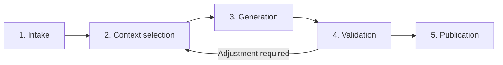

# Universal Context Foundation

## A governable, repeatable, and vendor-independent foundation for AI workflows

**CONTEXT · WORKFLOW · GOVERNANCE · PORTABILITY**

**Accessible GitHub edition · publication version 1.2 · 11 August 2026**

---

<strong>English</strong> · <a href="../nl/universal-context-foundation.md">Nederlands</a> · <a href="../../README.md">← Architecture overview</a>

<!-- publication-navigation:start -->
<table width="100%">
  <tr>
    <td width="33%" align="center">
      <a href="workplace-vision.md"><strong>01 · Workplace Vision</strong></a> 
      Human purpose → digital experience
    </td>
    <td width="33%" align="center">
      <a href="value-delivery-thread.md"><strong>02 · Value Delivery Thread</strong></a> 
      Customer promise → delivery evidence
    </td>
    <td width="34%" align="center">
      <strong>03 · Universal Context Foundation</strong> 
      Current paper · EN
    </td>
  </tr>
</table>
<!-- publication-navigation:end -->

## The core in one minute

AI can produce convincing texts, analyses, and recommendations in a short time. The real challenge begins when an organization must be able to explain **why** a result was produced, **which information** was used, **which rules** applied, and **who** reviewed the result.

Many AI initiatives start with a model, a prompt, and access to business information. That is enough for an experiment, but not yet for a reliable part of business operations.

The **Universal Context Foundation (UCF)** therefore places controlled context and workflow under management at the center, rather than the AI model.

> **Core message:** the durable foundation of an AI application is not the model, but the controlled context and workflow.

The model performs a task. The organization remains the owner of the purpose, the sources used, the quality criteria, the human review, and the decision whether or not to publish a result.

## Why a context foundation is needed

Relevant context within organizations is often distributed across documents, policies, knowledge bases, tickets, conversations, applications, and personal working methods. The fact that an AI application can technically reach this information does not mean that it uses the right information for a specific assignment.

Without a clear structure, fundamental questions quickly arise:

- Is the source current and approved?
- Was information used that was unnecessary or not permitted for this purpose?
- Which rules and quality criteria applied during execution?
- Was the result merely generated, or was it actually reviewed?
- Who authorized publication?
- Can the same method later be repeated with a different model?

When context, prompts, rules, and review steps also become hidden inside one AI platform or vendor, moving to another solution becomes unnecessarily complex. The organization may still own its data, but no longer fully owns the coherence and method through which that data is used.

UCF therefore changes the central question from:

> **Which information can the model access?**

to:

> **Which context has been explicitly approved for this assignment?**

## What the Universal Context Foundation is

UCF is an architecture pattern and way of working for AI processes that must be controllable, repeatable, and transferable.

A separate **workspace** can be created for each topic, product, process, or decision question. Such a workspace is comparable to a controlled digital case file. It records, among other things:

- the purpose of the assignment;
- the owner and responsible reviewer;
- the permitted and excluded sources;
- the rules for data, quality, and publication;
- the steps that must be completed;
- intermediate results and assessments;
- the final publication decision and associated evidence.

This keeps the meaning of the process understandable even when the executing model, vendor, application, or team changes.

## Four fixed principles

| Principle | Meaning |
|---|---|
| **Context** | Only purpose-specific, approved, and identifiable information is used for an assignment. |
| **Workflow** | Every execution follows clear steps with a recognizable beginning, result, and control point. |
| **Governance** | Ownership, rules, review, exceptions, and publication decisions are explicitly recorded. |
| **Portability** | Models, vendors, and technical environments can change without rebuilding the meaning of the process. |

These four principles belong together. Context without workflow is difficult to control. Workflow without governance lacks responsibility. Governance without portability can still become completely dependent on one vendor.

## Context as a managed organizational asset

Within UCF, context is not an incidental collection of information added to a prompt. Context is treated as a managed asset with a clear purpose of use.

For every relevant source, the organization must know:

- who is responsible for its content;
- which version or snapshot is permitted;
- where the information originated;
- which sensitivity and retention period apply;
- for which assignments the source is suitable;
- which minimum portion is necessary;
- how the source remains identifiable or citable later.

Excluding information is equally important. When a source is outdated, too sensitive, or unnecessary, the organization records not only that it was not used, but also why it was excluded.

This supports data minimization, prevents unintended use, and makes it clear afterwards why a result was produced on a particular information basis.

## From assignment to publication in five steps

A UCF workflow consists of five fixed steps. Each step has its own purpose and a clear control point.

### 1. Intake

The workflow begins not with a prompt, but with a clear assignment. The desired result, target audience, boundaries, data classification, responsible owner, reviewer, and stop conditions are established in advance.

Generation does not begin while this information is incomplete or has not been reviewed.

### 2. Context selection

The organization then determines which sources and rules apply to this specific assignment. Only approved and necessary information is selected. Outdated, irrelevant, or overly sensitive sources are excluded, and the reason remains recorded.

This prevents a model from receiving default access to everything that is technically available.

### 3. Generation

The selected AI model receives only the approved assignment, context, and rules. Its result is a **draft**, not a publication.

A technically successful model response does not automatically mean that the content is correct, complete, or permitted. Every new attempt or execution remains identifiable as a separate result.

### 4. Validation

The draft is checked against quality criteria established in advance. This can include automated checks, source verification, fact checking, checks for prohibited data, and human review.

The reviewer always assesses a concrete result linked to a concrete set of sources and rules. If the result is rejected, the workflow can return to context selection or generation. The rejected draft remains available as evidence, but cannot be published.

### 5. Publication

Only a validated and explicitly approved result may be sent to the agreed publication channel. It remains visible which result was published, what the approval was based on, and how the organization can return to an earlier valid version when an error is discovered later.

**Generated is therefore not the same as approved. Approved is not the same as published.**

## Human responsibility remains central

UCF automates where technology can provide predictable and repeatable support. Examples include checking mandatory information, applying fixed steps, enforcing boundaries, and recording evidence.

Substantive responsibility remains with people. A system cannot independently decide whether a policy interpretation is acceptable to the organization, whether a risk may be accepted, or whether advice is ready for external publication.

At a minimum, the following choices therefore remain with the organization:

- the purpose of the assignment;
- the selection and suitability of sources;
- the meaning of policy and quality criteria;
- the acceptance of uncertainty and risk;
- final approval and publication.

UCF does not replace these roles. It makes their responsibility visible and executable.

## Practical example: a controlled policy brief

Suppose a policy department wants to prepare a decision brief about energy-saving measures for office buildings.

The brief must align with organizational objectives, relevant regulation, and internal measurements. Personal data and raw sensor data may not be sent to the model. Legal review is mandatory before publication.

Within UCF, the process is as follows:

1. The purpose, audience, owner, legal reviewer, and data boundaries are recorded in advance.
2. Current organizational objectives, a legally reviewed summary of regulations, and aggregated energy data are selected.
3. Raw sensor data is excluded because it is unnecessary. An old draft strategy is excluded because a newer approved version exists.
4. The model produces a draft brief using only the selected sources.
5. The text is checked for source references, personal data, assumptions, uncertainties, and legal accuracy.
6. Only the exact reviewed version is published.

This example shows that UCF is much more than prompt management. It manages the entire decision chain around the prompt: from assignment and source selection to review and publication.

## Vendor independence without loss of control

An organization can first execute the same policy workflow through an approved cloud model and later use a local model for confidential applications.

Within UCF, the following remain unchanged:

- purpose and ownership;
- selected context;
- data and policy boundaries;
- the five workflow steps;
- quality controls;
- human review;
- the way evidence and publication are recorded.

Only the technical connection to the executing model changes.

Vendor independence does not mean that different models will produce exactly the same answer. It means that the organization retains its own context, method, and assessment framework and can evaluate results from different models in a comparable way.

The vendor supplies the execution engine. The organization remains the owner of meaning, quality, and responsibility.

## UCF as part of a complete application

An AI application consists of more than context alone. It also needs functionality, a user experience, and often a database. Within this architecture pattern, four components remain deliberately separated:

| Component | Responsibility |
|---|---|
| **UCF** | Purpose, context, sources, rules, workflow, review, and evidence. |
| **Feature** | The concrete functionality a user can perform. |
| **UI** | The way the user sees and operates the application. |
| **Database** | The structure in which application data is stored and evolved in a controlled manner. |

Managing these components separately prevents a design change from silently changing the meaning of a workflow. Context does not have to be hidden in program code, and a database change remains independently reviewable.

The components can be improved independently, but are only used together in a combination that has been deliberately checked and approved.

## What UCF can deliver for organizations

### Explainability

An organization can reconstruct which purpose, sources, rules, model result, and review belonged to a publication.

### Responsible data use

Not all accessible information is used by default. Only necessary and approved context proceeds to AI execution.

### Better quality control

Draft, review, and publication remain separate. A convincingly written AI result is therefore not automatically treated as approved truth.

### Clear ownership

Every workflow shows who owns it, who reviews it, and who may authorize publication.

### Less vendor dependency

Models, clouds, and technical solutions can change without reconstructing purpose, sources, rules, and the review process.

### Continuity and recovery

A new version replaces the existing method only after it has been fully checked. When errors occur, the previous valid state can remain available or be restored.

### Reuse without loss of control

Approved rules, methods, and technical connections can be reused when their purpose and data boundaries match. New purposes or more sensitive information receive their own workspace and review.

## Trust is created through evidence

An AI result is not trustworthy merely because it comes from a familiar application, cloud, or URL. Trust arises from a combination of:

- an approved purpose;
- identifiable and recorded sources;
- explicit data and policy boundaries;
- a controllable workflow;
- a concrete review;
- a demonstrable publication decision;
- a recovery option.

UCF connects these elements into one coherent chain. This enables an organization to show not only **what** was published, but also **why** that result was allowed to be published.

## What UCF is not

UCF should not be presented as a fully autonomous AI environment in which agents make decisions and perform actions independently without boundaries.

It is primarily intended for processes that:

- have a clear purpose and owner;
- can be performed in recognizable steps;
- require human or substantive review;
- must be repeatable and auditable;
- must be able to stop or recover when errors occur.

UCF does not guarantee that a model will always give a correct answer. It ensures that the answer is produced, reviewed, and justified within a controlled method.

UCF also does not replace the subject-matter owner, reviewer, model provider, or management organization. It gives these parties a shared and traceable structure through which to exercise their responsibilities.

## Adoption: begin with one decision process

Successful adoption does not begin with all business data or an organization-wide autonomous agent. Choose one recognizable process with a clear source set, owner, output, and existing review.

A policy brief, customer recommendation, risk analysis, or controlled response to a request for proposal is generally a more suitable starting point.

Adoption can then proceed through seven manageable steps:

1. **Define purpose and governance.** Name the purpose, owner, reviewer, data classification, desired output, and stop conditions.
2. **Bring context and rules under management.** Determine which sources are permitted, who owns them, and which versions may be used.
3. **Formalize the five steps.** Make clear for each step which input is required, which result is expected, and when the workflow may continue.
4. **Connect a model or system.** Only then select the technical executor and record the permitted conditions.
5. **Run both a successful and a failed test.** Prove not only that the process works, but also that missing context, rejection, or provider failure actually blocks publication.
6. **Make the method transferable.** Ensure that context, functionality, design, and data structure can change independently.
7. **Scale through controlled reuse.** Reuse only components whose purpose, risk, and data boundaries genuinely match.

## Closing

The Universal Context Foundation makes the context around AI explicit, governable, and transferable. It separates organizational purpose from model execution, source selection from technical reachability, generation from publication, and durable meaning from temporary technology.

Its strength lies not in one individual measure, but in their coherence:

- a workspace makes purpose and context readable;
- fixed steps make the workflow controllable;
- adapters make execution technology replaceable;
- version management and evidence make results repeatable;
- validation and recovery make change responsible.

UCF is not an extra layer that needlessly slows progress. It is the layer that makes speed **repeatable, explainable, and reversible**.

That is how AI can grow from a convincing experiment into a reliable part of business operations.

---

## About this publication

| Property | Value |
|---|---|
| **Document** | Accessible GitHub edition of the architecture whitepaper |
| **Version** | 1.2 |
| **Publication date** | 11 August 2026 |
| **Language** | English |
| **Audience** | Executives, architects, security professionals, product owners, and engineers |
| **Examples** | Fictional and free from customer, provider, and environment data |

[← Previous: Value Delivery Thread](value-delivery-thread.md) · [Architecture overview](../../README.md)
