<div align="center">

# Universal Context Foundation

## A governable, repeatable, and vendor-independent foundation for AI workflows

*From strategic principle to concrete workspace, stage contracts, and portable execution*

**CONTEXT · WORKFLOW · GOVERNANCE · PORTABILITY**

**Accessible GitHub edition · publication version 1.2 · 11 August 2026**

</div>

---

<p align="right"><sub><strong>English</strong> · <a href="../nl/universal-context-foundation.md">Nederlands</a> · <a href="../../README.md">← Architecture overview</a></sub></p>

<!-- publication-navigation:start -->
<table width="100%">
  <tr>
    <td width="33%" align="center">
      <a href="workplace-vision.md"><strong>01 · Workplace Vision</strong></a><br />
      <sub>Human purpose → digital experience</sub>
    </td>
    <td width="33%" align="center">
      <a href="value-delivery-thread.md"><strong>02 · Value Delivery Thread</strong></a><br />
      <sub>Customer promise → delivery evidence</sub>
    </td>
    <td width="34%" align="center">
      <strong>03 · Universal Context Foundation</strong><br />
      <sub>Current paper · EN</sub>
    </td>
  </tr>
</table>
<!-- publication-navigation:end -->

## The core in one minute

Many AI initiatives begin with a model, a prompt, and a connection to business data. This quickly produces a demonstration, but not yet a governable system. As soon as more teams, sources, and models become involved, governance questions arise: which context and policy applied, who approved selection and publication, which intermediate result was validated, and can the same method be repeated with another model?

The Universal Context Foundation (UCF) is designed to make these questions part of the architecture. The UCF organizes context, policy, workflow, and evidence around AI execution. Within it, a model is a replaceable executor behind an adapter. The meaning of the work, source selection, quality criteria, and approval remain the property of the organization.

> KEY MESSAGE - The UCF makes controlled context and workflow, rather than the model, the durable foundation of AI applications.

A UCF workspace is a readable, versionable context container with a purpose, ownership, workflow boundaries, references, policies, stage contracts, adapters, and run administration. Five fixed stages form the backbone: intake, context selection, generation, validation, and publication. Each stage has required input, explicit output, and a gate. The structure is also an execution map: order shows the route, hierarchy bounds the context, and artifacts prove the state that has been reached.

The technical implementation is a portable platform in which context remains separate from feature code, design assets, and database contracts. These four artifact types are published, signed, pinned, and installed locally and independently. The application then operates from verified local bytes; a central store is not required during a user request.

This whitepaper describes the structure of the UCF and the end-to-end information flow. The chapters on Features, UI, and DB cover their directory structure, publication contract, installation, local runtime, and mutual boundaries. Three practical examples make its operation concrete:

1. A policy memorandum generated exclusively from approved sources and published only after human validation.
2. The same workflow moving from a cloud model to a local model without rewriting the context structure.
3. A portable AI feature that combines code, UI, context, and database schema as four exact, verifiable releases.

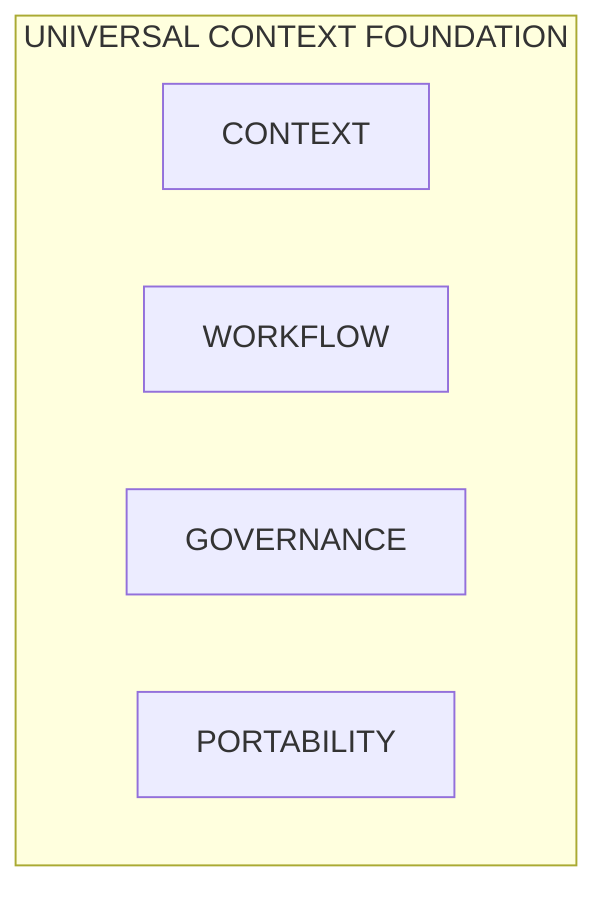

*UCF connects context, workflow, governance, and portability as one managed foundation.*

## Reader's guide

> This whitepaper describes the durable architectural pattern and uses generic names only. Environment-specific configuration, secrets, and internal source references are deliberately excluded.

The first half covers the motivation, design, and complete UCF structure. It then describes the five stages and three full peer chapters on Features, UI, and DB, including their structure, publication, installation, and examples. Three practical examples subsequently connect the four peers end to end. The final chapters address trust, continuity, boundaries, and adoption. Technical examples are illustrative; normative implementation documentation remains authoritative for deployment and operations.

## Why a Universal Context Foundation Is Needed

### The Problem with Application-Bound Context

Context often emerges scattered across documents, prompts, application configurations, tickets, conversations, and personal working methods. An AI application may be technically capable of accessing all these sources, but that does not mean the right context is used at the right time. Without explicit selection and versioning, it is difficult to determine afterward why an answer was produced.

A second risk is that context and workflow become inseparable from a single vendor. Prompts then become part of a specific studio, policies are hidden in connector configuration, and review steps exist only in an automation flow. Moving to another model or another cloud consequently becomes a reconstruction project.

A third risk arises when mechanical automation and substantive assessment are mixed together. A script can move files, validate fields, and calculate hashes. It cannot independently determine whether a policy interpretation is acceptable from a governance perspective. The UCF therefore distinguishes between technology that can be executed deterministically and gates that require explicit ownership or human review.

### Context as a Managed Product

In the UCF, context is treated as a managed product with an owner, version, provenance, classification, and intended use. A source does not become relevant merely because it is technically accessible. It becomes relevant after determining:

- who is responsible for the source;
- which version or snapshot may be used;
- which sensitivity and retention requirements apply;
- for which purpose the source is suitable;
- which parts are minimally necessary;
- how the source remains recognizable or citable in output.

This shifts the question from “which data can the model see?” to “which context has been approved for this task?”. That is an important distinction. Accessibility is a technical fact; approved relevance is a governance decision.

### Six Design Objectives

The UCF is built around six interrelated objectives.

#### Context-First

The task, data boundary, policies, and sources are established before generation. The model performs an approved workflow step; it does not independently determine which business context is valid.

#### Explicit Contracts

Each stage specifies required input, output, and gate. Interfaces between context, features, UI, database, and providers are version-bound. Missing input or capabilities lead to a visible stop condition.

#### Visible Intermediate Results

Generation output remains an intermediate until validation succeeds. The organization can inspect, reject, rerun, or compare a draft without the presence of a file automatically constituting publication.

#### Vendor Independence

Model and system providers are connected through adapters. The workspace contains no mandatory provider, customer endpoint, or credential. The same context bundle can therefore be used with different executors.

#### Audit and Rollback

Selections, hashes, reviews, execution metadata, and publication decisions remain traceable. A publication record refers to the validated run and to a rollback option.

#### Portable Continuity

Artifacts are published immutably and pinned exactly. A consumer can then operate from local last-known-good bytes. Failure of a store need not bring an existing application to a halt.

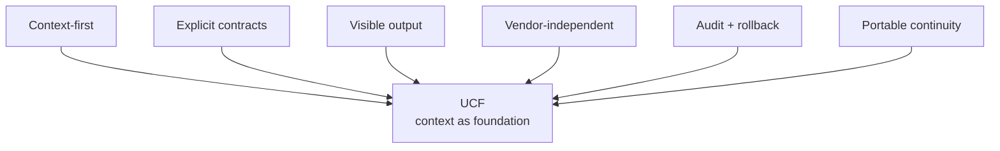

*Figure 1. The six design objectives place controlled context between the organizational objective and AI execution. Text equivalent: Circular model with context-first, contracts, visible output, vendor independence, audit, and portable continuity.*

> Six principles surround one durable context foundation.

## How the UCF Is Structured

### From Vision to Executable Architecture

The construction of the UCF can be understood in five design steps.

1. **Make context visible.** The first step was a generic workspace in which purpose, sources, policies, workflow, and runs were no longer implicit.
2. **Make workflow gates explicit.** Intake, context selection, generation, validation, and publication were each given a contract with input, output, and a gate.
3. **Separate responsibilities.** Context, executable feature code, design, and database evolution became distinct artifact types with their own ownership.
4. **Enforce portability.** Packages were given a target-neutral contract, signatures, file hashes, capabilities, and local adapter bindings.
5. **Make activation recoverable.** Installation and updates were built around preflight, staging, database transactions, health checks, rollback, and last-known-good state.

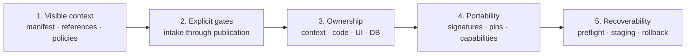

*Figure 2. The implementation evolved from a readable context workspace into a portable, signed, and recoverable platform. Text equivalent: Five construction phases from context structure to transactional activation.*

> **Organizational context remains the owner of meaning and evidence.**

This sequence is important. The system did not begin with a model API and receive governance later. First, what the organization itself must own was established; only then were providers and portable execution added as interchangeable technical layers.

### The Workspace as the Basic Unit

A workspace represents one subject, product, process, or decision-making flow. The generic scaffold does not yet know a customer, vendor, model, or deployment target. The starting position therefore remains neutral. Bindings and sources are added only after review.

The logical workspace looks as follows:

```text
workspace/
  WORKSPACE_MANIFEST.md
  WORKFLOW_CONTEXT.md
  references/
  policies/
  stages/
    01_intake/STAGE_CONTRACT.md
    02_context_selection/STAGE_CONTRACT.md
    03_generation/STAGE_CONTRACT.md
    04_validation/STAGE_CONTRACT.md
    05_publish/STAGE_CONTRACT.md
  adapters/
  runs/
  features/
  ui/
```

| Workspace component | Meaning |
|---|---|
| `WORKSPACE_MANIFEST` | purpose · owner · review · bindings |
| `WORKFLOW_CONTEXT` | routing · data boundary · model boundary |
| `REFERENCES` | approved sources + versions |
| `POLICIES` | rules for data, quality, and publication |
| `ADAPTERS` | provider and system boundaries |

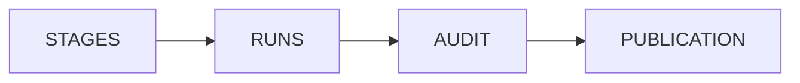

*Figure 3. The workspace separates identity, context, rules, execution, and evidence without losing their cohesion. Text equivalent: Anatomy of a UCF workspace with manifest, workflow context, references, policies, stages, adapters, and runs.*

> Every transition has input, output, and a gate.

#### WORKSPACE_MANIFEST

The workspace manifest establishes identity and governance. The minimal scaffold contains a slug, title, creation time, manifest version, and status. It also includes sections for purpose, bindings, and review. New workspaces deliberately begin with `pending` approval and without a UI, context, or feature binding.

The manifest therefore answers these questions: what is this workspace, why does it exist, who owns it, which artifacts belong to it, and when was its content last approved?

#### WORKFLOW_CONTEXT

Workflow context describes routing, the data boundary, and the model boundary. Routing specifies inputs, outputs, reviewers, and permitted transitions. The data boundary defines source ownership, sensitivity, access, and retention. The model boundary establishes which provider or model class may be used. No data source and no model are selected in the generic scaffold.

This separation prevents operational provider configuration from determining the meaning of the workflow. The workflow can remain the same when the executor changes.

#### References

References are the substantive sources on which a run may rely: documents, decisions, definitions, fact sheets, schemas, or controlled extracts. They are pinned with a version identity and hash. Context selection records not only what was chosen, but also which candidate context was rejected and why.

#### Policies

Policies describe the rules that apply during selection, generation, validation, and publication. Examples include data minimization, source requirements, prohibition of personal data, tone of voice, legal review, uncertainty marking, and publication classification. A policy is not a hidden prompt rule, but a separately reviewable object.

#### Stage Contracts

The five stage contracts form the workflow backbone. They do not prescribe a model choice; they establish when a step may begin and what evidence is needed to continue. A stage may be performed by software, a person, or a combination, as long as the contract is respected.

#### Adapters

Adapters connect the neutral workflow to a model, document platform, identity provider, database service, or other system. Credentials, endpoints, and customer identities remain consumer configuration. A portable context or feature package does not contain these values.

#### Runs

A run is one concrete execution of the workflow. The run preserves the intake, context pins, parameters, intermediate output, validation evidence, review decision, and publication record. Non-secret execution metadata may be stored; secrets and the complete process environment do not belong in the run ledger.

### The Workspace as a Readable Execution Structure

A workspace is more than a collection of files around a workflow. Its organization itself conveys meaning. A participant must be able to infer from the visible structure where the work begins, which context applies to a step, what result that step must produce, and what evidence is needed to proceed. This keeps the workflow understandable when the executing model, application, or team changes.

Four universal rules make this possible:

1. **Order makes sequencing visible.** Where steps have a fixed order, their arrangement shows which step precedes and which follows. The workflow therefore does not have to be reconstructed solely from hidden orchestration code.
2. **Hierarchy bounds context.** A work unit reads its own contract, the explicitly designated references, and the required run input. Adjacent or parent content is not included automatically.
3. **The entry point routes, but contains no substantive payload.** A small, stable entry point states the workspace identity and purpose and routes to the correct contract. Extensive policies, sources, and work instructions remain in their own manageable artifacts.
4. **Artifacts make progress visible.** Intake, intermediates, review evidence, and publication records show what actually exists. The registry and audit remain authoritative for activation and evidence; the readable structure prevents only a hidden runtime from being able to explain the state.

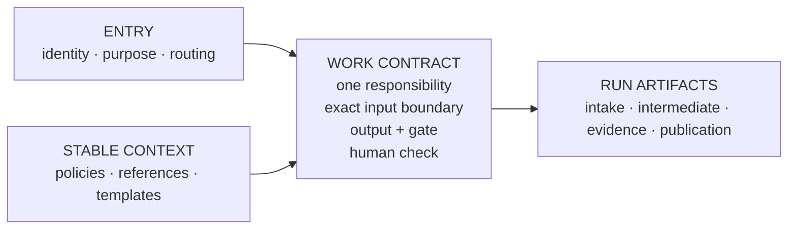

*Figure 4. A readable workspace keeps routing, work contract, stable context, and run artifacts separate, allowing a person or agent without prior knowledge to orient themselves and execute safely. Text equivalent: Diagram in which a small entry point routes to a work contract, stable context is loaded in a controlled manner, and run artifacts emerge as visible output and evidence.*

> **Cold-start test:** where am I? · what do I read? · what do I deliver? · what evidence exists?

#### Entry Point, Work Contract, and Content

The entry point answers only these questions: where am I, why does this workspace exist, and where should I go for the current task? The work contract is the actual control point. It specifies one responsibility, the required input, the permitted references, the output type, and the gate or human control. This keeps context selection explicit instead of dependent on whatever an agent happens to decide to load.

The content then divides into two types of artifacts that must not be mixed:

- **Stable context** includes policies, definitions, schemas, templates, and other references that remain the same across multiple runs. These artifacts are managed, reviewed, and versioned separately.
- **Run artifacts** include intake, selected context pins, intermediates, validation evidence, and publications associated with one concrete execution.

This separation prevents draft output from inadvertently becoming a new standard, or fixed rules from being copied into every run and subsequently diverging.

#### One Place per Fact

A durable context foundation has one authoritative location for every fact. Other components refer to it through an identifier, path, or link instead of duplicating the content. Catalogs and dashboards are derived navigation aids: when they can be rebuilt from manifests, front matter, or registrations, they are not maintained as a second substantive truth. This keeps source, route, and evidence aligned even after many changes.

#### The Cold-Start Test

A workspace is truly transferable only when a person or agent without knowledge of a previous session can orient themselves. A practical cold-start test checks whether four questions can be answered within a few targeted reading steps:

1. Where am I, what is the purpose, and who is the owner?
2. Which work contract applies now, and which input may be read?
3. Which output and which gate or human assessment are expected?
4. Which artifacts and registrations prove the current status?

If answering is possible only with verbal explanation, a hidden prompt, or a complete scan of all available context, the structure is not yet sufficient. The solution is not to load more context, but to make routing, contracts, or boundaries clearer.

#### Multiple Workspace Forms

Not every information environment is itself a pipeline. The same principles can structure a portfolio of workflows, a library of records, a navigable knowledge collection, or an organizational model. These forms can be combined: a portfolio can route to multiple UCF workspaces, a record library can preserve approved run results, and a knowledge collection can supply controlled references.

The five UCF stages remain the governance chain of one controlled AI run. The surrounding information architecture therefore does not have to be forced into the same model. Each layer receives its own small entry point and bounded responsibility; a parent layer routes to a child layer without duplicating its internal content.

> READABILITY PRINCIPLE - A workspace is governable only when identity, route, context boundary, work contract, output, and evidence can be found without hidden session knowledge.

## The Functional Building Blocks of UCF

### A Layered Architecture

The UCF logically consists of seven layers. The layers can be understood independently, but together form a single governance chain.

| Layer | Responsibility | Durable object |
|---|---|---|
| Identity and purpose | Workspace identity, purpose, owner, and review status. | Workspace manifest |
| Context | References, selection, versions, and provenance. | Context bundle and context pins |
| Policy | Data, quality, and publication rules. | Policy sets |
| Workflow | Stages, inputs, outputs, gates, and transitions. | Stage contracts |
| Execution | Provider and system adapters behind capabilities. | Adapter bindings |
| Evidence | Runs, hashes, review decisions, audit, and rollback references. | Run and publication ledger |
| Distribution | Signed, immutable context releases and exact pins. | Release manifest |

> **Markdown representation:** the layer matrix above replaces the original figure. The layers form a managed model, not a directional process flow.

*Figure 5. Seven layers clarify what UCF owns and what is supplied only in a consumer adapter. Text equivalent: Layered UCF model from identity and context to evidence and distribution.*

### Scaffolder and Workspace Registry

The Scaffolder creates a new workspace from a fixed template. It validates the slug and title, copies the template to an arbitrary staging directory, and replaces only the agreed placeholders. The staging directory is then activated atomically as a workspace.

The Workspace Registry reads only valid workspace directories with a manifest. It retrieves the title and manifest hash and sorts the results deterministically. An existing workspace with the same metadata produces an idempotent result; divergent metadata under the same slug is rejected.

After filesystem activation, the manifest hash is registered within a database transaction and an audit event is written. If the database operation fails, a newly created scaffold is removed. This prevents a workspace from appearing “ready” on disk without being recorded in the registry.

### Manifest, Policy, Reference, and Contract Stores

These stores give the principal governance documents a recognizable location and identity. The human-readable file remains the substantive source. The database stores registrations such as hashes, review status, bindings, and audit. This hybrid model combines readability with reliable search, status, and evidence functions.

The Contract Store manages the schemas and agreements that make components independent. By versioning contracts, an adapter or feature can be replaced without other components needing to know internal classes or database structures.

### Context Publish Workflow and Release Registry

The Context Publish Workflow transforms reviewed context into an immutable `context-release`. The publisher accepts only target-neutral textual content: JSON, Markdown, and text for context, policies, references, and stages. Executable code, SQL, secrets, endpoints, and local target names are not permitted.

For each file, its relative path, size, and SHA-256 are recorded. The manifest is canonicalized and digitally signed. Publication uses staging and an atomic rename. An identical replay of the same version is idempotent; different bytes under the same name and version are rejected.

The Context Release Registry makes these exact releases discoverable. Discovery can show which versions exist, but a consumer never installs “the latest” implicitly. The feature or composite pins a specific version and manifest digest.

### Adapter Export and Capability Runtime

Adapter Export supports making provider and system boundaries visible without including credentials in context packages. The runtime exposes to features only capabilities agreed in advance, such as reading context, rendering a UI template, or executing a feature-bound database transaction.

A feature cannot access environment variables, global request state, the raw filesystem, arbitrary network resources, or a PDO connection. It requests an operation from the consumer. The consumer validates arguments, authorization, and scope and invokes a local adapter. If the adapter is absent, an explicit `provider_unavailable` status follows instead of a hidden fallback.

### Run Audit

Run Audit connects execution to evidence. Important events receive a stable code and limited context. The audit contains no secrets or complete environment dump. A reviewer must be able to trace which intake was approved, which context versions were used, which validation checks were performed, and which publication record resulted from them.

### Feature Management and Diagnostics

Feature Management keeps installation and activation status separate. Presence on disk means installed; a local activation configuration determines whether the feature is active. Diagnostics provides health checks and a strictly bounded database view that is available only when debug mode is explicitly enabled and only to trusted local sources.

## End-to-End Through the Five UCF Stages

### Stage 1 - Intake

Intake begins with a reviewed problem statement, a named owner and reviewer, and an explicit data classification. The output is an accepted or rejected intake record with open questions and evidence links. Generation is prohibited until the required intake information is complete and has been assessed.

Intake prevents a technically available prompt from starting a workflow without a clear purpose. A good intake specifies at least:

- the desired decision or result;
- the intended user and target audience;
- the boundaries of the assignment;
- data classification and prohibited data;
- responsible owner and independent reviewer;
- quality criteria and publication class;
- conditions under which the workflow must stop.

### Stage 2 - Context Selection

Context selection receives an approved intake plus candidate policies and references. The stage selects exact context versions, records their hashes, and registers rejected context with the reason. Only approved and locally available context may proceed.

This is the most important data-minimization step. Instead of sending every document from a department to a model, a bounded context set is created for each task. Irrelevant, outdated, or overly sensitive sources are therefore not merely kept out of the prompt; their exclusion becomes part of the evidence.

### Stage 3 - Generation

Generation receives pinned workflow context and approved generation parameters. The provider adapter receives only the selected context and the operation permitted by the contract. The output is an immutable intermediate with provenance and limited, non-secret execution metadata.

Every generation output receives pending status. Even a technically successful model response may not automatically proceed to a publication channel. A retry or second model run creates a new intermediate with its own identity; it does not silently overwrite the previous output.

### Stage 4 - Validation

Validation receives the immutable generation output, applicable policies, and quality checks. The stage may combine deterministic checks, source coverage, schema validation, fact-checking, and human review. The output contains results, evidence hashes, and the reviewer's decision.

A failed or incomplete check blocks publication. The reviewer therefore does not approve “the workflow” in a general sense, but a concrete intermediate linked to concrete context pins and policy versions.

### Stage 5 - Publish

Publish receives only an approved validation result and an explicit target binding. The output is an immutable publication record, an audit event, and a rollback reference. The presence of a file or status `generated` is never sufficient to infer publication.

The publication record closes the chain: purpose, context, generation, review, and distribution remain connected. When an error or policy change is discovered, the organization can determine which publications were affected by the same context or policy version.

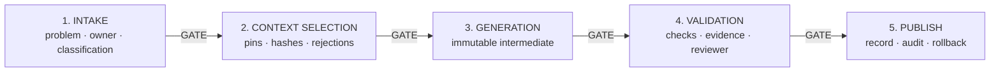

*Figure 6. Five gates prevent incomplete intake, unapproved context, or unvalidated output from flowing through silently. Text equivalent: End-to-end UCF flow with intake, context selection, generation, validation, and publish.*

> **Failed or incomplete → stop visibly or start a new run.**

### The Control Loop

The workflow is sequential, but not merely linear. Validation may require a new context selection or generation run. A changed source does not invalidate earlier context pins, but creates a new version for a subsequent run. A publication error can lead to rollback without removing the evidence trail.

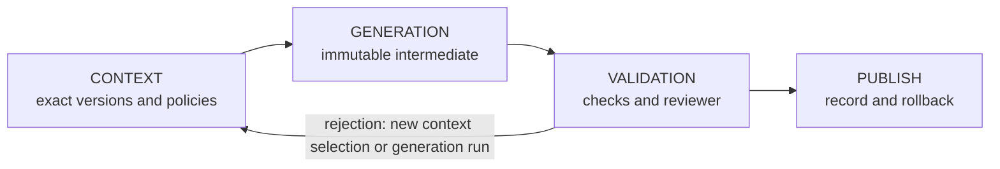

*Figure 7. UCF preserves every iteration as a new, traceable run instead of overwriting existing intermediate results. Text equivalent: Control loop from context and generation through validation, back to a new run or forward to publication.*

## The Feature Peer - Portable Functionality as a Capsule

### What a Feature Means in This Platform

A feature is neither a standalone controller nor a plug-in that retrieves code from a central store during a request. It is an independent release product with its own identity, version, entry points, routes, views, assets, contracts, services, database access, and health check. The feature also declares which capabilities and which exact UI, UCF, and DB releases are required. This allows a consumer to determine before installation whether it can safely execute the complete functionality.

The feature boundary has two forms that must not be confused:

1. **The published feature release** contains only target-neutral bytes managed by the feature. Consumer locks, credentials, endpoints, and local schema names do not belong there.
2. **The installed feature capsule** contains the verified feature code plus locally materialized copies of the exactly pinned UI, context, and database packages. The consumer adds its own receipts and locks.

This distinction makes the feature both independent and verifiable. The release remains usable in multiple environments; the installed capsule contains everything one concrete consumer needs to operate without a request-time store connection.

### Structure of a Feature Release

A mature feature release may be structured as follows:

```text
KnowledgeBrief/
  feature.php
  boot.php
  routes.php
  CHANGELOG.md
  Assets/
    css/feature.css
    js/feature.js
    images/
  Contracts/
  Controllers/
  Services/
  Defaults/
  SelfHeal/
  Tests/
    health.php
  Views/
    index.php
  Database/
    migrations/
```

The minimal contract files each have a bounded role:

| Component | Responsibility | Why it remains in the feature |
|---|---|---|
| `feature.php` | Authoritative manifest with name, version, paths, schema identity, requirements, and health. | The loader does not have to infer anything from naming conventions or global configuration. |
| `boot.php` | Deterministic initialization through the portable runtime. | The feature starts without importing consumer classes. |
| `routes.php` | Registration of only its own HTTP routes through a capability. | Route ownership remains visible and conflicts can be found before activation. |
| `Assets/` | Feature-specific CSS, JavaScript, images, and fonts. | The feature does not require a CDN or external runtime assets. |
| `Views/` | The feature's own screens and markup. | Presentation logic that is truly feature-specific moves with it. |
| `Contracts/` | Internal interfaces and feature-specific data structures. | Controllers and services remain mutually replaceable without global coupling. |
| `Controllers/` and `Services/` | Orchestration and domain logic. | Functional behavior remains in one testable capsule. |
| `Defaults/` | Safe, target-neutral default values. | Environment configuration can override them locally without modifying release bytes. |
| `SelfHeal/` | Recovery policy and checkpoints for local materializations. | Recovery behavior belongs to the feature that uses the dependencies. |
| `Tests/health.php` | Small, stable runtime check with an explicit status code. | Activation can succeed objectively or roll back. |
| `Database/migrations/` | Feature-bound bootstrap migrations when used by the selected contract. | Simple schema evolution can move with the feature; in a four-peer composite, the independent DB release is authoritative. |

The `Controllers`, `Services`, and `Contracts` directories are not a mandatory framework. Above all, they make ownership visible: code that exists only for this feature remains within the same release boundary. A small feature may have fewer directories, provided that the manifest, boot, routes, assets, health, and requirements remain unambiguous.

### The Manifest as an Executable Contract

The manifest describes not only where files are located, but also what the consumer must provide. An illustrative manifest looks as follows:

```php
return [
    'name' => 'KnowledgeBrief',
    'version' => '1.0.0',
    'routes' => 'routes.php',
    'bootfile' => 'boot.php',
    'views' => 'Views',
    'assets' => 'Assets',
    'migrations' => 'Database/migrations',
    'schema' => 'knowledge_brief',
    'roles' => [
        'rw' => 'knowledge_brief_rw',
        'ro' => 'knowledge_brief_ro',
    ],
    'ui_packages' => ['universal-layout@2.1.0'],
    'context_bundles' => ['knowledge-brief-context@3.2.0'],
    'database_packages' => ['KnowledgeBriefDb@1.0.0'],
    'capabilities' => [
        'content.context.v1',
        'database.transaction.v1',
        'http.routes.v1',
        'ui.render.v1',
    ],
    'navigation' => [],
    'health' => ['callable' => 'Tests/health.php'],
];
```

The identities in this example are fictitious. What matters is that every dependency has an exact version. The consumer does not automatically select the latest UI, context, or database. Capabilities are also explicit and minimal: a feature receives only operations that it declares and that the target profile supports.

### Boot and Routes Without Consumer Coupling

`boot.php` and `routes.php` return a callable with a frozen runtime interface. The feature therefore does not import a concrete router, database class, or service locator from the consumer. A route can, for example, be registered as follows:

```php
use Portable\Contracts\FeatureRuntimeV1;

return static function (
    FeatureRuntimeV1 $runtime,
    array $manifest,
    string $root
): void {
    $runtime->invoke('http.routes.v1', 'get', [
        'pattern' => '/knowledge-brief',
        'handler' => static fn (): mixed => $runtime->invoke(
            'ui.render.v1',
            'render',
            [
                'template' => 'Views/index.php',
                'data' => ['feature' => $runtime->featureName()],
            ]
        ),
    ]);
};
```

The feature requests an operation; the consumer determines how that operation is executed safely. The same principle applies to context reads, sessions, CSRF, audit, outbound HTTP, and database transactions. If a capability or local adapter is missing, installation or execution stops with an explicit status. There is no hidden fallback to a global service.

### How Everything Remains Within the Feature Boundary

The portability barrier checks both structure and code. A portable feature complies at least with the following rules:

- all feature code, feature views, feature assets, defaults, tests, and health logic reside under its own package root;
- assets are served from the local capsule through a feature-bound asset route;
- CSS selectors and JavaScript hooks are feature-specific, so features do not silently overwrite one another;
- a feature does not import files or classes from another feature;
- collaboration with another capability takes place through a version contract, not through a direct include path;
- direct filesystem access, process execution, raw sockets, raw database handles, and process globals are not permitted;
- target names, local ports, credentials, secrets, and concrete consumer classes do not occur in release bytes;
- external runtime assets, dynamic includes, symlinks, and undeclared files are rejected at the package boundary;
- every route, capability, and dependency can be declared and checked in advance.

These rules do not turn PHP into a formally proven sandbox. They do reduce the attack surfaces, prevent unintended coupling, and ensure that review and signing apply to a complete, bounded file set.

```mermaid
flowchart LR
    subgraph RELEASE["FEATURE-RELEASE"]
        MAN["MANIFEST + ENTRY POINTS<br/>feature.php · boot.php · routes.php"]
        LOG["LOGIC<br/>Contracts · Controllers · Services"]
        UX["EXPERIENCE<br/>Views · Assets · Tests"]
        DBE["DATABASE EXPECTATION<br/>neutral schema · migrations · capabilities"]
    end
    subgraph CAPSULE["INSTALLED FEATURE CAPSULE"]
        CODE["CODE<br/>feature release and feature.lock"]
        UI["UI<br/>design release and ui.lock"]
        UCF["UCF<br/>context release and context.lock"]
        DB["DATABASE<br/>database release · database.lock · local schema"]
        LOCK["COMPOSITE LOCK V2<br/>four exact pins · digests · materialization paths"]
    end
    RELEASE -->|review and preflight| CAPSULE
```

*Figure 8. The feature release contains its own target-neutral bytes; the consumer uses them to build a complete local capsule with three exactly pinned peer packages and four evidence locks. Text equivalent: Two-part diagram with the publishable feature release on the left and the installed feature capsule with local UI, context, and database packages on the right.*

> **The feature release contains no:** locks · secrets · endpoints · target names.

### The Installed Feature Capsule

After a successful installation, the local structure may conceptually look as follows:

```text
features/KnowledgeBrief/
  feature.php
  boot.php
  routes.php
  Assets/
  Contracts/
  Controllers/
  Services/
  Tests/
  Views/
  Ui/universal-layout/
    ... verified design files ...
    ui.lock.json
  Context/knowledge-brief-context/
    ... verified context files ...
    context.lock.json
  Database/KnowledgeBriefDb/
    ... verified schema files ...
    database.lock.json
  feature.lock.json
  composite.lock.json
```

The locks are written by the consumer and therefore do not belong in the original feature release. `feature.lock.json` proves the code release. The three dependency locks prove the local materializations. `composite.lock.json` connects the four exact pins, manifest digests, signing identities, and materialization paths. Store endpoints are not runtime bindings and do not need to be included in the composite lock.

This gives “everything remains within the feature” a precise meaning: the active feature can be inventoried, verified, backed up, and removed from a single local root. At the same time, UI, UCF, and DB remain independent peers, because their content is not rewritten by the feature publisher and their own signatures remain valid.

### Publishing, Installing, and Activating

Publication begins in an incoming package. The publisher validates the manifest, safe relative paths, permitted extensions, route contracts, health signature, capability list, and prohibited couplings. It then produces a canonical manifest containing the path, size, and SHA-256 for every file. That manifest is signed and the release is published atomically and immutably.

Installation is a separate consumer action:

1. The operator authorizes the exact feature version.
2. The consumer verifies the signature, manifest, file ledger, core compatibility, requirements, and target profile.
3. All bytes are downloaded to a same-volume staging directory and hashed again.
4. The package boundary and entry points are probed in isolation.
5. Under an exclusive feature lock, database preparation and migrations are started within a transaction.
6. The staged feature is swapped atomically with the active directory; the previous directory remains a rollback candidate.
7. The consumer writes local locks, activates routes, and runs health.
8. The database transaction is committed only for a fully valid candidate.
9. In the event of an error, the database, files, activation configuration, and locks return to the previous last-known-good state; the rejected candidate is moved to quarantine.

An activation journal and database receipt enable recovery if the process fails precisely around the filesystem swap or database commit. Recovery does not rely on the presence of a directory, but compares the expected feature identity, digests, locks, and receipt.

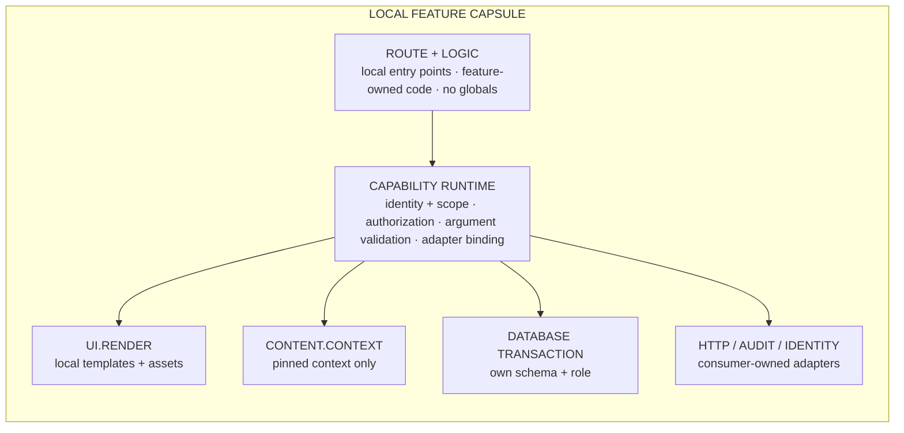

*Figure 9. After activation, a request remains within the local feature boundary and reaches context, UI, database, and external systems exclusively through granted capabilities. Text equivalent: Runtime flow from a local route to feature logic, consumer capability, and feature-bound UI, context, and database operations.*

### Example: A Portable Knowledge Brief

Suppose `KnowledgeBrief@1.0.0` provides a screen in which an employee starts a brief. The GET route renders the local feature view with the locally pinned design release. The consumer protects the POST route with authentication and CSRF controls. Through `content.context.v1`, the controller requests only the selected context and, through `database.transaction.v1`, writes exclusively to its own schema. The generation output is not published directly, but linked as an intermediate to the UCF validation stage.

The same feature release can then be installed in a second consumer. That consumer may use a different local provider adapter or a different target prefix for the database schema. The feature bytes and four release identities remain the same; only consumer configuration and local materialization differ. That is the portability test in practice.

## The UI Peer - Design as a Versionable Release Product

### Why UI Is an Independent Peer

When design is implicit in a central application shell or CDN, a feature cannot demonstrate which components and states it was tested with. A global design update can then unexpectedly change every feature. The UI peer therefore treats design as an independent, immutable release product. A feature pins one exact design release and installs a local copy of it.

The UI release contains no customer name, product identity, or remote asset. It provides generic primitives with which features can build consistent, accessible interfaces. Branding and target binding can be added at consumer level without rewriting the signed design release.

### Structure of a Design Package

A generic design package may have this structure:

```text
universal-layout/
  README.md
  CHANGELOG.md
  tokens.json
  tokens.css
  shell.css
  components.css
  interaction.js
  components/
    badge.php
    button.php
    card.php
    field.php
    table.php
  views/
    dashboard/
      view.php
      view.css
      view.js
      states.json
      test.php
    list-table/
      ... same view contract ...
    form/
      ... same view contract ...
```

The structure progresses from abstract to concrete:

- `tokens.json` is the machine-readable source for color, spacing, radius, and typography;
- `tokens.css` translates those values into locally applicable CSS variables;
- `shell.css` defines the general page and navigation structure;
- `components.css` and `components/` provide reusable primitives;
- `interaction.js` contains generic behavior without a framework or CDN dependency;
- each view bundles markup, scoped CSS, vanilla JavaScript, states, and a smoke test;
- `README.md` and `CHANGELOG.md` make purpose and version evolution reviewable.

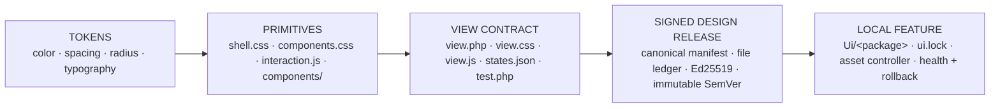

*Figure 10. Tokens form the basis; components and view contracts are materialized together in a feature as one signed design release. Text equivalent: Layered UI diagram from tokens through shell and components to views, states, tests, signed release, and local feature copy.*

> A new design version does not change a feature until a new exact pin has been reviewed.

### A View Is More Than Markup

A view contract describes not only the default representation, but also relevant states. A dashboard may, for example, contain this metadata:

```json
{
  "view": "dashboard",
  "states": ["default", "loading", "empty", "error", "success"],
  "responsive": true,
  "accessibility": [
    "keyboard",
    "focus-visible",
    "semantic-landmarks",
    "reduced-motion"
  ]
}
```

This prevents empty, loading, and error from becoming late exceptions in feature code. They are part of the reviewed design contract. The corresponding smoke test proves at least that markup can render and that the expected assets and states exist. Functional business logic remains in the feature; generic visual patterns remain in UI.

### Publication and Immutable Versions

The UI publisher scans the complete design package, rejects unsafe paths and external runtime assets, creates a canonical file ledger, and signs the manifest. Publication to an existing name and version is idempotent only when all bytes are identical. A change requires a new SemVer version.

This gives teams two kinds of freedom. The UI peer can publish new design versions without changing features automatically. After review, a feature team can select a new UI pin without modifying the UCF context or DB release. The composite makes visible which combination was tested together.

### Local Materialization and Serving

During installation, the consumer downloads every declared UI file to staging, checks size and hash, and validates the complete manifest once more against the staged directory. Under an exclusive lock, the existing local UI directory is moved to rollback and the candidate is activated atomically. The consumer then writes a signed install receipt containing release identity, manifest digest, target feature, and file ledger.

The health check runs only against the new local copy. If it fails, the candidate is moved to failed or quarantine and the previous design directory is restored. When the store is unavailable or a checksum does not match, the active UI remains byte-identical.

Normal requests load CSS, JavaScript, components, and view templates from the feature-bound local directory. An asset controller normalizes the requested path, verifies that it remains within the owning feature, and serves only permitted files. The UI Store is therefore required for discovery and updates, not for rendering a screen.

### Example: Updating Design Independently

A knowledge-brief feature initially uses `universal-layout@2.1.0`. UI later publishes `2.2.0` with improved focus states and a new report pattern. The active feature does not change. The feature team first tests the same feature code, UCF bundle, and DB release with the new design pin. After review, it publishes a new composite that changes only the UI pin. Preflight and health prove the combination; rollback can restore the previous design copy without reverting context or data.

## The DB Peer - Schema as an Independent Contract

### Why Database Evolution Does Not Remain Hidden in Code

A portable feature needs persistence, but must not own a general database user or consumer-wide schema. The DB peer therefore makes database evolution an independent release product. The package describes only the schema, migrations, grants, validation tests, and documentation. Live data, customer dumps, secrets, backups, and production bindings are explicitly excluded.

Treating DB as a peer allows a database change to be reviewed, signed, and pinned separately. The feature declares which neutral database contract it expects; the consumer materializes that contract into a local, feature-bound schema and role model.

### Structure of a Database Package

```text
KnowledgeBriefDb/
  db-package.json
  docs/
    README.md
  files/
    migrations/
      001_create_briefs.sql
      002_add_review_status.sql
    grants/
      grants.sql
    schema/
      schema.md
    tests/
      isolation.sql
```

`db-package.json` is the descriptor of the release:

```json
{
  "protocol_version": 1,
  "kind": "database-package",
  "name": "KnowledgeBriefDb",
  "version": "1.0.0",
  "schema": "knowledge_brief",
  "migrations": "files/migrations",
  "grants": "files/grants",
  "schema_files": "files/schema",
  "tests": "files/tests",
  "docs": "docs"
}
```

The schema identity is target-neutral. A package does not create a database or role, assign a password, or write a fixed consumer prefix. Grants use a role placeholder supplied by the consumer. A migration may, for example, create a table, but may not seed live records:

```sql
CREATE TABLE briefs (
    brief_id bigint GENERATED ALWAYS AS IDENTITY PRIMARY KEY,
    title text NOT NULL,
    review_status text NOT NULL,
    created_at timestamptz NOT NULL DEFAULT now()
);
```

```sql
GRANT SELECT, INSERT, UPDATE, DELETE
ON briefs TO __FEATURE_RW_ROLE__;
```

The publisher rejects, among other things, data inserts, database or role creation, passwords, owners, restore commands, and files outside the schema-only layout. Existing migrations are append-only: a new release adds `003_...sql` and does not rewrite the bytes of `001_...sql`.

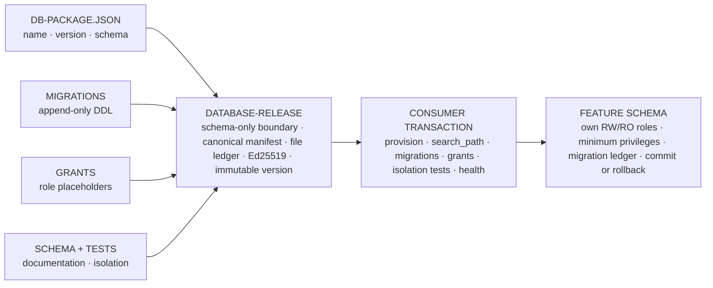

*Figure 11. The DB peer publishes only a schema contract; the consumer materializes it transactionally into one local feature schema with minimal roles and a migration ledger. Text equivalent: DB diagram from descriptor, migrations, grants, schema, and tests through a signed release to a feature-bound schema, roles, and ledger.*

> **Not in the release:** live data · secrets · backups · fixed consumer prefix · cross-feature access.

### Publication of a Database Release

The DB publisher validates the descriptor, name, SemVer, neutral schema identity, layout, and SQL boundaries. It then builds a file ledger with safe relative paths, sizes, and SHA-256 digests. The canonical manifest receives release kind `database-release`, is digitally signed, and is placed atomically in immutable storage.

An identical replay of the same name and version is idempotent. Different bytes under the same identity produce an immutable conflict. The download API serves only files listed in the manifest and checks their size and digest again before delivering them.

### Materialization in the Consumer

The consumer translates the neutral schema identity deterministically into a local feature schema. It creates or checks a read/write role and, where necessary, a read-only role with minimal privileges. These roles are not superusers, cannot create databases or roles, and receive no access to schemas belonging to other features.

During activation, the following occurs within a single database transaction:

1. The feature's own schema and required roles are provisioned or checked.
2. The transactional `search_path` is restricted to the feature's own schema and temporary objects.
3. Migrations are executed in fixed file order.
4. Each migration identifier and digest is recorded in a feature-specific ledger.
5. Grants are applied to the materialized roles.
6. Schema and isolation tests check the expected objects and negative access to other schemas.
7. The feature candidate is loaded and its health check runs while the transaction is still controllable.
8. Commit follows only on success; otherwise rollback follows and the previous feature remains active.

An already registered migration identifier with different bytes is fatal. This prevents a package from silently redefining a previously executed database change.

### Access During Normal Requests

Portable feature code receives no PDO or driver handle. It opens a feature-bound database transaction through a capability. The session provides bounded operations for parameterized statements and exists only within the owning transaction. Schema names, hosts, and credentials are not feature input.

This prevents two common portability problems: SQL that hard-codes an environment name and code that accidentally reads a table belonging to another feature. The consumer owns the connection, authorization, timeouts, search path, and logging; the feature owns only its neutral data contract and query intent.

### Example: Safely Extending a Schema

Version `1.1.0` of the knowledge-brief feature requires a review date. DB publishes `KnowledgeBriefDb@1.1.0` with a new append-only migration. The feature publisher declares the new DB pin, but does not change the design or context pin. Preflight verifies that the descriptor schema matches the feature expectation. During activation, the column is added transactionally and the health check runs against the candidate. If the new route or isolation test fails, the database operation is rolled back and the previous composite remains last-known-good.

### The Three Peers Alongside UCF

Features, UI, and DB have the same integrity ladder but different substantive boundaries. Features own executable behavior, UI owns generic interaction and presentation rules, DB owns schema evolution, and UCF owns meaning, context, and governance. None of the peers may take over another peer's private runtime configuration. Their cohesion arises exclusively through exact pins, manifest digests, and locally controlled materialization.

## Practical Example 1 - A Controlled Policy Memorandum

### The Assignment

A policy department wants a two-page decision memorandum prepared on energy-saving measures for office buildings. The memorandum must align with current organizational objectives, relevant regulations, and internal measurement data. Personal data and raw building sensor logs may not be sent to a model. Legal review is mandatory before publication.

This example is fictitious, but the artifacts and gates follow the UCF structure.

### Workspace Manifest

The workspace begins with a manifest that specifies purpose and ownership:

```yaml
slug: beleidsnotitie-energiebesparing
title: Energy-Saving Policy Memorandum
manifest_version: 1
status: reviewed

purpose:
  outcome: Decision-ready memorandum of no more than two pages
  audience: Executive team

review:
  owner_role: Sustainability policy adviser
  reviewer_role: Legal adviser
  approval_state: approved_for_runs
```

The manifest contains no model name, endpoint, or credential. These values belong to the consumer and may differ by environment.

### Workflow Context and Data Boundary

The workflow context defines the permitted input and output:

```yaml
routing:
  input: approved_intake
  output: decision_note_pdf
  reviewer: legal_review

data_boundary:
  classification: internal
  allowed:
    - approved_policy_documents
    - regulation_summaries
    - aggregated_energy_kpis
  forbidden:
    - personal_data
    - raw_sensor_events
    - credentials

model_boundary:
  provider: consumer_selected
  retention: no_training
  human_approval_required: true
```

### References and Policies

Context selection assesses five candidate sources. Three are selected:

| Candidate | Decision | Reason |
|---|---|---|
| Organizational objectives, version 3 | Selected | Current and approved by governance. |
| Summary of regulations | Selected | Legally reviewed source. |
| Aggregated energy KPIs | Selected | Needed for impact assessment; no personal data. |
| Raw sensor data | Rejected | Not necessary and outside the data-minimization boundary. |
| Old draft strategy | Rejected | Replaced by version 3. |

The policy set requires source references for factual claims, a separate section for uncertainties, neutral policy language, and legal approval. The context selection output contains the three exact version identifiers and hashes.

### Generation

The generation adapter receives the intake, policy set, and three selected sources. The adapter may execute a `respond` operation and returns an intermediate with text, context usage, and non-secret execution metadata. The output is stored as `pending_validation`.

An illustrative run ledger looks as follows:

```json
{
  "run_id": "run-2026-08-0021",
  "workspace": "beleidsnotitie-energiebesparing",
  "stage": "generation",
  "context_versions": ["goals-v3", "regulation-summary-v2", "energy-kpi-q2"],
  "output_digest": "sha256:…",
  "status": "pending_validation"
}
```

The ellipsis in the digest field is used only in this readable example. A real ledger contains the complete digest.

### Validation

The validation stage performs four checks:

1. Every factual claim has a reference to one of the selected sources.
2. The text contains no personal data or raw sensor details.
3. The recommended measures include assumptions and uncertainties.
4. The legal reviewer has approved the exact output digest.

If one claim has no source, the run is rejected. A recovery run can select additional context or perform a new generation. The rejected intermediate remains as evidence, but cannot be published.

### Publication

After approval, the publish stage binds the result to the document management target. The publication contains the PDF, publication digest, validation result, review decision, and rollback reference. The target application receives only the approved output; context selection and provider credentials are not published with it.

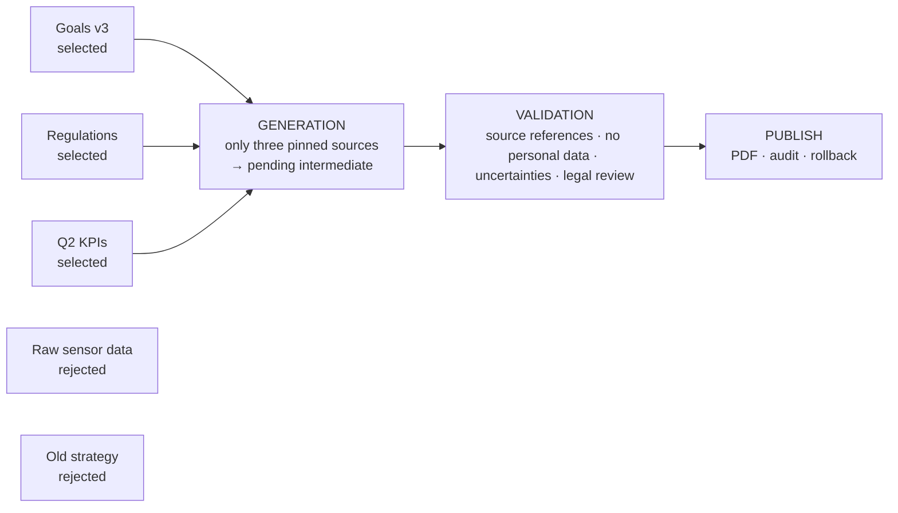

*Figure 12. The policy-memorandum example shows how three approved sources lead through generation and legal review to a single publication. Text equivalent: Practical flow with five candidate sources, three context pins, generation, four validation checks, and publication.*

### What This Example Demonstrates

The example shows that UCF is more than prompt management. It manages the complete decision chain surrounding the prompt: assignment, source selection, data minimization, policy, intermediate, review, and publication. If another provider is selected later, these artifacts remain usable.

## Practical Example 2 - From Cloud Model to Local Model

### Motivation

The policy workflow from the first example initially runs through an approved cloud provider. For confidential scenario analyses, the organization later wants to use a local model. In an application-bound design, the prompt, connector, model configuration, and review logic would have to be migrated together. In the UCF, only the consumer-owned adapter binding changes, as long as the new adapter supports the same capability contract.

### What Remains the Same

- The workspace manifest and purpose.
- The data boundary and policies.
- The five stage contracts.
- The identifiers and hashes of selected context.
- The validation checks and human review.
- The format of the run and publication ledger.

### What Changes

- The local adapter binding for the model capability.
- The provider-specific credential and endpoint configuration.
- Potentially the allowlist of models and generation parameters.
- Execution characteristics such as latency, context limit, and cost metadata.

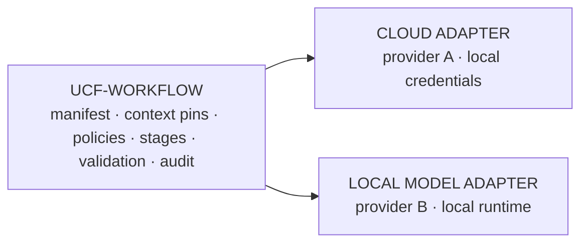

*Figure 13. The context and governance chain remains the same while only the consumer adapter changes from a cloud model to a local model. Text equivalent: Comparison of one UCF workflow with a cloud adapter and a local model adapter.*

> Both adapters implement the same capability contract.

### Comparable Validation

Because both runs use the same context pins and validation policy, results can be compared directly. The reviewer sees not only two texts, but also:

- which provider adapter and model class were used;
- which generation parameters differed;
- whether context usage remained within the agreed boundary;
- which claims or uncertainties changed;
- whether both outputs met the same quality threshold.

In this context, vendor independence does not mean that models produce identical output. It means the organization retains its context, workflow, and assessment framework and can evaluate provider results under the same governance.

### Fail-Closed Behavior

When the local target does not provide a suitable model adapter, the capability is unavailable. The workflow receives an explicit `provider_unavailable` outcome. It does not fall back to an old provider without review, because such a hidden fallback would undermine both the data boundary and the audit trail.

## Practical Example 3 - A Portable AI Feature

### Why Four Artifact Types

A complete application consists of more than context. It needs executable logic, a user interface, and often a database schema. The portable platform distributes these responsibilities across four independently publishing peers:

| Peer | Owns | Publishes |
|---|---|---|
| Feature | Executable logic, routes, and capability requirements. | Feature release |
| UI | Design tokens, components, views, and assets. | Design release |
| UCF | Context, policies, references, and stages. | Context release |
| DB | Migrations, grants, schema description, and isolation tests. | Database release |

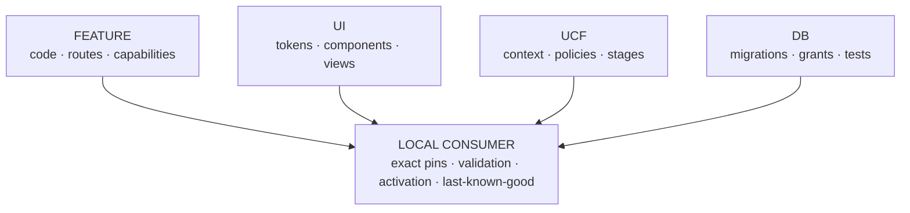

*Figure 14. Four peers publish independently; a consumer combines only exact, validated versions. Text equivalent: Publishable four-peer diagram with Feature, UI, UCF, and DB around a local consumer.*

This separation prevents context from being hidden in code, database evolution from being reduced to informal SQL in a feature directory, or design updates from automatically changing the meaning of a workflow.

### Illustrative Composite

A fictitious feature for knowledge briefs may pin the following exact versions:

```json
{
  "code": "KnowledgeBrief@1.0.0",
  "ui": ["universal-layout@2.1.0"],
  "ucf": "knowledge-brief-context@3.2.0",
  "db": "KnowledgeBriefDb@1.0.0"
}
```

The code release additionally declares the capabilities it needs, such as reading context, UI rendering, controlled routes, and a feature-bound database transaction. The target must provide every capability locally before installation may begin.

### Preflight

Preflight retrieves or inspects the four exact manifests and all declared files. The consumer validates:

1. Release identity and version.
2. Digital signature against the local trust store.
3. Canonical manifest digest.
4. Path, size, and SHA-256 of every file.
5. Core compatibility and capability match.
6. Target neutrality of feature and context bytes.
7. Binding of the context to the same feature.
8. Equality of the neutral feature schema and the DB descriptor schema.
9. Any immutable cache conflicts.

Preflight writes nothing. The same technical change gate can therefore be run before a maintenance window without modifying the active application.

### Activation

After preflight approval, dependencies are staged in local caches without being activated. The consumer creates a staging feature, materializes context and the database contract, and resolves the exact design. Under an exclusive feature lock, a single database transaction begins for the schema, migrations, grants, and isolation tests.

Only then does the consumer atomically swap the staging directory and active directory. Local provenance locks record the four pins, manifest digests, signing identities, and materialization paths. Loader, routes, and health are checked before the database transaction is committed.

In the event of an error, the database transaction is rolled back, the candidate is placed in quarantine, and the previous feature, configuration, and locks are restored. The user therefore remains on the previous last-known-good version.

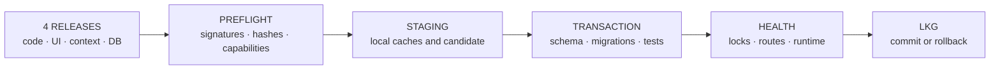

*Figure 15. Preflight first validates the entire composite; activation connects the filesystem, database, health, and rollback. Text equivalent: End-to-end portable feature flow from four releases through preflight and staging to a local last-known-good runtime.*

> **Failure before commit → DB rollback + candidate quarantine + restore the previous version.**

### Operating Without Stores

After activation, the consumer builds routes, UI, context reads, and database transactions exclusively from local, verified state. The four stores are required for discovery and new releases, but not for normal requests. A network outage may delay an update without stopping the active application.

This is the operational expression of vendor and store independence: not every component needs to be continuously online as long as the consumer possesses a demonstrably valid local composite.

## Trust, Security, and Data Boundaries

### Trust Resides in Evidence, Not Location

A package is not trusted because it comes from a known URL. Trust arises from a local combination of review, pinned public key, digital signature, canonical manifest, file ledger, exact version, and target policy.


*Figure 16. The consumer builds trust step by step and activates only when every layer is valid. Text equivalent: Trust chain from human review through signature and file hashes to capability and health checks.*

> A known location is not evidence; every layer must be valid locally. **Only then → active last-known-good.**

Every release identity is immutable. The same name and version can be offered again idempotently only when the complete canonical content is identical. Different bytes under the same identity produce a conflict. This prevents a publisher from silently replacing an already reviewed version.

### Target Neutrality

Portable package bytes contain no target ID, deployment environment, local endpoint, credentials, consumer namespace, fixed schema prefix, or concrete adapter class. These details arise only in the consumer. The same release can therefore be used in multiple environments without being signed again.

### Capability Isolation

Portable feature code receives no general service locator or raw system access. The runtime interface provides only feature identity, the names of granted capabilities, and an invocation boundary. Risky global PHP functions, process globals, dynamic includes, process execution, and raw database handles are rejected at the package boundary.

This is defense in depth, not a claim that arbitrary hostile PHP code can become a formally proven sandbox. Publisher review, trusted keys, separate OS processes, minimal network access, and database grants remain important.

### Database Isolation

Each feature receives its own local schema and its own read/write role and, optionally, read-only role on the target. The runtime role cannot create databases, roles, or schemas. Transactions use a local search path restricted to the feature's own schema and temporary objects. A feature receives no `USAGE` privilege on another feature's schema.

Database releases contain only migrations, grants, schema descriptions, tests, and documentation. Live data, secrets, customer dumps, and restore payloads are excluded. A migration identifier is registered together with its digest; reuse of the same identifier with different bytes is fatal.

### HTTP and Management Boundary

State-changing routes require an authenticated management session and CSRF protection before the feature handler is invoked. Management responses are not cached. Diagnostic database views are hidden by default and, when explicitly activated, restricted to trusted local sources and single, read-only statements.

### Secrets

Private signing keys, database credentials, and provider secrets are consumer state. They do not belong in source control, releases, health responses, audit context, or workspace files. A context package describes which provider class is permitted; the actual credential remains local.

## Audit, Continuity, and Recovery

### From Run to Publication Evidence

A complete run connects the following objects:

- intake ID and approval;
- context version identifiers and digests;
- policy versions;
- generation parameters and adapter identity;
- intermediate output digest;
- validation checks and evidence;
- review decision;
- publication digest, target binding, and rollback reference.

The audit trail does not need to duplicate every source file or every prompt byte indefinitely. It preserves sufficient identity and digests to retrieve the objects used and detect changes, within the agreed retention and classification.

### Last-Known-Good

A consumer marks only a fully validated artifact set as active. New releases are staged first. The previous version remains available as a rollback candidate until migration, routes, and health have succeeded. Store failure, timeout, invalid signature, and checksum errors do not modify the active files.

### Backup and Restore

A usable backup comprises more than a database. It must also contain local releases, activation status, trust, locks, target reports, and relevant workspace context. Restore first validates archive and file checksums and the database dump. Filesystem swaps use same-volume staging and rollback copies; database replay occurs transactionally.

### Recovery After an Uncertain Commit

Filesystem rename and database commit do not form a native distributed transaction. Activation therefore preserves a journal and receipt. If a process fails around commit, recovery uses the expected feature identity, locks, manifest digests, and receipt to determine whether the intended result is actually active. An unknown directory is not treated as evidence of success.

### Signed Target Reports

After successful installation or activation, the target can publish a locally signed report. The report contains release and installed-artifact digests, target profile hash, result, and non-secret diagnostic codes. Delivery is durable: when the receiver is offline, the report remains in the local queue and can be sent later without delayed evidence overwriting a newer target status.

## What UCF Does and Does Not Automate

### What Has Explicitly Been Built

The UCF provides a generic, atomically scaffoldable workspace; manifests and workflow context; policy, reference, and contract stores; context publication; immutable releases; capability boundaries; audit; portable composite onboarding; local activation, rollback, and a last-known-good runtime.

The five stage contracts serve as governance contracts. They make required input, output, and gates explicit. An organization can execute these contracts manually, through a workflow service, or through feature code without changing the meaning of the stages.

### What Is Not Assumed

The generic scaffold selects no customer, data source, model, or vendor. A model provider is operational only when the consumer supplies a reviewed adapter. Missing providers produce a visible unavailable status. There is no hidden model choice and no automatic publication merely because a file exists.

The UCF should therefore not be presented as a fully autonomous multi-agent environment. It is best suited to workflows that must be sequential, reviewable, repeatable, and auditable. High-frequency real-time automation, complex parallel agents, and unbounded autonomous tool execution require additional orchestration and isolation engineering.

> HONEST BOUNDARY - UCF standardizes the context and governance chain. It does not replace the substantive owner, reviewer, model provider, or operations function.

## Adoption in an Organization

### Start with One Decision Process

Successful adoption does not begin with a central catalog of all business data. Choose one workflow with a recognizable source set, clear owner, verifiable output, and existing review. A policy memorandum, customer recommendation, risk analysis, or controlled RFP response is more suitable than an organization-wide autonomous agent.

### Step 1 - Define Purpose and Governance

Create the workspace manifest and name the owner, reviewer, data classification, output, and stop conditions. Decide which parts of the workflow must remain human.

### Step 2 - Bring Context and Policies Under Management

Inventory candidate sources, but pin only approved versions. Document ownership, sensitivity, retention, and permitted use cases. Make policies separately reviewable.

### Step 3 - Formalize the Five Stages

Apply the generic stage contracts to the selected process. Define exact input, output, gate, and evidence for each stage. Keep generation and publication strictly separate.

### Step 4 - Bind a Provider Adapter

Select a model or system provider at consumer level. Establish the model allowlist, region, retention, cost limit, timeout, retry, and logging. Give the feature only the necessary capability.

### Step 5 - Run One Golden Run and One Failure Run

Execute a fully approved run and archive the evidence. Then force an error, such as missing context, rejected validation, or provider unavailable. Verify that publication is blocked and the error remains visible.

### Step 6 - Make the Workflow Portable

Publish the context, feature, UI, and database contract independently. Perform preflight and local activation. Then test that the active application continues to operate when the stores are temporarily unavailable.

### Step 7 - Scale Through Reuse

Reuse policies, stage contracts, and adapters only when their scope permits. Create new workspaces for new purposes or data boundaries. Measure not only output volume, but also context quality, rejections, review turnaround time, provider dependence, and rollback capability.

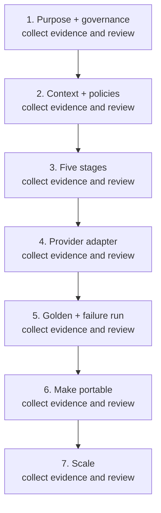

*Figure 17. Manageable adoption grows from one decision process through a golden run to portable reuse. Text equivalent: Seven-step UCF adoption path in an organization.*

## Conclusion

The Universal Context Foundation makes the context surrounding AI explicit, governable, and transferable. It separates organizational purpose from model execution, source selection from technical accessibility, generation from publication, and portable artifacts from local consumer configuration.

The strength of the design lies in the combination. A workspace makes meaning readable. Stage contracts make the workflow verifiable. Adapters make providers replaceable. Immutable releases and exact pins make distribution reproducible. Local last-known-good state makes the runtime less dependent on stores. Audit and rollback make change accountable.

This shifts AI governance from a collection of documents and agreements to an executable architectural pattern. The organization can continue to change models, clouds, and applications without repeatedly determining which context is valid and who may approve publication.

A UCF is therefore not an extra layer that slows delivery. It is the layer that makes speed repeatable, explainable, and reversible. Precisely because of this, AI can grow from an experiment into a reliable part of business operations.

## Appendix A - Illustrative Workspace Manifest

The example below is generic. Roles and bindings are supplied by the organization; secrets and endpoints remain outside the manifest.

```yaml
slug: kennisnotitie
title: Knowledge Brief
created_at: 2026-08-02T12:00:00Z
manifest_version: 1
status: reviewed

purpose:
  outcome: A reviewed knowledge brief
  audience: Internal decision-makers
  exclusions:
    - Personal data
    - Unapproved sources

bindings:
  ui_packages:
    - universal-layout@2.1.0
  context_bundles:
    - knowledge-context@3.2.0
  features:
    - KnowledgeBrief@1.0.0

review:
  owner_role: Knowledge owner
  reviewer_role: Independent reviewer
  last_reviewed: 2026-08-02
  approval_state: approved_for_runs
```

## Appendix B - Illustrative Stage Contract

```yaml
stage: validation
version: 1

required_inputs:
  - immutable_generation_output
  - selected_context_ledger
  - applicable_policy_set

checks:
  - schema_valid
  - required_sources_present
  - forbidden_data_absent
  - uncertainty_marked
  - reviewer_approved

outputs:
  - validation_result
  - evidence_digests
  - reviewer_decision

gate:
  advance_when: all_required_checks_pass
  on_failure: block_publication
```

## Appendix C - Glossary

**Adapter.** Consumer-owned connection between a neutral capability contract and a concrete provider or system.

**Capability.** Version-bound operation that a target offers to a feature in a controlled manner.

**Cold-start test.** Check whether a person or agent without knowledge of a previous session can infer the purpose, route, input, output, gate, and status from the workspace.

**Composite.** Exact combination of feature code, design, context, and database contract.

**Context bundle.** Published, versioned set of context, policies, references, and optionally stages.

**Context selection.** Workflow stage in which exact context versions are selected, pinned, or rejected with a reason.

**Gate.** Condition that determines whether a stage may proceed to the next stage.

**Intermediate.** Immutable output produced between stages that has not yet been approved for publication.

**Entry point.** Small, stable router that provides identity and navigation without taking over substantive context payload.

**Last-known-good.** Last fully verified local artifact set that may remain active.

**Policy.** Reviewable rule for data, quality, generation, validation, or publication.

**Preflight.** Complete technical validation of a composite without persistent mutation.

**Provenance.** Traceable information about the origin, version, processing, and review of an artifact.

**Reference.** Approved source that can be selected as context for a workspace or run.

**Run.** One concrete execution from intake through validation or publication.

**Run artifact.** Input, intermediate result, evidence, or publication bound to one concrete run.

**Stable context.** Policies, references, schemas, and templates managed separately from run products and reusable across multiple runs.

**Stage contract.** Definition of the required input, output, and gate of one workflow stage.

**Target profile.** Local description of the runtime, capabilities, and adapter bindings of a consumer.

**Workspace.** Bounded context and governance container for one subject, product, or workflow.

## Appendix D - Basis for This Whitepaper

This whitepaper is based on the strategic vision “From Two Pillars to a Universal Context Foundation,” the current UCF workspace and stage contracts, principles for readable and self-routing workspace architecture, the portable platform wire protocol, the implementation of workspace scaffolding, context publication, capability adapters, composite onboarding, transactional activation, and the associated technical documentation.

To keep the text publishable and durable, this version contains no local repository paths, environment-bound technical identifiers, internal network details, customer names, or provider credentials. The technical examples are illustrative and use fictitious names. For implementation and operations, the controlled technical documentation set remains the normative source.

---

## About this publication

| Property | Value |
|---|---|
| **Document** | Publishable architecture whitepaper · accessible GitHub edition |
| **Author** | Dennis Westerman |
| **Version** | 1.2 |
| **Publication date** | 11 August 2026 |
| **Language** | English |
| **Purpose** | Explain how UCF, Features, UI, and DB are structured and work together end to end |
| **Audience** | Executives, architects, security professionals, product owners, and engineers |
| **Examples** | Fictional and free from customer-, provider-, and environment-specific data |
| **Publication class** | Suitable for external publication after an organization's own branding and legal review |

[← Previous: Value Delivery Thread](value-delivery-thread.md) · [Architecture overview](../../README.md)
