<div align="center">

# Universeel Context Fundament

## Een bestuurbare, herhaalbare en vendor-onafhankelijke basis voor AI-workflows

*Van strategisch principe tot concrete workspace, stagecontracten en portable uitvoering*

**CONTEXT · WORKFLOW · GOVERNANCE · PORTABILITY**

**Toegankelijke GitHub-editie · publicatieversie 1.2 · 11 augustus 2026**

</div>

---

<p align="right"><sub><a href="../en/universal-context-foundation.md">English</a> · <strong>Nederlands</strong> · <a href="../../README.nl.md">← Architectuuroverzicht</a></sub></p>

<!-- publication-navigation:start -->
<table width="100%">
  <tr>
    <td width="33%" align="center">
      <a href="workplace-vision.md"><strong>01 · Workplace Vision</strong></a><br />
      <sub>Menselijke bedoeling → digitale ervaring</sub>
    </td>
    <td width="33%" align="center">
      <a href="value-delivery-thread.md"><strong>02 · Value Delivery Thread</strong></a><br />
      <sub>Klantbelofte → leveringsbewijs</sub>
    </td>
    <td width="34%" align="center">
      <strong>03 · Universeel Context Fundament</strong><br />
      <sub>Huidige paper · NL</sub>
    </td>
  </tr>
</table>
<!-- publication-navigation:end -->

## De kern in één minuut

Veel AI-initiatieven beginnen met een model, een prompt en een koppeling naar bedrijfsdata. Dat levert snel een demonstratie op, maar nog geen bestuurbaar systeem. Zodra meer teams, bronnen en modellen betrokken raken, ontstaan bestuurlijke vragen: welke context en policy golden, wie keurde selectie en publicatie goed, welk tussenresultaat is gevalideerd en kan dezelfde werkwijze met een ander model worden herhaald?

Het Universeel Context Fundament (UCF) is ontworpen om die vragen onderdeel van de architectuur te maken. Het UCF organiseert context, beleid, workflow en bewijs rond de AI-uitvoering. Een model is daarin een vervangbare uitvoerder achter een adapter. De betekenis van het werk, de selectie van bronnen, de kwaliteitscriteria en de goedkeuring blijven eigendom van de organisatie.

> KERNBOODSCHAP - Het UCF maakt niet het model, maar de gecontroleerde context en workflow tot het duurzame fundament van AI-toepassingen.

Een UCF-workspace is een leesbare, versieerbare contextcontainer met doel, eigenaarschap, workflowgrenzen, references, policies, stagecontracten, adapters en runadministratie. Vijf vaste stages vormen de ruggengraat: intake, contextselectie, generatie, validatie en publicatie. Iedere stage heeft vereiste input, expliciete output en een gate. De structuur is tevens een uitvoeringskaart: volgorde toont de route, hiërarchie begrenst de context en artifacts bewijzen de bereikte toestand.

De technische implementatie is een portable platform waarin context los blijft van featurecode, design-assets en databasecontracten. Deze vier artifactsoorten worden onafhankelijk gepubliceerd, ondertekend, gepind en lokaal geïnstalleerd. Daarna werkt de toepassing vanaf geverifieerde lokale bytes; een centrale store is tijdens een gebruikersrequest niet nodig.

Deze whitepaper beschrijft de UCF-opbouw en de end-to-end informatiestroom. De hoofdstukken over Features, UI en DB behandelen hun mappenstructuur, publicatiecontract, installatie, lokale runtime en onderlinge grenzen. Drie praktijkvoorbeelden maken de werking concreet:

1. Een beleidsnotitie die uitsluitend met goedgekeurde bronnen wordt gegenereerd en pas na menselijke validatie wordt gepubliceerd.
2. Dezelfde workflow die van een cloudmodel naar een lokaal model verhuist zonder de contextstructuur te herschrijven.
3. Een portable AI-feature die code, UI, context en databaseschema als vier exacte, controleerbare releases combineert.

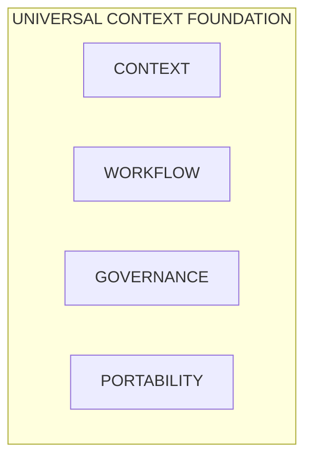

*UCF verbindt context, workflow, governance en portability tot één beheerd fundament.*

## Leeswijzer

> Deze whitepaper beschrijft het duurzame architectuurpatroon en gebruikt alleen generieke namen. Environmentgebonden configuratie, secrets en interne bronverwijzingen zijn bewust niet opgenomen.

De eerste helft behandelt aanleiding, ontwerp en volledige UCF-opbouw. Daarna volgen de vijf stages en drie volwaardige peerhoofdstukken over Features, UI en DB, inclusief opbouw, publicatie, installatie en voorbeelden. Vervolgens verbinden drie praktijkvoorbeelden de vier peers end-to-end. De laatste hoofdstukken behandelen trust, continuïteit, grenzen en invoering. Technische voorbeelden zijn illustratief; normatieve implementatiedocumentatie blijft leidend voor deployment en operations.

## Waarom een Universeel Context Fundament nodig is

### Het probleem met applicatiegebonden context

Context ontstaat vaak verspreid over documenten, prompts, applicatieconfiguraties, tickets, gesprekken en persoonlijke werkwijzen. Een AI-toepassing kan al deze bronnen technisch benaderen, maar dat betekent nog niet dat de juiste context op het juiste moment wordt gebruikt. Zonder expliciete selectie en versionering is achteraf moeilijk vast te stellen waarom een antwoord tot stand kwam.

Een tweede risico is dat context en workflow samenvallen met één leverancier. Prompts worden dan onderdeel van een specifieke studio, policies zitten verborgen in connectorconfiguratie en reviewstappen bestaan alleen in een automationflow. Een overstap naar een ander model of een andere cloud wordt daardoor een reconstructieproject.

Een derde risico ontstaat wanneer mechanische automatisering en inhoudelijke beoordeling door elkaar lopen. Een script kan bestanden verplaatsen, velden valideren en hashes berekenen. Het kan niet zelfstandig bepalen of een beleidsinterpretatie bestuurlijk acceptabel is. Het UCF maakt daarom onderscheid tussen techniek die deterministisch kan worden uitgevoerd en gates waar expliciet eigenaarschap of menselijke review nodig is.

### Context als beheerd product

In het UCF wordt context behandeld als een beheerd product met een eigenaar, versie, herkomst, classificatie en gebruiksdoel. Een bron wordt niet relevant omdat hij technisch bereikbaar is. Hij wordt relevant nadat is bepaald:

- wie verantwoordelijk is voor de bron;
- welke versie of momentopname mag worden gebruikt;
- welke gevoeligheid en retentie gelden;
- voor welk doel de bron geschikt is;
- welke delen minimaal noodzakelijk zijn;
- hoe de bron in output herkenbaar of citeerbaar blijft.

Hierdoor verschuift de vraag van “welke data kan het model zien?” naar “welke context is voor deze taak goedgekeurd?”. Dat is een belangrijk verschil. Bereikbaarheid is een technisch gegeven; goedgekeurde relevantie is een governancebesluit.

### Zes ontwerpdoelen

Het UCF is rond zes samenhangende doelen gebouwd.

#### Context-first

De taak, data boundary, policies en bronnen worden vastgesteld vóór generatie. Het model vult een goedgekeurde workflowstap in; het bepaalt niet zelfstandig welke bedrijfscontext geldig is.

#### Expliciete contracten

Iedere stage benoemt vereiste input, output en gate. Interfaces tussen context, features, UI, database en providers zijn versiegebonden. Ontbrekende input of capabilities leiden tot een zichtbare stopconditie.

#### Zichtbare tussenresultaten

Generatieoutput blijft een intermediate totdat validation slaagt. De organisatie kan een concept inspecteren, afwijzen, opnieuw uitvoeren of vergelijken zonder dat aanwezigheid van een bestand automatisch publicatie betekent.

#### Vendor-onafhankelijkheid

Model- en systeemproviders worden via adapters verbonden. De workspace bevat geen verplichte provider, klantendpoint of credential. Eenzelfde contextbundle kan daardoor met verschillende uitvoerders worden gebruikt.

#### Audit en rollback

Selecties, hashes, reviews, uitvoeringsmetadata en publicatiebesluiten blijven traceerbaar. Een publicatierecord verwijst naar de gevalideerde run en naar een rollbackmogelijkheid.

#### Portable continuïteit

Artifacts worden immutable gepubliceerd en exact gepind. Een consumer kan daarna vanaf lokale last-known-good bytes werken. Uitval van een store hoeft een bestaande toepassing niet stil te leggen.

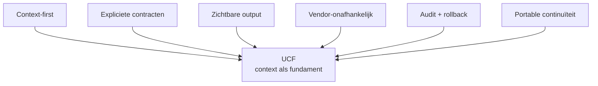

*Figuur 1. De zes ontwerpdoelen plaatsen gecontroleerde context tussen organisatiedoel en AI-uitvoering. Tekstequivalent: Cirkelmodel met context-first, contracten, zichtbare output, vendor-onafhankelijkheid, audit en portable continuïteit.*

> Zes principes staan rond één duurzaam contextfundament.

## Hoe het UCF is opgebouwd

### Van visie naar uitvoerbare architectuur

De bouw van het UCF kan in vijf ontwerpstappen worden begrepen.

1. **Context zichtbaar maken.** De eerste stap was een generieke workspace waarin doel, bronnen, policies, workflow en runs niet langer impliciet zijn.
2. **Workflowgates expliciet maken.** Intake, contextselectie, generatie, validatie en publicatie kregen ieder een contract met input, output en gate.
3. **Verantwoordelijkheden scheiden.** Context, uitvoerbare featurecode, design en database-evolutie werden verschillende artifactsoorten met eigen eigenaarschap.
4. **Portability afdwingen.** Packages kregen een target-neutraal contract, signatures, filehashes, capabilities en lokale adapterbindings.
5. **Activatie herstelbaar maken.** Installatie en updates werden opgebouwd rond preflight, staging, database-transacties, healthchecks, rollback en last-known-good state.

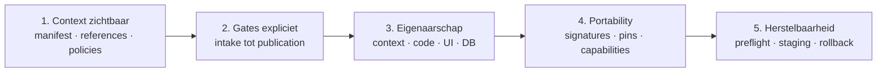

*Figuur 2. De implementatie groeide van een leesbare contextworkspace naar een portable, ondertekend en herstelbaar platform. Tekstequivalent: Vijf bouwfasen van contextstructuur naar transactionele activatie.*

> **Organisatiecontext blijft eigenaar van betekenis en bewijs.**

Deze volgorde is belangrijk. Het systeem is niet begonnen bij een model-API en later voorzien van governance. Eerst is vastgelegd wat de organisatie zelf moet bezitten; pas daarna zijn providers en portable uitvoering als verwisselbare technische lagen toegevoegd.

### De workspace als basiseenheid

Een workspace vertegenwoordigt één onderwerp, product, proces of besluitvormingsstroom. De generieke scaffold kent nog geen klant, vendor, model of deploymenttarget. Daarmee blijft de startpositie neutraal. Pas na review worden bindings en bronnen toegevoegd.

De logische workspace ziet er als volgt uit:

```text
workspace/
  WORKSPACE_MANIFEST.md
  WORKFLOW_CONTEXT.md
  references/
  policies/
  stages/
    01_intake/STAGE_CONTRACT.md
    02_context_selection/STAGE_CONTRACT.md
    03_generation/STAGE_CONTRACT.md
    04_validation/STAGE_CONTRACT.md
    05_publish/STAGE_CONTRACT.md
  adapters/
  runs/
  features/
  ui/
```

| Workspace-onderdeel | Betekenis |
|---|---|
| `WORKSPACE_MANIFEST` | doel · owner · review · bindings |
| `WORKFLOW_CONTEXT` | routing · data boundary · model boundary |
| `REFERENCES` | goedgekeurde bronnen + versies |
| `POLICIES` | regels voor data, kwaliteit en publicatie |
| `ADAPTERS` | provider- en systeemgrenzen |

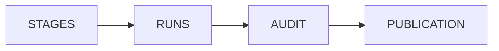

*Figuur 3. De workspace scheidt identiteit, context, regels, uitvoering en bewijs zonder de samenhang te verliezen. Tekstequivalent: Anatomie van een UCF-workspace met manifest, workflowcontext, references, policies, stages, adapters en runs.*

> Iedere overgang heeft input, output en een gate.

#### WORKSPACE_MANIFEST

Het workspace-manifest legt identiteit en governance vast. De minimale scaffold bevat een slug, titel, creatietijd, manifestversie en status. Verder zijn secties aanwezig voor purpose, bindings en review. Nieuwe workspaces beginnen bewust met `pending` approval en zonder UI-, context- of featurebinding.

Het manifest beantwoordt daarmee de vragen: wat is deze workspace, waarvoor bestaat hij, wie is eigenaar, welke artifacts horen erbij en wanneer is de inhoud voor het laatst goedgekeurd?

#### WORKFLOW_CONTEXT

Workflowcontext beschrijft routing, data boundary en model boundary. Routing benoemt inputs, outputs, reviewers en toegestane overgangen. De data boundary bepaalt bronownership, gevoeligheid, toegang en retentie. De model boundary legt vast welke provider of modelklasse gebruikt mag worden. In de generieke scaffold is geen datasource en geen model geselecteerd.

Deze scheiding voorkomt dat operationele providerconfiguratie de betekenis van de workflow bepaalt. De workflow kan hetzelfde blijven wanneer de uitvoerder verandert.

#### References

References zijn de inhoudelijke bronnen waarop een run mag steunen: documenten, besluiten, definities, factsheets, schema’s of gecontroleerde extracten. Zij worden met versie-identiteit en hash gepind. Context selection registreert niet alleen wat is gekozen, maar ook welke kandidaatcontext is afgewezen en waarom.

#### Policies

Policies beschrijven de regels die tijdens selectie, generatie, validatie en publicatie gelden. Voorbeelden zijn dataminimalisatie, bronvereisten, verbod op persoonsgegevens, tone of voice, juridische review, onzekerheidsmarkering en publicatieclassificatie. Een policy is geen verborgen promptregel, maar een apart reviewbaar object.

#### Stagecontracten

De vijf stagecontracten vormen de workflowruggengraat. Zij leggen geen modelkeuze op; ze leggen vast wanneer een stap mag beginnen en welk bewijs nodig is om door te gaan. Een stage kan door software, een mens of een combinatie worden uitgevoerd zolang het contract wordt gerespecteerd.

#### Adapters

Adapters verbinden de neutrale workflow met een model, documentplatform, identityprovider, databaseservice of ander systeem. Credentials, endpoints en klantidentiteiten blijven consumerconfiguratie. Een portable context- of featurepackage bevat deze waarden niet.

#### Runs

Een run is één concrete uitvoering van de workflow. De run bewaart de intake, contextpins, parameters, intermediate output, validatiebewijs, reviewbesluit en publicatierecord. Niet-geheime uitvoeringsmetadata kan worden opgeslagen; secrets en volledige processomgeving horen niet in de runledger.

### De workspace als leesbare uitvoeringsstructuur

Een workspace is meer dan een verzameling bestanden rond een workflow. De ordening zelf draagt betekenis. Een deelnemer moet uit de zichtbare structuur kunnen afleiden waar het werk begint, welke context voor een stap geldt, welk resultaat die stap moet opleveren en welk bewijs nodig is om verder te mogen. Daardoor blijft de workflow begrijpelijk wanneer het uitvoerende model, de applicatie of het team verandert.

Vier universele regels maken dit mogelijk:

1. **Volgorde maakt sequencing zichtbaar.** Waar stappen een vaste volgorde hebben, laat de ordening zien welke stap voorafgaat en welke stap volgt. De workflow hoeft daardoor niet uitsluitend uit verborgen orchestrationcode te worden gereconstrueerd.
2. **Hiërarchie begrenst context.** Een werkeenheid leest haar eigen contract, de expliciet aangewezen references en de benodigde runinput. Naburige of bovenliggende inhoud wordt niet automatisch meegenomen.
3. **De ingang routeert, maar bevat geen inhoudelijke payload.** Een kleine, stabiele ingang benoemt identiteit, doel en routes naar het juiste contract. Uitgebreide policies, bronnen en werkinstructies blijven in hun eigen beheerbare artifacts.
4. **Artifacts maken voortgang zichtbaar.** Intake, intermediates, reviewbewijs en publicatierecords tonen wat werkelijk bestaat. De registry en audit blijven gezaghebbend voor activatie en bewijs; de leesbare structuur voorkomt dat alleen een verborgen runtime de toestand kan verklaren.

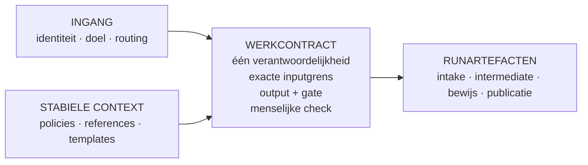

*Figuur 4. Een leesbare workspace houdt routing, werkcontract, stabiele context en runartefacten gescheiden, zodat een mens of agent zonder voorkennis veilig kan oriënteren en uitvoeren. Tekstequivalent: Diagram waarin een kleine ingang naar een werkcontract routeert, stabiele context gecontroleerd wordt geladen en runartefacten als zichtbare output en bewijs ontstaan.*

> **Cold-startproef:** waar ben ik? · wat lees ik? · wat lever ik op? · welk bewijs bestaat?

#### Ingang, werkcontract en inhoud

De ingang beantwoordt alleen de vragen: waar ben ik, waarvoor bestaat deze workspace en waar moet ik zijn voor de huidige taak? Het werkcontract is het feitelijke controlepunt. Het benoemt één verantwoordelijkheid, de vereiste input, de toegestane references, het outputtype en de gate of menselijke controle. Daarmee blijft contextselectie expliciet in plaats van afhankelijk van wat een agent toevallig besluit te laden.

De inhoud valt vervolgens uiteen in twee soorten artifacts die niet door elkaar moeten lopen:

- **Stabiele context** omvat policies, definities, schemas, templates en andere references die over meerdere runs gelijk blijven. Deze artifacts worden afzonderlijk beheerd, gereviewd en versioned.
- **Runartefacten** omvatten intake, geselecteerde contextpins, intermediates, validatiebewijs en publicaties die bij één concrete uitvoering horen.

Deze scheiding voorkomt dat een conceptoutput ongemerkt een nieuwe standaard wordt, of dat vaste regels worden gekopieerd naar iedere run en vervolgens uiteen gaan lopen.

#### Eén plek per feit

Een duurzaam contextfundament heeft voor ieder feit één gezaghebbende plek. Andere onderdelen verwijzen daarnaar via een identifier, pad of link in plaats van de inhoud te dupliceren. Catalogi en dashboards zijn afgeleide navigatiemiddelen: wanneer zij opnieuw kunnen worden opgebouwd uit manifests, frontmatter of registraties, worden zij niet als tweede inhoudelijke waarheid onderhouden. Zo blijven bron, route en bewijs ook na veel wijzigingen met elkaar in overeenstemming.

#### De cold-startproef

Een workspace is pas werkelijk overdraagbaar wanneer een mens of agent zonder kennis van een eerdere sessie zichzelf kan oriënteren. Een praktische cold-startproef controleert of binnen enkele gerichte leesstappen vier vragen kunnen worden beantwoord:

1. Waar ben ik, wat is het doel en wie is eigenaar?
2. Welk werkcontract geldt nu en welke input mag worden gelezen?
3. Welke output en welke gate of menselijke beoordeling worden verwacht?
4. Welke artifacts en registraties bewijzen de actuele status?

Als beantwoording alleen mogelijk is met mondelinge toelichting, een verborgen prompt of een volledige scan van alle beschikbare context, is de structuur nog niet voldoende. De oplossing is dan niet méér context laden, maar routing, contracten of grenzen duidelijker maken.

#### Meerdere workspacevormen

Niet iedere informatieomgeving is zelf een pipeline. Dezelfde principes kunnen een portfolio van workflows, een bibliotheek van records, een navigeerbare kenniscollectie of een organisatiemodel structureren. Deze vormen kunnen worden gecombineerd: een portfolio kan naar meerdere UCF-workspaces routeren, een recordbibliotheek kan goedgekeurde runresultaten bewaren en een kenniscollectie kan gecontroleerde references leveren.

De vijf UCF-stages blijven de governanceketen van één gecontroleerde AI-run. De omringende informatiearchitectuur hoeft daarom niet in hetzelfde model te worden gedwongen. Iedere laag krijgt een kleine eigen ingang en afgebakende verantwoordelijkheid; een bovenliggende laag routeert naar een onderliggende laag zonder haar interne inhoud te dupliceren.

> LEESBAARHEIDSPRINCIPE - Een workspace is pas bestuurbaar wanneer identiteit, route, contextgrens, werkcontract, output en bewijs zonder verborgen sessiekennis kunnen worden teruggevonden.

## De functionele bouwblokken van UCF

### Een gelaagde architectuur

Het UCF bestaat logisch uit zeven lagen. De lagen zijn zelfstandig te begrijpen, maar vormen samen één governanceketen.

| Laag | Verantwoordelijkheid | Duurzaam object |
|---|---|---|
| Identiteit en doel | Workspace-identiteit, purpose, owner en reviewstatus. | Workspace-manifest |
| Context | References, selectie, versies en provenance. | Contextbundle en contextpins |
| Beleid | Data-, kwaliteits- en publicatieregels. | Policysets |
| Workflow | Stages, inputs, outputs, gates en transitions. | Stagecontracten |
| Uitvoering | Provider- en systeemadapters achter capabilities. | Adapterbindingen |
| Bewijs | Runs, hashes, reviewbesluiten, audit en rollbackreferenties. | Run- en publicatieledger |
| Distributie | Ondertekende, immutable contextreleases en exacte pins. | Release-manifest |

> **Markdownweergave:** de bovenstaande laagmatrix vervangt de oorspronkelijke figuur. De lagen vormen een beheerd model, geen directionele procesflow.

*Figuur 5. Zeven lagen maken duidelijk wat UCF bezit en wat pas in een consumeradapter wordt ingevuld. Tekstequivalent: Gelaagd UCF-model van identiteit en context tot bewijs en distributie.*

### Scaffolder en Workspace Registry

De Scaffolder maakt een nieuwe workspace vanuit een vaste template. Hij valideert slug en titel, kopieert de template naar een willekeurige stagingdirectory en vervangt uitsluitend de afgesproken placeholders. Daarna wordt de stagingdirectory atomisch als workspace geactiveerd.

De Workspace Registry leest alleen geldige workspacedirectories met een manifest. Hij haalt titel en manifesthash op en sorteert de resultaten deterministisch. Een bestaande workspace met dezelfde metadata levert een idempotent resultaat; afwijkende metadata onder dezelfde slug wordt geweigerd.

Na filesystemactivatie wordt de manifesthash binnen een databasetransactie geregistreerd en wordt een audit event geschreven. Wanneer de databasehandeling mislukt, wordt een zojuist gemaakte scaffold verwijderd. Daardoor ontstaat geen workspace die op disk “gereed” lijkt maar niet in de registry is vastgelegd.

### Manifest, Policy, Reference en Contract Stores

Deze stores geven de belangrijkste governancedocumenten een herkenbare plek en identiteit. Het menselijk leesbare bestand blijft de inhoudelijke bron. De database bewaart registraties zoals hashes, reviewstatus, bindings en audit. Dit hybride model combineert leesbaarheid met betrouwbare zoek-, status- en bewijsfuncties.

De Contract Store beheert de schemas en afspraken die componenten onafhankelijk maken. Door contracts te versioneren kan een adapter of feature worden vervangen zonder dat andere componenten interne classes of databasestructuren hoeven te kennen.

### Context Publish Workflow en Release Registry

De Context Publish Workflow verandert gereviewde context in een immutable `context-release`. De publisher accepteert uitsluitend target-neutrale tekstuele inhoud: JSON, Markdown en tekst voor context, policies, references en stages. Uitvoerbare code, SQL, secrets, endpoints en lokale targetnamen zijn niet toegestaan.

Voor ieder bestand worden relatief pad, grootte en SHA-256 vastgelegd. Het manifest wordt canoniek gemaakt en digitaal ondertekend. Publicatie gebruikt staging en een atomische rename. Een identieke replay van dezelfde versie is idempotent; andere bytes onder dezelfde naam en versie worden geweigerd.

De Context Release Registry maakt deze exacte releases vindbaar. Discovery kan laten zien welke versies bestaan, maar een consumer installeert nooit impliciet “de nieuwste”. De feature of composite pint een specifieke versie en manifestdigest.

### Adapter Export en capability runtime

Adapter Export ondersteunt het zichtbaar maken van provider- en systeemgrenzen zonder credentials in contextpackages op te nemen. De runtime biedt features alleen vooraf afgesproken capabilities, bijvoorbeeld context lezen, een UI-template renderen of een featuregebonden databasetransactie uitvoeren.

Een feature kan niet bij environmentvariabelen, globale requeststate, raw filesystem, willekeurig netwerk of een PDO-verbinding. Zij vraagt een operatie aan de consumer. De consumer valideert argumenten, autorisatie en scope en roept een lokale adapter aan. Ontbreekt de adapter, dan volgt een expliciete `provider_unavailable`-status in plaats van een verborgen fallback.

### Run Audit

Run Audit verbindt uitvoering met bewijs. Belangrijke gebeurtenissen krijgen een stabiele code en beperkte context. De audit bevat geen secrets of volledige environmentdump. Een reviewer moet kunnen herleiden welke intake is goedgekeurd, welke contextversies zijn gebruikt, welke validationchecks zijn uitgevoerd en welk publicatierecord daaruit volgde.

### Feature Management en diagnostiek

Feature Management houdt installatie en activatiestatus gescheiden. Aanwezigheid op disk betekent geïnstalleerd; een lokale activatieconfiguratie bepaalt of de feature actief is. Diagnostiek biedt healthchecks en een streng begrensde databaseview die alleen in expliciete debugmode en vanaf een vertrouwde lokale bron beschikbaar is.

## End-to-end door de vijf UCF-stages

### Stage 1 - Intake

Intake begint met een gereviewde probleemstelling, een benoemde owner en reviewer en een expliciete dataclassificatie. De output is een geaccepteerd of afgewezen intakerecord met open vragen en evidence links. Generation is verboden zolang de vereiste intake-informatie niet compleet en beoordeeld is.

Intake voorkomt dat een technisch beschikbare prompt een workflow start zonder duidelijk doel. Een goede intake specificeert minimaal:

- het gewenste besluit of resultaat;
- de beoogde gebruiker en doelgroep;
- de grenzen van de opdracht;
- data-classificatie en verboden gegevens;
- verantwoordelijke owner en onafhankelijke reviewer;
- kwaliteitscriteria en publicatieklasse;
- voorwaarden waaronder de workflow moet stoppen.

### Stage 2 - Context selection

Context selection ontvangt een goedgekeurde intake plus kandidaat-policies en references. De stage selecteert exacte contextversies, legt hun hashes vast en registreert afgewezen context met reden. Alleen goedgekeurde en lokaal beschikbare context mag verder.

Dit is de belangrijkste data-minimalisatiestap. In plaats van alle documenten van een afdeling naar een model te sturen, wordt per taak een begrensde contextset gemaakt. Daardoor worden irrelevante, verouderde of te gevoelige bronnen niet alleen uit de prompt gehouden; hun uitsluiting wordt onderdeel van het bewijs.

### Stage 3 - Generation

Generation ontvangt gepinde workflowcontext en goedgekeurde generatieparameters. De provideradapter krijgt alleen de geselecteerde context en de operatie die het contract toestaat. De output is een immutable intermediate met provenance en beperkte, niet-geheime uitvoeringsmetadata.

Iedere generation-output krijgt status pending. Ook een technisch succesvolle modelresponse mag niet automatisch naar een publicatiekanaal. Een retry of tweede modelrun creëert een nieuwe intermediate met eigen identiteit; hij overschrijft niet stilzwijgend de vorige output.

### Stage 4 - Validation

Validation ontvangt de immutable generation-output, toepasselijke policies en kwaliteitschecks. De stage kan deterministische controles, brondekking, schema-validatie, feitencontrole en menselijke review combineren. De output bevat resultaten, evidence hashes en het reviewerbesluit.

Een mislukte of onvolledige check blokkeert publication. De reviewer keurt dus niet “de workflow” in algemene zin goed, maar een concrete intermediate gekoppeld aan concrete contextpins en policyversies.

### Stage 5 - Publish

Publish ontvangt uitsluitend een goedgekeurd validation-resultaat en een expliciete targetbinding. De output is een immutable publicatierecord, een audit event en een rollbackreferentie. Aanwezigheid van een bestand of status `generated` is nooit voldoende om publicatie af te leiden.

Het publicatierecord maakt de keten sluitend: doel, context, generatie, review en distributie blijven aan elkaar verbonden. Wanneer een fout of beleidswijziging wordt ontdekt, kan de organisatie bepalen welke publicaties door dezelfde context- of policyversie zijn geraakt.

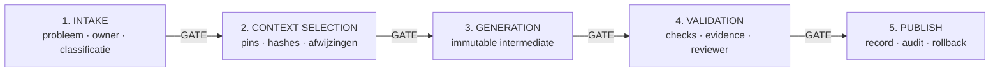

*Figuur 6. Vijf gates voorkomen dat onvolledige intake, ongekeurde context of ongevalideerde output stilzwijgend doorstroomt. Tekstequivalent: End-to-end UCF-flow met intake, context selection, generation, validation en publish.*

> **Failed of incomplete → zichtbaar stoppen of nieuwe run.**

### De control loop

De workflow is sequentieel, maar niet alleen lineair. Validation kan een nieuwe contextselectie of generation-run vereisen. Een gewijzigde bron maakt eerdere contextpins niet ongeldig, maar creëert een nieuwe versie voor een volgende run. Een publicatiefout kan naar rollback leiden zonder de bewijsadministratie te verwijderen.

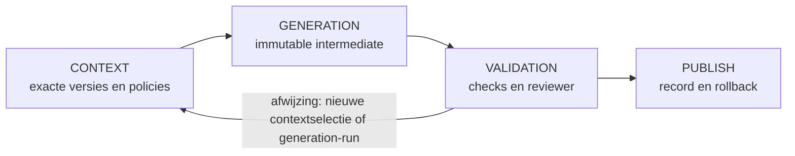

*Figuur 7. UCF bewaart iedere iteratie als nieuwe, traceerbare run in plaats van bestaande tussenresultaten te overschrijven. Tekstequivalent: Control loop van context en generatie via validation terug naar een nieuwe run of vooruit naar publication.*

## De Feature-peer - Portable functionaliteit als capsule

### Wat een feature in dit platform betekent

Een feature is geen losse controller en ook geen plug-in die tijdens een request code uit een centrale store ophaalt. Het is een zelfstandig releaseproduct met een eigen identiteit, versie, entrypoints, routes, views, assets, contracten, services, databasetoegang en healthcheck. De feature verklaart tevens welke capabilities en welke exacte UI-, UCF- en DB-releases nodig zijn. Daardoor kan een consumer vóór installatie bepalen of hij de volledige functionaliteit veilig kan uitvoeren.

De featuregrens heeft twee verschijningsvormen die niet door elkaar moeten worden gehaald:

1. **De gepubliceerde feature-release** bevat alleen target-neutrale, door de feature beheerde bytes. Consumerlocks, credentials, endpoints en lokale schemanamen horen daar niet in.
2. **De geïnstalleerde feature-capsule** bevat de geverifieerde featurecode plus lokaal gematerialiseerde kopieën van de exact gepinde UI-, context- en databasepackages. De consumer schrijft daar eigen receipts en locks bij.

Dit onderscheid maakt de feature tegelijk zelfstandig en controleerbaar. De release blijft in meerdere omgevingen bruikbaar; de geïnstalleerde capsule bevat alles wat één concrete consumer nodig heeft om zonder request-time storeverbinding te draaien.

### Opbouw van een feature-release

Een volwassen feature-release kan als volgt zijn opgebouwd:

```text
KnowledgeBrief/
  feature.php
  boot.php
  routes.php
  CHANGELOG.md
  Assets/
    css/feature.css
    js/feature.js
    images/
  Contracts/
  Controllers/
  Services/
  Defaults/
  SelfHeal/
  Tests/
    health.php
  Views/
    index.php
  Database/
    migrations/
```

De minimale contractbestanden hebben elk een afgebakende rol:

| Onderdeel | Verantwoordelijkheid | Waarom het in de feature blijft |
|---|---|---|
| `feature.php` | Autoritatief manifest met naam, versie, paden, schema-identiteit, requirements en health. | De loader hoeft niets af te leiden uit naamconventies of globale configuratie. |
| `boot.php` | Deterministische initialisatie via de portable runtime. | De feature start zonder consumerclasses te importeren. |
| `routes.php` | Registratie van alleen de eigen HTTP-routes via een capability. | Routeownership blijft zichtbaar en conflicten zijn vóór activatie te vinden. |
| `Assets/` | Feature-specifieke CSS, JavaScript, afbeeldingen en fonts. | De feature heeft geen CDN of externe runtime-assets nodig. |
| `Views/` | Feature-eigen schermen en markup. | Presentatielogica die werkelijk featurespecifiek is, verhuist mee. |
| `Contracts/` | Interne interfaces en feature-eigen datastructuren. | Controllers en services blijven onderling vervangbaar zonder globale koppeling. |
| `Controllers/` en `Services/` | Orchestratie en domeinlogica. | Functioneel gedrag blijft in één testbare capsule. |
| `Defaults/` | Veilige, target-neutrale standaardwaarden. | Omgevingsconfiguratie kan lokaal overrulen zonder releasebytes te wijzigen. |
| `SelfHeal/` | Herstelpolicy en controlepunten voor lokale materialisaties. | Herstelgedrag hoort bij de feature die de dependencies gebruikt. |
| `Tests/health.php` | Kleine, stabiele runtimecheck met een expliciete statuscode. | Activatie kan objectief slagen of terugrollen. |
| `Database/migrations/` | Featuregebonden bootstrapmigraties wanneer het gekozen contract die gebruikt. | Eenvoudige schema-evolutie kan met de feature meelopen; in een vier-peer composite is de zelfstandige DB-release leidend. |

De mappen `Controllers`, `Services` en `Contracts` zijn geen verplicht framework. Zij maken vooral eigenaarschap zichtbaar: code die alleen voor deze feature bestaat, blijft onder dezelfde releasegrens. Een kleine feature mag minder mappen hebben, zolang manifest, boot, routes, assets, health en requirements ondubbelzinnig blijven.

### Het manifest als uitvoerbaar contract

Het manifest beschrijft niet alleen waar bestanden staan, maar ook wat de consumer moet aanbieden. Een illustratief manifest ziet er zo uit:

```php
return [
    'name' => 'KnowledgeBrief',
    'version' => '1.0.0',
    'routes' => 'routes.php',
    'bootfile' => 'boot.php',
    'views' => 'Views',
    'assets' => 'Assets',
    'migrations' => 'Database/migrations',
    'schema' => 'knowledge_brief',
    'roles' => [
        'rw' => 'knowledge_brief_rw',
        'ro' => 'knowledge_brief_ro',
    ],
    'ui_packages' => ['universal-layout@2.1.0'],
    'context_bundles' => ['knowledge-brief-context@3.2.0'],
    'database_packages' => ['KnowledgeBriefDb@1.0.0'],
    'capabilities' => [
        'content.context.v1',
        'database.transaction.v1',
        'http.routes.v1',
        'ui.render.v1',
    ],
    'navigation' => [],
    'health' => ['callable' => 'Tests/health.php'],
];
```

De identities in dit voorbeeld zijn fictief. Belangrijk is dat elke dependency een exacte versie heeft. De consumer kiest niet automatisch de nieuwste UI, context of database. Ook capabilities zijn expliciet en minimaal: een feature krijgt alleen operaties die zij declareert en die het targetprofiel ondersteunt.

### Boot en routes zonder consumerkoppeling

`boot.php` en `routes.php` retourneren een callable met een bevroren runtime-interface. De feature importeert dus geen concrete router, databaseclass of service locator van de consumer. Een route kan bijvoorbeeld zo worden geregistreerd:

```php
use Portable\Contracts\FeatureRuntimeV1;

return static function (
    FeatureRuntimeV1 $runtime,
    array $manifest,
    string $root
): void {
    $runtime->invoke('http.routes.v1', 'get', [
        'pattern' => '/knowledge-brief',
        'handler' => static fn (): mixed => $runtime->invoke(
            'ui.render.v1',
            'render',
            [
                'template' => 'Views/index.php',
                'data' => ['feature' => $runtime->featureName()],
            ]
        ),
    ]);
};
```

De feature vraagt om een operatie; de consumer bepaalt hoe die operatie veilig wordt uitgevoerd. Hetzelfde principe geldt voor contextreads, sessies, CSRF, audit, outbound HTTP en databasetransacties. Ontbreekt een capability of lokale adapter, dan stopt installatie of uitvoering met een expliciete status. Er is geen verborgen fallback naar een globale service.

### Hoe alles binnen de featuregrens blijft

De portabilitybarrière controleert zowel structuur als code. Een portable feature voldoet minimaal aan de volgende regels:

- alle featurecode, featureviews, featureassets, defaults, tests en healthlogica staan onder de eigen package-root;
- assets worden via een featuregebonden assetroute uit de lokale capsule geserveerd;
- CSS-selectors en JavaScript-hooks zijn feature-specifiek, zodat features elkaar niet stilzwijgend overschrijven;
- een feature importeert geen bestanden of classes van een andere feature;
- samenwerking met een andere capability verloopt via een versiecontract, niet via een direct include-pad;
- directe filesystemtoegang, process execution, raw sockets, raw databasehandles en processglobals zijn niet toegestaan;
- targetnamen, lokale poorten, credentials, secrets en concrete consumerclasses komen niet in releasebytes voor;
- externe runtime-assets, dynamische includes, symlinks en niet-gedeclareerde bestanden worden aan de packagegrens geweigerd;
- iedere route, capability en dependency is vooraf declareerbaar en controleerbaar.

Deze regels maken van PHP geen formeel bewezen sandbox. Zij verkleinen wel de aanvalsvlakken, verhinderen onbedoelde koppelingen en zorgen dat review en signing betrekking hebben op een complete, afgebakende file-set.

```mermaid
flowchart LR
    subgraph RELEASE["FEATURE-RELEASE"]
        MAN["MANIFEST + ENTRYPOINTS<br/>feature.php · boot.php · routes.php"]
        LOG["LOGICA<br/>Contracts · Controllers · Services"]
        UX["ERVARING<br/>Views · Assets · Tests"]
        DBE["DATABASEVERWACHTING<br/>neutraal schema · migrations · capabilities"]
    end
    subgraph CAPSULE["GEÏNSTALLEERDE FEATURE-CAPSULE"]
        CODE["CODE<br/>feature-release en feature.lock"]
        UI["UI<br/>designrelease en ui.lock"]
        UCF["UCF<br/>contextrelease en context.lock"]
        DB["DATABASE<br/>database-release · database.lock · lokaal schema"]
        LOCK["COMPOSITE LOCK V2<br/>vier exacte pins · digests · materialisatiepaden"]
    end
    RELEASE -->|review en preflight| CAPSULE
```

*Figuur 8. De feature-release bevat target-neutrale eigen bytes; de consumer bouwt daaruit een complete lokale capsule met drie exact gepinde peerpackages en vier bewijslocks. Tekstequivalent: Tweedelig diagram met links de publiceerbare feature-release en rechts de geïnstalleerde feature-capsule met lokale UI-, context- en databasepackages.*

> **De feature-release bevat geen:** locks · secrets · endpoints · targetnamen.

### De geïnstalleerde feature-capsule

Na een geslaagde installatie kan de lokale structuur er conceptueel zo uitzien:

```text
features/KnowledgeBrief/
  feature.php
  boot.php
  routes.php
  Assets/
  Contracts/
  Controllers/
  Services/
  Tests/
  Views/
  Ui/universal-layout/
    ... geverifieerde designbestanden ...
    ui.lock.json
  Context/knowledge-brief-context/
    ... geverifieerde contextbestanden ...
    context.lock.json
  Database/KnowledgeBriefDb/
    ... geverifieerde schemabestanden ...
    database.lock.json
  feature.lock.json
  composite.lock.json
```

De locks worden door de consumer geschreven en horen dus niet in de oorspronkelijke feature-release. `feature.lock.json` bewijst de code-release. De drie dependencylocks bewijzen de lokale materialisaties. `composite.lock.json` verbindt de vier exacte pins, manifestdigests, signing identities en materialisatiepaden. Store-endpoints zijn geen runtimebinding en hoeven niet in de composite lock te staan.

Hiermee krijgt “alles blijft binnen de feature” een precieze betekenis: de actieve feature is vanaf één lokale root te inventariseren, te verifiëren, te back-uppen en te verwijderen. Tegelijk blijven UI, UCF en DB zelfstandige peers, omdat hun inhoud niet door de featurepublisher wordt herschreven en hun eigen signatures geldig blijven.

### Publiceren, installeren en activeren

Publicatie begint in een incoming package. De publisher valideert het manifest, de veilige relatieve paden, toegestane extensies, routecontracten, healthsignature, capabilitylijst en verboden koppelingen. Daarna ontstaat een canonical manifest met voor ieder bestand pad, grootte en SHA-256. Dat manifest wordt ondertekend en de release wordt atomisch, immutable gepubliceerd.

Installatie is een afzonderlijke consumerhandeling:

1. De operator autoriseert de exacte featureversie.
2. De consumer verifieert signature, manifest, fileledger, corecompatibiliteit, requirements en targetprofiel.
3. Alle bytes worden naar een same-volume stagingdirectory gedownload en opnieuw gehasht.
4. De packageboundary en entrypoints worden in isolatie geprobed.
5. Onder een exclusieve featurelock worden databasevoorbereiding en migraties in een transactie gestart.
6. De staged feature wordt atomisch met de actieve directory omgewisseld; de vorige directory blijft rollbackcandidate.
7. De consumer schrijft lokale locks, activeert routes en voert health uit.
8. Alleen bij een volledig geldige kandidaat wordt de databasetransactie gecommit.
9. Bij een fout gaan database, files, activatieconfiguratie en locks terug naar de vorige last-known-good toestand; de afgekeurde kandidaat gaat naar quarantine.

Een activatiejournal en database-receipt maken herstel mogelijk wanneer het proces precies rond filesystemswap of databasecommit wegvalt. Recovery vertrouwt niet op de aanwezigheid van een directory, maar vergelijkt verwachte feature-identiteit, digests, locks en receipt.

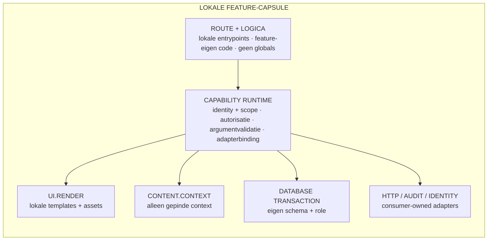

*Figuur 9. Een request blijft na activatie binnen de lokale featuregrens en bereikt context, UI, database en externe systemen uitsluitend via toegekende capabilities. Tekstequivalent: Runtimeflow van lokale route naar featurelogica, consumer-capability en featuregebonden UI-, context- en databaseoperaties.*

### Voorbeeld: een portable kennisnotitie

Stel dat `KnowledgeBrief@1.0.0` een scherm biedt waarin een medewerker een notitie start. De GET-route rendert de lokale featureview met de lokaal gepinde designrelease. De POST-route is door de consumer voorzien van authenticatie en CSRF-controle. De controller vraagt via `content.context.v1` alleen de geselecteerde context op en schrijft via `database.transaction.v1` uitsluitend naar het eigen schema. De output van generation wordt niet rechtstreeks gepubliceerd, maar als intermediate aan de UCF-validationstage gekoppeld.

Dezelfde feature-release kan daarna in een tweede consumer worden geïnstalleerd. Die consumer kan een andere lokale provideradapter of een andere targetprefix voor het databaseschema gebruiken. De featurebytes en vier release-identiteiten blijven gelijk; alleen consumerconfiguratie en lokale materialisatie verschillen. Dat is de portabilitytest in de praktijk.

## De UI-peer - Design als versieerbaar releaseproduct

### Waarom UI een zelfstandige peer is

Wanneer design impliciet in een centrale applicatieshell of CDN zit, kan een feature niet aantonen met welke componenten en states zij is getest. Een globale designupdate kan dan onverwacht alle features wijzigen. De UI-peer behandelt design daarom als een zelfstandig, immutable releaseproduct. Een feature pint één exacte designrelease en installeert daarvan een lokale kopie.

De UI-release bevat geen klantnaam, productidentiteit of remote asset. Zij levert generieke primitives waarmee features consistente, toegankelijke interfaces kunnen bouwen. Branding en targetbinding kunnen op consumer-niveau worden toegevoegd, zonder de ondertekende designrelease te herschrijven.

### Opbouw van een designpackage

Een generiek designpackage kan deze structuur hebben:

```text
universal-layout/
  README.md
  CHANGELOG.md
  tokens.json
  tokens.css
  shell.css
  components.css
  interaction.js
  components/
    badge.php
    button.php
    card.php
    field.php
    table.php
  views/
    dashboard/
      view.php
      view.css
      view.js
      states.json
      test.php
    list-table/
      ... hetzelfde viewcontract ...
    form/
      ... hetzelfde viewcontract ...
```

De opbouw werkt van abstract naar concreet:

- `tokens.json` is de machineleesbare bron voor kleur, ruimte, radius en typografie;
- `tokens.css` vertaalt die waarden naar lokaal toepasbare CSS-variabelen;
- `shell.css` definieert de algemene pagina- en navigatiestructuur;
- `components.css` en `components/` leveren herbruikbare primitives;
- `interaction.js` bevat generiek gedrag zonder framework- of CDN-afhankelijkheid;
- iedere view bundelt markup, scoped CSS, vanilla JavaScript, states en een smoke test;
- `README.md` en `CHANGELOG.md` maken bedoeling en versie-evolutie reviewbaar.

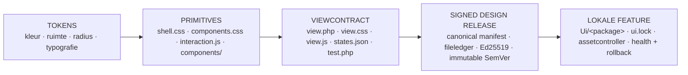

*Figuur 10. Tokens vormen de basis; componenten en viewcontracten worden samen als één ondertekende designrelease lokaal in een feature gematerialiseerd. Tekstequivalent: Gelaagd UI-diagram van tokens via shell en componenten naar views, states, tests, signed release en lokale featurekopie.*

> Een nieuwe designversie verandert geen feature totdat een nieuwe exacte pin is gereviewd.

### Een view is meer dan markup

Een viewcontract beschrijft niet alleen de standaardweergave, maar ook relevante toestanden. Een dashboard kan bijvoorbeeld deze metadata bevatten:

```json
{
  "view": "dashboard",
  "states": ["default", "loading", "empty", "error", "success"],
  "responsive": true,
  "accessibility": [
    "keyboard",
    "focus-visible",
    "semantic-landmarks",
    "reduced-motion"
  ]
}
```

Hierdoor worden empty, loading en error geen late uitzonderingen in featurecode. Zij zijn onderdeel van het gereviewde designcontract. De bijbehorende smoke test bewijst minimaal dat markup kan renderen en de verwachte assets en states bestaan. Functionele businesslogica blijft in de feature; generieke visuele patronen blijven in UI.

### Publicatie en immutable versies

De UI-publisher scant de volledige designpackage, weigert onveilige paden en externe runtime-assets, maakt een canonical fileledger en ondertekent het manifest. Publicatie naar een bestaande naam en versie is alleen idempotent wanneer alle bytes identiek zijn. Een wijziging vraagt een nieuwe SemVer-versie.

Dit geeft teams twee soorten vrijheid. De UI-peer kan nieuwe designversies publiceren zonder features automatisch te veranderen. Een featureteam kan na review een nieuwe UI-pin kiezen zonder de UCF-context of DB-release te wijzigen. De composite maakt zichtbaar welke combinatie samen is getest.

### Lokale materialisatie en serving

Tijdens installatie downloadt de consumer ieder gedeclareerd UI-bestand naar staging, controleert grootte en hash en valideert het complete manifest nogmaals tegen de staged directory. Onder een exclusieve lock wordt de bestaande lokale UI-map naar rollback verplaatst en de kandidaat atomisch geactiveerd. Daarna schrijft de consumer een ondertekende install receipt die release-identiteit, manifestdigest, targetfeature en fileledger bevat.

Health wordt pas op de nieuwe lokale kopie uitgevoerd. Mislukt health, dan verhuist de kandidaat naar failed of quarantine en wordt de vorige designmap hersteld. Wanneer de store niet beschikbaar is of een checksum niet klopt, blijft de actieve UI byte-identiek.

Normale requests laden CSS, JavaScript, componenten en viewtemplates uit de featuregebonden lokale map. Een assetcontroller normaliseert het aangevraagde pad, controleert dat het binnen de owning feature blijft en serveert alleen toegestane bestanden. De UI Store is dus nodig voor discovery en update, niet voor het renderen van een scherm.

### Voorbeeld: design onafhankelijk actualiseren

Een kennisnotitiefeature gebruikt aanvankelijk `universal-layout@2.1.0`. UI publiceert later `2.2.0` met verbeterde focusstates en een nieuw reportpatroon. De actieve feature verandert niet. Het featureteam test eerst dezelfde featurecode, UCF-bundle en DB-release met de nieuwe designpin. Na review publiceert het een nieuwe composite die alleen de UI-pin wijzigt. Preflight en health bewijzen de combinatie; rollback kan de vorige designkopie herstellen zonder context of data terug te zetten.

## De DB-peer - Schema als zelfstandig contract

### Waarom database-evolutie niet verborgen blijft in code

Een portable feature heeft persistentie nodig, maar mag geen algemene databasegebruiker of consumerbreed schema bezitten. De DB-peer maakt database-evolutie daarom een zelfstandig releaseproduct. De package beschrijft uitsluitend schema, migraties, grants, validatietests en documentatie. Live data, klantdumps, secrets, backups en productiebindings zijn expliciet uitgesloten.

Door DB als peer te behandelen kan een databasewijziging apart worden gereviewd, ondertekend en gepind. De feature declareert welk neutraal databasecontract zij verwacht; de consumer materialiseert dat contract naar een lokaal, featuregebonden schema en rollenmodel.

### Opbouw van een databasepackage

```text
KnowledgeBriefDb/
  db-package.json
  docs/
    README.md
  files/
    migrations/
      001_create_briefs.sql
      002_add_review_status.sql
    grants/
      grants.sql
    schema/
      schema.md
    tests/
      isolation.sql
```

`db-package.json` is de descriptor van de release:

```json
{
  "protocol_version": 1,
  "kind": "database-package",
  "name": "KnowledgeBriefDb",
  "version": "1.0.0",
  "schema": "knowledge_brief",
  "migrations": "files/migrations",
  "grants": "files/grants",
  "schema_files": "files/schema",
  "tests": "files/tests",
  "docs": "docs"
}
```

De schema-identiteit is target-neutraal. Een package maakt geen database of rol aan, kent geen wachtwoord toe en schrijft geen vaste consumerprefix. Grants gebruiken een door de consumer ingevulde rolplaceholder. Een migration kan bijvoorbeeld een tabel maken, maar geen live records seeden:

```sql
CREATE TABLE briefs (
    brief_id bigint GENERATED ALWAYS AS IDENTITY PRIMARY KEY,
    title text NOT NULL,
    review_status text NOT NULL,
    created_at timestamptz NOT NULL DEFAULT now()
);
```

```sql
GRANT SELECT, INSERT, UPDATE, DELETE
ON briefs TO __FEATURE_RW_ROLE__;
```

De publisher weigert onder meer data-inserts, database- of rolcreatie, passwords, owners, restorecommando's en bestanden buiten de schema-only layout. Bestaande migraties zijn append-only: een nieuwe release voegt `003_...sql` toe en herschrijft niet de bytes van `001_...sql`.

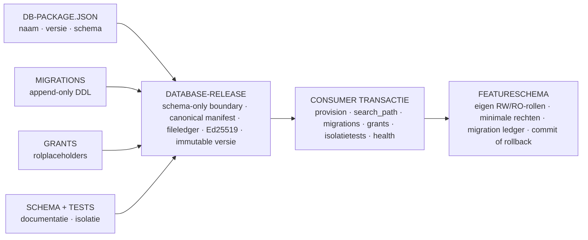

*Figuur 11. De DB-peer publiceert alleen een schema-contract; de consumer materialiseert het transactioneel naar één lokaal featureschema met minimale rollen en een migration ledger. Tekstequivalent: DB-diagram van descriptor, migraties, grants, schema en tests via signed release naar featuregebonden schema, rollen en ledger.*

> **Niet in de release:** live data · secrets · backups · vaste consumerprefix · cross-feature toegang.

### Publicatie van een database-release

De DB-publisher valideert descriptor, naam, SemVer, neutrale schema-identiteit, layout en SQL-grenzen. Daarna bouwt hij een fileledger met veilige relatieve paden, groottes en SHA-256-digests. Het canonical manifest krijgt releasekind `database-release`, wordt digitaal ondertekend en atomisch in immutable opslag geplaatst.

Een identieke replay van dezelfde naam en versie is idempotent. Andere bytes onder dezelfde identity leveren een immutable conflict. De download-API serveert alleen bestanden die in het manifest staan en controleert hun grootte en digest opnieuw voordat zij worden afgegeven.

### Materialisatie in de consumer

De consumer vertaalt de neutrale schema-identiteit deterministisch naar een lokaal featureschema. Hij maakt of controleert een read/write-rol en, waar nodig, een read-onlyrol met minimale privileges. Die rollen zijn geen superuser, kunnen geen databases of rollen maken en krijgen geen toegang tot schemas van andere features.

Tijdens activatie gebeurt het volgende binnen één databasetransactie:

1. Het eigen schema en de vereiste rollen worden geprovisioneerd of gecontroleerd.
2. De transactionele `search_path` wordt beperkt tot het eigen schema en tijdelijke objecten.
3. Migraties worden in vaste bestandsvolgorde uitgevoerd.
4. Iedere migration identifier en digest wordt in een featurespecifieke ledger vastgelegd.
5. Grants worden op de gematerialiseerde rollen toegepast.
6. Schema- en isolatietests controleren de verwachte objecten en negatieve toegang tot andere schemas.
7. De featurecandidate wordt geladen en health wordt uitgevoerd terwijl de transactie nog beheersbaar is.
8. Alleen bij succes volgt commit; anders volgt rollback en blijft de vorige feature actief.

Een reeds geregistreerde migration identifier met andere bytes is fataal. Daardoor kan een package een eerder uitgevoerde databasewijziging niet stilzwijgend herdefiniëren.

### Toegang tijdens normale requests

Portable featurecode ontvangt geen PDO- of driverhandle. Zij opent een featuregebonden databasetransactie via een capability. De sessie biedt begrensde operaties voor geparametriseerde statements en bestaat alleen binnen de owning transaction. Schemanamen, hosts en credentials zijn geen feature-input.

Dit voorkomt twee veelvoorkomende portabilityproblemen: SQL die een environmentnaam hardcodeert en code die per ongeluk een tabel van een andere feature leest. De consumer bezit verbinding, autorisatie, timeouts, search path en logging; de feature bezit alleen haar neutrale datacontract en query-intentie.

### Voorbeeld: een schema veilig uitbreiden

Versie `1.1.0` van de kennisnotitiefeature heeft een reviewdatum nodig. DB publiceert `KnowledgeBriefDb@1.1.0` met een nieuwe append-only migration. De featurepublisher declareert de nieuwe DB-pin, maar wijzigt de design- of contextpin niet. Preflight controleert dat het descriptor-schema overeenkomt met de featureverwachting. Bij activatie wordt de kolom transactioneel toegevoegd en health op de kandidaat uitgevoerd. Mislukt de nieuwe route of isolationtest, dan wordt de databasehandeling teruggedraaid en blijft de vorige composite last-known-good.

### De drie peers naast UCF

Features, UI en DB hebben dezelfde integriteitsladder maar verschillende inhoudelijke grenzen. Features bezitten uitvoerbaar gedrag, UI bezit generieke interactie- en presentatieregels, DB bezit schema-evolutie en UCF bezit betekenis, context en governance. Geen van de peers mag de private runtimeconfiguratie van een andere peer overnemen. Hun samenhang ontstaat uitsluitend door exacte pins, manifestdigests en lokaal gecontroleerde materialisatie.

## Praktijkvoorbeeld 1 - Een gecontroleerde beleidsnotitie

### De opdracht

Een beleidsafdeling wil een besluitnotitie van twee pagina’s laten voorbereiden over energiebesparende maatregelen voor kantoorgebouwen. De notitie moet aansluiten op de actuele organisatiedoelen, relevante regelgeving en interne meetgegevens. Persoonsgegevens en ruwe gebouwsensorlogs mogen niet naar een model worden gestuurd. Juridische review is verplicht vóór publicatie.

Dit voorbeeld is fictief, maar de artifacts en gates volgen de UCF-structuur.

### Workspace manifest

De workspace begint met een manifest dat doel en eigenaarschap benoemt:

```yaml
slug: beleidsnotitie-energiebesparing
title: Beleidsnotitie energiebesparing
manifest_version: 1
status: reviewed

purpose:
  outcome: Besluitrijpe notitie van maximaal twee pagina's
  audience: Directieteam

review:
  owner_role: Beleidsadviseur duurzaamheid
  reviewer_role: Juridisch adviseur
  approval_state: approved_for_runs
```

Er staat geen modelnaam, endpoint of credential in het manifest. Deze waarden behoren tot de consumer en kunnen per omgeving verschillen.

### Workflowcontext en data boundary

De workflowcontext definieert de toegestane input en output:

```yaml
routing:
  input: approved_intake
  output: decision_note_pdf
  reviewer: legal_review

data_boundary:
  classification: internal
  allowed:
    - approved_policy_documents
    - regulation_summaries
    - aggregated_energy_kpis
  forbidden:
    - personal_data
    - raw_sensor_events
    - credentials

model_boundary:
  provider: consumer_selected
  retention: no_training
  human_approval_required: true
```

### References en policies

Context selection beoordeelt vijf kandidaatbronnen. Drie worden geselecteerd:

| Kandidaat | Besluit | Reden |
|---|---|---|
| Organisatiedoelen, versie 3 | Geselecteerd | Actueel en bestuurlijk goedgekeurd. |
| Samenvatting regelgeving | Geselecteerd | Juridisch gereviewde bron. |
| Geaggregeerde energie-KPI’s | Geselecteerd | Nodig voor impactinschatting; geen persoonsgegevens. |
| Ruwe sensordata | Afgewezen | Niet noodzakelijk en buiten de dataminimalisatiegrens. |
| Oude conceptstrategie | Afgewezen | Vervangen door versie 3. |

De policyset vereist bronverwijzingen bij feitelijke claims, een aparte sectie voor onzekerheden, neutrale beleidstaal en juridische goedkeuring. De contextselectie-output bevat de drie exacte version identifiers en hashes.

### Generation

De generation-adapter ontvangt de intake, policyset en drie geselecteerde bronnen. De adapter mag een `respond`-operatie uitvoeren en retourneert een intermediate met tekst, context usage en niet-geheime uitvoeringsmetadata. De output wordt als `pending_validation` opgeslagen.

Een illustratieve runledger ziet er zo uit:

```json
{
  "run_id": "run-2026-08-0021",
  "workspace": "beleidsnotitie-energiebesparing",
  "stage": "generation",
  "context_versions": ["goals-v3", "regulation-summary-v2", "energy-kpi-q2"],
  "output_digest": "sha256:…",
  "status": "pending_validation"
}
```

De ellips in het digestveld staat alleen in dit leesvoorbeeld. Een echte ledger bevat de volledige digest.

### Validation

De validation-stage voert vier controles uit:

1. Iedere feitelijke claim heeft een verwijzing naar één van de geselecteerde bronnen.
2. De tekst bevat geen persoonsgegevens of ruwe sensordetails.
3. De aanbevolen maatregelen zijn van aannames en onzekerheden voorzien.
4. De juridisch reviewer heeft de exacte outputdigest goedgekeurd.

Wanneer één claim geen bron heeft, wordt de run afgewezen. Een herstelrun kan aanvullende context selecteren of een nieuwe generation uitvoeren. De afgewezen intermediate blijft als bewijs bestaan, maar kan niet worden gepubliceerd.

### Publication

Na goedkeuring bindt de publish-stage het resultaat aan het documentmanagementdoel. De publicatie bevat de PDF, publicatiedigest, validatieresultaat, reviewerbesluit en rollbackreferentie. De doelapplicatie ontvangt alleen de goedgekeurde output; contextselectie en providercredentials worden niet meegepubliceerd.

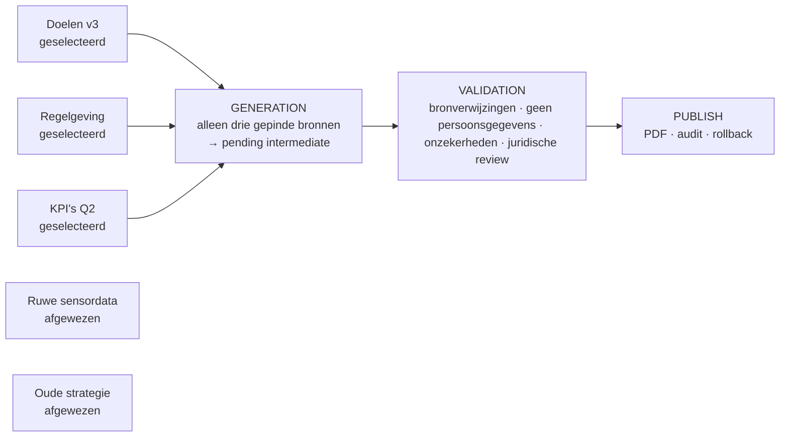

*Figuur 12. Het beleidsnotitievoorbeeld laat zien hoe drie goedgekeurde bronnen via generation en juridische review tot één publicatie leiden. Tekstequivalent: Praktijkflow met vijf kandidaatbronnen, drie contextpins, generation, vier validationchecks en publication.*

### Wat dit voorbeeld aantoont

Het voorbeeld laat zien dat UCF meer is dan promptbeheer. Het beheert de complete beslisketen rondom de prompt: opdracht, bronselectie, dataminimalisatie, policy, intermediate, review en publicatie. Wanneer later een andere provider wordt gekozen, blijven deze artifacts bruikbaar.

## Praktijkvoorbeeld 2 - Van cloudmodel naar lokaal model

### Aanleiding

De beleidsworkflow uit het eerste voorbeeld draait aanvankelijk via een goedgekeurde cloudprovider. Voor vertrouwelijke scenarioanalyses wil de organisatie later een lokaal model gebruiken. In een applicatiegebonden ontwerp zouden prompt, connector, modelconfiguratie en reviewlogica samen moeten worden gemigreerd. In UCF verandert alleen de consumer-owned adapterbinding, zolang de nieuwe adapter hetzelfde capabilitycontract ondersteunt.

### Wat gelijk blijft

- Het workspace-manifest en purpose.
- De data boundary en policies.
- De vijf stagecontracten.
- De identifiers en hashes van geselecteerde context.
- De validationchecks en menselijke review.
- Het formaat van de run- en publicatieledger.

### Wat verandert

- De lokale adapterbinding voor de modelcapability.
- De provider-specifieke credential en endpointconfiguratie.
- Eventueel de allowlist van modellen en generationparameters.
- De uitvoeringseigenschappen zoals latency, contextlimiet en kostenmetadata.

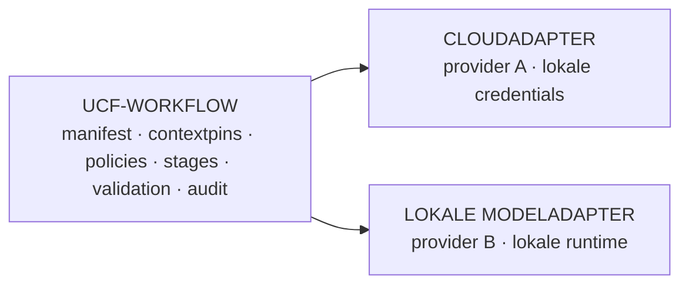

*Figuur 13. De context- en governanceketen blijft gelijk terwijl alleen de consumeradapter van cloud naar lokaal model wisselt. Tekstequivalent: Vergelijking van één UCF-workflow met een cloudadapter en een lokale modeladapter.*

> Beide adapters implementeren hetzelfde capabilitycontract.

### Vergelijkbare validation

Omdat beide runs dezelfde contextpins en validationpolicy gebruiken, kunnen resultaten gericht worden vergeleken. De reviewer ziet niet alleen twee teksten, maar ook:

- welke provideradapter en modelklasse zijn gebruikt;
- welke generationparameters verschilden;
- of context usage binnen de afgesproken grens bleef;
- welke claims of onzekerheden veranderden;
- of beide outputs dezelfde kwaliteitsdrempel haalden.

Vendor-onafhankelijkheid betekent hier niet dat modellen identieke output produceren. Het betekent dat de organisatie haar context, workflow en beoordelingskader behoudt en providerresultaten onder dezelfde governance kan evalueren.

### Fail-closed gedrag

Wanneer het lokale target geen passende modeladapter aanbiedt, wordt de capability niet beschikbaar. De workflow krijgt een expliciete `provider_unavailable`-uitkomst. Zij valt niet terug naar een oude provider zonder review, want zo’n verborgen fallback zou zowel de data boundary als het auditspoor ondermijnen.

## Praktijkvoorbeeld 3 - Een portable AI-feature

### Waarom vier artifactsoorten

Een volledige toepassing bestaat uit meer dan context. Zij heeft uitvoerbare logica, een gebruikersinterface en vaak een databaseschema nodig. Het portable platform verdeelt die verantwoordelijkheden over vier zelfstandig publicerende peers:

| Peer | Bezit | Publiceert |
|---|---|---|
| Feature | Uitvoerbare logica, routes en capability-eisen. | Feature-release |
| UI | Design tokens, componenten, views en assets. | Design-release |
| UCF | Context, policies, references en stages. | Context-release |
| DB | Migraties, grants, schemabeschrijving en isolatietests. | Database-release |

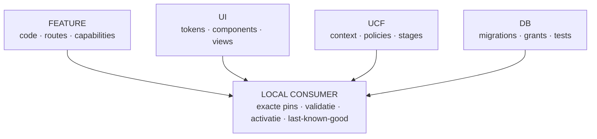

*Figuur 14. Vier peers publiceren zelfstandig; een consumer combineert alleen exacte, gevalideerde versies. Tekstequivalent: Publiceerbaar vier-peer diagram met Feature, UI, UCF en DB rond een lokale consumer.*

Deze scheiding voorkomt dat context wordt verstopt in code, dat database-evolutie als informele SQL in een featuremap leeft of dat designupdates automatisch de betekenis van een workflow wijzigen.

### Illustratieve composite

Een fictieve feature voor kennisnotities kan de volgende exacte versies pinnen:

```json
{
  "code": "KnowledgeBrief@1.0.0",
  "ui": ["universal-layout@2.1.0"],
  "ucf": "knowledge-brief-context@3.2.0",
  "db": "KnowledgeBriefDb@1.0.0"
}
```

De code-release declareert daarnaast de capabilities die zij nodig heeft, bijvoorbeeld context lezen, UI-rendering, gecontroleerde routes en een featuregebonden databasetransactie. Het target moet iedere capability lokaal aanbieden voordat installatie mag beginnen.

### Preflight

Preflight haalt of inspecteert de vier exacte manifests en alle gedeclareerde bestanden. De consumer valideert:

1. Release-identiteit en versie.
2. Digitale signature tegen de lokale trust store.
3. Canonical manifestdigest.
4. Pad, grootte en SHA-256 van ieder bestand.
5. Core compatibility en capabilitymatch.
6. Target-neutraliteit van feature- en contextbytes.
7. Binding van de context aan dezelfde feature.
8. Gelijkheid van het neutrale featureschema en het DB-descriptorschema.
9. Eventuele immutable cacheconflicten.

Preflight schrijft niets. Daardoor kan dezelfde technische changebarrière vóór een onderhoudsvenster worden uitgevoerd zonder de actieve toepassing te wijzigen.

### Activatie

Na goedgekeurde preflight worden dependencies inert in lokale caches geplaatst. De consumer maakt een stagingfeature, materialiseert context en databasecontract en resolveert het exacte design. Onder een exclusieve featurelock begint één databasetransactie voor schema, migraties, grants en isolatietests.

Pas daarna wisselt de consumer de stagedirectory en actieve directory atomisch om. Lokale provenance locks leggen de vier pins, manifestdigests, signing identities en materialisatiepaden vast. Loader, routes en health worden gecontroleerd voordat de databasecommit definitief wordt bevestigd.

Bij een fout wordt de databasetransactie teruggedraaid, de kandidaat in quarantine geplaatst en de vorige feature, configuratie en locks hersteld. De gebruiker blijft daardoor op de vorige last-known-good versie.

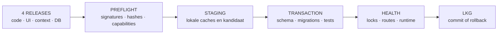

*Figuur 15. Preflight valideert eerst de hele composite; activatie koppelt filesystem, database, health en rollback. Tekstequivalent: End-to-end portable featureflow van vier releases via preflight en staging naar lokale last-known-good runtime.*

> **Fout vóór commit → DB rollback + candidate quarantine + vorige versie terug.**

### Werken zonder stores

Na activatie bouwt de consumer routes, UI, contextreads en databasetransacties uitsluitend uit lokale, geverifieerde state op. De vier stores zijn nodig voor discovery en nieuwe releases, maar niet voor normale requests. Een netwerkstoring kan een update vertragen zonder de actieve toepassing te stoppen.

Dit is de operationele vertaling van vendor- en store-onafhankelijkheid: niet iedere component hoeft continu online te zijn zolang de consument een aantoonbaar geldige lokale composite bezit.

## Vertrouwen, security en datagrenzen

### Vertrouwen zit in bewijs, niet in locatie

Een package is niet vertrouwd omdat het van een bekende URL komt. Vertrouwen ontstaat door een lokale combinatie van review, gepinde publieke sleutel, digitale signature, canonical manifest, fileledger, exacte versie en targetpolicy.

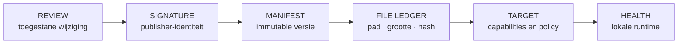

*Figuur 16. De consumer bouwt vertrouwen stapsgewijs op en activeert alleen wanneer iedere laag geldig is. Tekstequivalent: Trustketen van menselijke review via signature en filehashes naar capability- en healthcontrole.*

> Een bekende locatie is geen bewijs; iedere laag moet lokaal geldig zijn. **alleen dan → active last-known-good.**

Iedere release-identiteit is immutable. Dezelfde naam en versie kunnen alleen idempotent opnieuw worden aangeboden wanneer de complete canonical inhoud gelijk is. Andere bytes onder dezelfde identiteit leveren een conflict. Daarmee kan een publisher een reeds gereviewde versie niet stilzwijgend vervangen.

### Target-neutraliteit

Portable packagebytes bevatten geen target-id, deploymentenvironment, lokaal endpoint, credentials, consumer-namespace, vaste schemaprefix of concrete adapterclass. Deze gegevens ontstaan pas in de consumer. Dezelfde release kan daardoor in meerdere omgevingen worden gebruikt zonder opnieuw te worden ondertekend.

### Capability-isolatie

Portable featurecode krijgt geen algemene service locator of raw systeemtoegang. De runtimeinterface geeft alleen feature-identiteit, de toegekende capabilitynamen en een invokegrens. Risicovolle globale PHP-functies, processglobals, dynamische includes, process execution en raw databasehandles worden aan de packagegrens geweigerd.

Dit is defense in depth, geen claim dat willekeurige vijandige PHP-code een formeel bewezen sandbox kan worden. Publisherreview, trusted keys, afzonderlijke OS-processen, minimale netwerktoegang en databasegrants blijven belangrijk.

### Database-isolatie

Iedere feature krijgt op het target een eigen lokaal schema en eigen read/write- en eventueel read-only rol. De runtime role kan geen databases, rollen of schemas creëren. Transacties gebruiken een lokale search path naar uitsluitend het eigen schema en tijdelijke objects. Een feature krijgt geen usage-recht op het schema van een andere feature.

Database-releases bevatten alleen migraties, grants, schemabeschrijvingen, tests en documentatie. Live data, secrets, klantdumps en restorepayloads zijn uitgesloten. Een migration identifier wordt samen met zijn digest geregistreerd; hergebruik van dezelfde identifier met andere bytes is fataal.

### HTTP- en beheergrens

State-changing routes vereisen een geauthenticeerde beheersessie en CSRF-controle voordat de featurehandler wordt aangeroepen. Beheerresponses worden niet gecachet. Diagnostische databaseviews zijn standaard verborgen en, wanneer expliciet geactiveerd, beperkt tot vertrouwde lokale bronnen en read-only single statements.

### Secrets

Private signing keys, databasecredentials en providersecrets zijn consumerstate. Zij horen niet in source control, releases, healthresponses, auditcontext of workspacebestanden. Een contextpackage beschrijft welke providerklasse is toegestaan; de feitelijke credential blijft lokaal.

## Audit, continuïteit en herstel

### Van run naar publicatiebewijs

Een complete run verbindt de volgende objecten:

- intake-id en goedkeuring;
- contextversion identifiers en digests;
- policyversies;
- generationparameters en adapteridentiteit;
- intermediate outputdigest;
- validationchecks en evidence;
- reviewerbesluit;
- publicatiedigest, targetbinding en rollbackreferentie.

Het auditspoor hoeft niet ieder bronbestand of iedere promptbyte onbeperkt te dupliceren. Het bewaart voldoende identiteit en digests om de gebruikte objects terug te vinden en wijzigingen te detecteren, binnen de afgesproken retentie en classificatie.

### Last-known-good

Een consumer gebruikt alleen een volledig gevalideerde artifactset als actief. Nieuwe releases worden eerst staged. De vorige versie blijft beschikbaar als rollbackcandidate totdat migration, routes en health zijn geslaagd. Store-uitval, timeout, invalid signature en checksumfout wijzigen de actieve files niet.

### Backup en restore

Een bruikbare backup omvat meer dan een database. Zij moet ook lokale releases, activatiestatus, trust, locks, targetreports en relevante workspacecontext bevatten. Restore valideert eerst archive- en filechecksums en de databasedump. Filesystemwissels gebruiken same-volume staging en rollbackcopies; databasereplay gebeurt transactioneel.

### Recovery na een onzekere commit

Filesystemrename en databasecommit vormen geen native distributed transaction. Daarom bewaart de activatie een journal en receipt. Wanneer een proces rond commit wegvalt, gebruikt recovery de verwachte feature-identiteit, locks, manifestdigests en receipt om vast te stellen of het bedoelde resultaat werkelijk actief is. Een onbekende directory wordt niet als succesvol geaccepteerd.

### Ondertekende targetreports

Na succesvolle installatie of activatie kan het target een lokaal ondertekend report publiceren. Het report bevat release- en installed-artifactdigests, targetprofielhash, resultaat en niet-geheime diagnostische codes. Delivery is durable: wanneer de receiver offline is, blijft het report lokaal in de queue en kan het later worden verzonden zonder dat vertraagde evidence een nieuwere targetstatus overschrijft.

## Wat UCF wel en niet automatiseert

### Wat nu expliciet is gebouwd

Het UCF biedt een generieke, atomisch scaffoldbare workspace; manifests en workflowcontext; policy-, reference- en contractstores; contextpublication; immutable releases; capabilitygrenzen; audit; portable composite onboarding; lokale activatie, rollback en last-known-good runtime.

De vijf stagecontracten zijn aanwezig als governancecontracten. Zij maken vereiste input, output en gates expliciet. Een organisatie kan deze contracts handmatig, via een workflowservice of via featurecode uitvoeren zonder de betekenis van de stages te wijzigen.

### Wat niet wordt verondersteld

De generieke scaffold kiest geen klant, datasource, model of vendor. Een modelprovider is pas operationeel wanneer de consumer een gereviewde adapter aanbiedt. Ontbrekende providers leveren een zichtbare unavailable-status. Er is geen verborgen modelkeuze en geen automatische publicatie omdat een bestand bestaat.

Het UCF moet daarom niet worden gepresenteerd als een volledig autonome multi-agentomgeving. Het is primair sterk voor workflows die sequentieel, reviewbaar, herhaalbaar en auditbaar moeten zijn. Hoogfrequente realtime automation, complexe parallelle agents en onbegrensde autonome tooluitvoering vragen aanvullende orchestration- en isolationengineering.

> EERLIJKE GRENS - UCF standaardiseert de context- en governanceketen. Het vervangt niet de inhoudelijke eigenaar, reviewer, modelprovider of operationele beheerorganisatie.

## Invoering in een organisatie

### Begin bij één beslisproces

Een succesvolle invoering start niet met een centrale catalogus van alle bedrijfsdata. Kies één workflow met herkenbare bronset, duidelijke owner, controleerbare output en bestaande review. Een beleidsnotitie, klantadvies, risicoanalyse of gecontroleerd RFP-antwoord is geschikter dan een organisatiebrede autonome agent.

### Stap 1 - Definieer doel en governance

Maak het workspace-manifest en benoem owner, reviewer, data-classificatie, output en stopcondities. Beslis welke delen van de workflow menselijk moeten blijven.

### Stap 2 - Breng context en policies onder beheer

Inventariseer kandidaatbronnen, maar pin alleen goedgekeurde versies. Documenteer ownership, gevoeligheid, retentie en toegestane use cases. Maak policies afzonderlijk reviewbaar.

### Stap 3 - Formaliseer de vijf stages

Pas de generieke stagecontracten toe op het gekozen proces. Definieer per stage exacte input, output, gate en evidence. Houd generation en publication strikt gescheiden.

### Stap 4 - Bind een provideradapter

Kies een model- of systeemprovider op het consumer-niveau. Leg modelallowlist, regio, retentie, kostenlimiet, timeout, retry en logging vast. Geef de feature alleen de noodzakelijke capability.

### Stap 5 - Draai één golden run en één failure run

Voer een volledig goedgekeurde run uit en archiveer het bewijs. Forceer daarna een fout, bijvoorbeeld ontbrekende context, afgewezen validation of provider unavailable. Controleer dat publication wordt geblokkeerd en de fout zichtbaar blijft.

### Stap 6 - Maak de workflow portable

Publiceer context, feature, UI en databasecontract onafhankelijk. Voer preflight en lokale activatie uit. Test daarna dat de actieve toepassing blijft werken wanneer de stores tijdelijk niet bereikbaar zijn.

### Stap 7 - Schaal via hergebruik

Hergebruik policies, stagecontracten en adapters alleen wanneer hun scope dat toestaat. Maak nieuwe workspaces voor nieuwe doelen of data boundaries. Meet niet alleen outputvolume, maar ook contextkwaliteit, afwijzingen, reviewdoorlooptijd, providerafhankelijkheid en rollbackbaarheid.

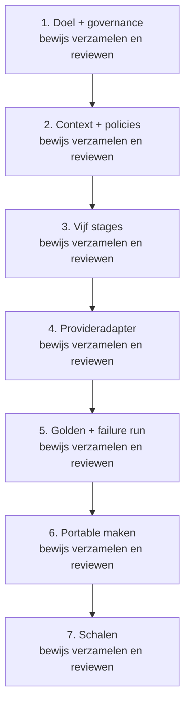

*Figuur 17. Een beheersbare invoering groeit van één beslisproces via een golden run naar portable hergebruik. Tekstequivalent: Zevenstaps adoptiepad voor UCF in een organisatie.*

## Conclusie

Het Universeel Context Fundament maakt de context rond AI expliciet, bestuurbaar en overdraagbaar. Het scheidt organisatiedoel van modeluitvoering, bronselectie van technische bereikbaarheid, generatie van publicatie en portable artifacts van lokale consumerconfiguratie.

De kracht van het ontwerp ligt in de combinatie. Een workspace maakt betekenis leesbaar. Stagecontracten maken de workflow controleerbaar. Adapters maken providers vervangbaar. Immutable releases en exacte pins maken distributie reproduceerbaar. Lokale last-known-good state maakt de runtime minder afhankelijk van stores. Audit en rollback maken verandering verantwoord.

Daarmee verschuift AI-governance van een verzameling documenten en afspraken naar een uitvoerbaar architectuurpatroon. De organisatie kan modellen, clouds en applicaties blijven veranderen zonder telkens opnieuw te bepalen welke context geldig is en wie publicatie mag goedkeuren.

Een UCF is dus geen extra laag om snelheid te vertragen. Het is de laag die maakt dat snelheid kan worden herhaald, uitgelegd en teruggedraaid. Juist daardoor kan AI van experiment uitgroeien tot een betrouwbaar onderdeel van de bedrijfsvoering.

## Bijlage A - Illustratief workspace-manifest

Onderstaand voorbeeld is generiek. Rollen en bindings worden door de organisatie ingevuld; secrets en endpoints blijven buiten het manifest.

```yaml
slug: kennisnotitie
title: Kennisnotitie
created_at: 2026-08-02T12:00:00Z
manifest_version: 1
status: reviewed

purpose:
  outcome: Een gereviewde kennisnotitie
  audience: Interne besluitvormers
  exclusions:
    - Persoonsgegevens
    - Niet-goedgekeurde bronnen

bindings:
  ui_packages:
    - universal-layout@2.1.0
  context_bundles:
    - knowledge-context@3.2.0
  features:
    - KnowledgeBrief@1.0.0

review:
  owner_role: Knowledge owner
  reviewer_role: Independent reviewer
  last_reviewed: 2026-08-02
  approval_state: approved_for_runs
```

## Bijlage B - Illustratief stagecontract

```yaml
stage: validation
version: 1

required_inputs:
  - immutable_generation_output
  - selected_context_ledger
  - applicable_policy_set

checks:
  - schema_valid
  - required_sources_present
  - forbidden_data_absent
  - uncertainty_marked
  - reviewer_approved

outputs:
  - validation_result
  - evidence_digests
  - reviewer_decision

gate:
  advance_when: all_required_checks_pass
  on_failure: block_publication
```

## Bijlage C - Begrippenlijst

**Adapter.** Consumer-owned verbinding tussen een neutraal capabilitycontract en een concrete provider of systeem.

**Capability.** Versiegebonden operatie die een target gecontroleerd aan een feature aanbiedt.

**Cold-startproef.** Controle of een mens of agent zonder eerdere sessiekennis doel, route, input, output, gate en status uit de workspace kan afleiden.

**Composite.** Exacte combinatie van featurecode, design, context en databasecontract.

**Contextbundle.** Gepubliceerde, versioned set van context, policies, references en eventueel stages.

**Context selection.** Workflowstage waarin exacte contextversies worden geselecteerd, gepind of met reden afgewezen.

**Gate.** Voorwaarde die bepaalt of een stage naar de volgende stage mag overgaan.

**Intermediate.** Immutable tussenoutput die nog niet voor publication is goedgekeurd.

**Ingang.** Kleine, stabiele router die identiteit en navigatie biedt zonder inhoudelijke contextpayload over te nemen.

**Last-known-good.** Laatste volledig geverifieerde lokale artifactset die actief mag blijven.

**Policy.** Reviewbare regel voor data, kwaliteit, generatie, validation of publication.

**Preflight.** Volledige technische validatie van een composite zonder persistente mutatie.

**Provenance.** Herleidbare informatie over oorsprong, versie, verwerking en review van een artifact.

**Reference.** Goedgekeurde bron die als context voor een workspace of run kan worden geselecteerd.

**Run.** Eén concrete uitvoering van intake tot en met validation of publication.

**Runartefact.** Input, tussenresultaat, bewijs of publicatie die aan één concrete run is gebonden.

**Stabiele context.** Policies, references, schemas en templates die afzonderlijk van runproducten worden beheerd en over meerdere runs kunnen worden hergebruikt.

**Stagecontract.** Definitie van vereiste input, output en gate van één workflowstage.

**Targetprofiel.** Lokale beschrijving van runtime, capabilities en adapterbindings van een consumer.

**Workspace.** Afgebakende context- en governancecontainer voor één onderwerp, product of workflow.

## Bijlage D - Basis voor deze whitepaper

Deze whitepaper is gebaseerd op de strategische visie “Van twee pilaren naar een Universeel Context Fundament”, de actuele UCF-workspace- en stagecontracten, principes voor leesbare en zelfrouterende workspacearchitectuur, het portable platform wire protocol, de implementatie van workspace scaffolding, contextpublication, capabilityadapters, composite onboarding, transactionele activatie en de bijbehorende technische documentatie.

Om de tekst publiceerbaar en duurzaam te houden bevat deze versie geen lokale repositorypaden, environmentgebonden technische identifiers, interne netwerkdetails, klantnamen of providercredentials. De technische voorbeelden zijn illustratief en gebruiken fictieve namen. Voor implementatie en operations blijft de gecontroleerde technische documentatieset de normatieve bron.

---

## Over deze publicatie

| Eigenschap | Waarde |
|---|---|
| **Document** | Publiceerbare architectuurwhitepaper · toegankelijke GitHub-editie |
| **Auteur** | Dennis Westerman |
| **Versie** | 1.2 |
| **Publicatiedatum** | 11 augustus 2026 |
| **Taal** | Nederlands |
| **Doel** | Uitleggen hoe UCF, Features, UI en DB zijn opgebouwd en end-to-end samenwerken |
| **Doelgroep** | Bestuurders, architecten, securityprofessionals, productowners en engineers |
| **Voorbeelden** | Fictief en vrij van klant-, provider- en environmentgegevens |
| **Publicatieklasse** | Geschikt voor externe publicatie na eigen huisstijl- en juridische review |

[← Vorige: Value Delivery Thread](value-delivery-thread.md) · [Architectuuroverzicht](../../README.nl.md)
