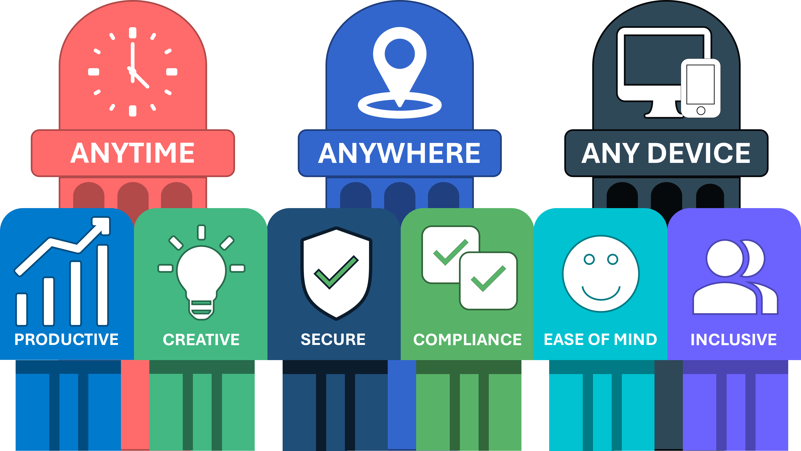

<div align="center">

# Workplace Vision

## Mensen eerst in een digitale toekomst

**Een werkplek moet mensen vrijheid, vertrouwen en duidelijkheid geven — geen extra complexiteit.**

</div>

---

<p align="right"><sub><a href="../en/workplace-vision.md">English</a> · <strong>Nederlands</strong> · <a href="../../README.nl.md">← Architectuuroverzicht</a></sub></p>

<!-- publication-navigation:start -->
<table width="100%">
  <tr>
    <td width="33%" align="center">
      <strong>01 · Workplace Vision</strong><br />
      <sub>Huidige paper · NL</sub>
    </td>
    <td width="33%" align="center">
      <a href="value-delivery-thread.md"><strong>02 · Value Delivery Thread</strong></a><br />
      <sub>Klantbelofte → leveringsbewijs</sub>
    </td>
    <td width="34%" align="center">
      <a href="universal-context-foundation.md"><strong>03 · Universeel Context Fundament</strong></a><br />
      <sub>Organisatiecontext → bestuurbare AI</sub>
    </td>
  </tr>
</table>
<!-- publication-navigation:end -->

## De centrale overtuiging

Het fundament van deze werkplekvisie is eenvoudig: **mensen komen eerst, technologie daarna**.

Technologie verandert snel. Verwachtingen van medewerkers, regeldruk, beveiligingsdreigingen en organisatieprioriteiten veranderen mee. Een duurzame werkplek kan daarom niet rond één product, functieset of implementatiemodel worden gebouwd. Zij moet zijn gebaseerd op menselijke behoeften en organisatieprincipes die betekenisvol blijven terwijl de technologie zich ontwikkelt.

De werkplek moet mensen helpen het beste uit zichzelf te halen door samenwerking natuurlijk te maken, informatie toegankelijk te houden, beveiliging betrouwbaar te organiseren en verandering begrijpelijk te maken. Zij moet kantoormedewerkers, mobiele medewerkers, ploegendiensten, partners en mensen met verschillende mogelijkheden ondersteunen zonder van die verschillen onnodige barrières te maken.

Deze visie beperkt zich niet tot een fysiek kantoor of een verzameling digitale hulpmiddelen. Zij beschrijft een verbonden werkomgeving waarin mensen effectief, veilig en inclusief kunnen bijdragen — ongeacht tijd, locatie of apparaat.

## De werkplek: een fundament van negen pijlers

<p align="center">
  
</p>

De werkplek rust op negen verbonden pijlers. De eerste drie bepalen de vrijheid van toegang. De andere zes bepalen de kwaliteit, het vertrouwen en de ervaring die deze vrijheid duurzaam maken.

### 1. Anytime — flexibel en zonder onnodige beperkingen

Mensen moeten hun werk kunnen uitvoeren op het moment dat bij de activiteit, het team en de organisatie past. Flexibiliteit betekent niet dat structuur ontbreekt; het betekent dat onnodige beperkingen verdwijnen terwijl duidelijke afspraken, verantwoordelijkheden en serviceverwachtingen behouden blijven.

### 2. Anywhere — naadloos toegankelijk

Werk moet veilig en betrouwbaar toegankelijk blijven vanaf kantoor, thuis, een klantlocatie of onderweg. Locatie mag niet bepalen of iemand kan samenwerken, informatie kan bereiken of een goedgekeurde taak kan uitvoeren.

### 3. Any Device — flexibel verbonden

Mensen moeten kunnen werken met geschikte laptops, tablets, smartphones, gedeelde apparaten en gespecialiseerde endpoints. Apparaatkeuze moet aansluiten bij rol, datagevoeligheid, supportbaarheid, toegankelijkheid en beveiliging — zonder de ervaring onnodig inconsistent te maken.

### 4. Productive — versterkend en efficiënt

De werkplek moet terugkerend werk vereenvoudigen, vermijdbare handmatige stappen verminderen en de juiste informatie en acties eenvoudig vindbaar maken. Productiviteit wordt niet alleen in snelheid gemeten; zij omvat ook duidelijkheid, focus, vertrouwen en het vermogen om werk zonder onnodige onderbreking af te ronden.

### 5. Creative — inspirerend voor innovatie

Mensen hebben ruimte nodig om te onderzoeken, ideeën te delen, aannames ter discussie te stellen en samen te bouwen. De werkplek moet experimenteren en samenwerken eenvoudiger maken en tegelijkertijd passende grenzen bieden voor informatie, risico en besluitvorming.

### 6. Secure — betrouwbaar en moeiteloos

Beveiliging is een fundament, geen hindernis. Bescherming moet proportioneel, begrijpelijk en in normaal werk geïntegreerd zijn. Identiteit, apparaatvertrouwen, gegevensbescherming, monitoring en herstel moeten mensen ondersteunen zonder frictie als primaire control te gebruiken.

### 7. Compliance — betrouwbaar en transparant

Beleid en wettelijke verplichtingen moeten worden vertaald naar duidelijk en praktisch gedrag. Mensen moeten begrijpen wat wordt verwacht, systemen moeten controls consistent toepassen en de organisatie moet kunnen aantonen waarom een besluit is genomen en of het werkt.

### 8. Ease of Mind — eenduidig en intuïtief

Iemand hoeft de interne complexiteit van het technologielandschap niet te begrijpen om normaal werk uit te voeren. Consistente patronen, voorspelbare toegang, bruikbare begeleiding, betrouwbare support en transparant servicegedrag geven vertrouwen en verminderen cognitieve belasting.

### 9. Inclusive — toegankelijk en uitnodigend

De werkplek moet zijn ontworpen voor verschillende mogelijkheden, talen, rollen, locaties, apparaten en niveaus van digitaal vertrouwen. Toegankelijkheid en inclusie zijn geen optionele toevoegingen na implementatie; het zijn ontwerpvereisten vanaf het begin.

Samen creëren deze pijlers een werkplek die functioneel, veilig, versterkend, begrijpelijk en klaar voor verandering is.

## Van visie naar strategie

Een werkplekstrategie moet organisatiedoelen verbinden met de werkelijke ervaringen van medewerkers. Zij moet niet beginnen met een productcatalogus, maar met de uitkomsten die mensen en de organisatie nodig hebben, de grenzen die moeten worden gerespecteerd en het bewijs dat nodig is om te weten of de werkplek slaagt.

Vijf ontwerpprincipes vertalen de negen pijlers naar een consistente strategie.

### Een mensgerichte benadering

Een succesvolle werkplek wordt **met mensen** ontworpen, niet alleen **voor mensen**. Medewerkers, supportteams, securityspecialisten, businessowners en andere stakeholders moeten vroeg genoeg worden betrokken om het resultaat te kunnen beïnvloeden.

Inzicht in echte journeys, obstakels, verantwoordelijkheden en werkomstandigheden voorkomt dat architectuur alleen op technische aannames wordt gebaseerd. Technologie moet zich waar redelijkerwijs mogelijk aan mensen aanpassen, terwijl heldere governance uitlegt welke grenzen niet kunnen verdwijnen.

### Technologie als enabler, nooit als barrière

Goede werkplektechnologie wordt tijdens normaal gebruik bijna onzichtbaar. Zij helpt mensen informatie ontdekken, communiceren, samenwerken, beslissen en taken uitvoeren zonder dat zij ieder onderliggend systeem hoeven te begrijpen.

Technologiekeuzes moeten daarom zowel op architectuurkwaliteit als gebruikerservaring worden beoordeeld. Een technisch capabel platform dat onnodige frictie, versnippering of onzekerheid introduceert, levert geen succesvolle werkplekuitkomst.

### Beveiliging als fundament, niet als hindernis

Beveiliging moet aanwezig zijn in identiteit, apparaten, applicaties, informatie, connectiviteit en operations. Zij moet de architectuur vanaf het begin sturen en niet pas worden toegevoegd nadat de ervaring al is ontworpen.

Het doel is niet beveiliging die moeilijker kan worden omzeild omdat zij ingewikkeld is. Het doel is beveiliging die effectief is doordat zij geïntegreerd, risicogebaseerd, consistent toegepast en door duidelijke communicatie ondersteund wordt.

### Voortdurende verbetering door ervaring

Een werkplek is nooit af. Werkelijk gebruik, incidenten, supportdata, adoptiepatronen, securitysignalen, feedback van medewerkers en organisatieverandering laten voortdurend zien waar het ontwerp beter kan.

Feedback moet daarom onderdeel zijn van het operating model. Verbeteringen moeten in een voortdurende lus worden geprioriteerd, ontworpen, getest, uitgerold, gemeten en beoordeeld, in plaats van alleen via incidentele grote transformatieprogramma's.

### Cultuur als voortdurende motor van verandering

Een werkplek is niet alleen een verzameling hulpmiddelen en controls. Zij wordt ook gevormd door vertrouwen, leiderschap, gedrag, communicatie, leren en gedeeld eigenaarschap.

Technologie kan nieuwe manieren van werken mogelijk maken, maar cultuur bepaalt of mensen deze mogelijkheden effectief gebruiken. Duurzame verandering vraagt coaching, transparante besluiten, betekenisvolle communicatie, ruimte om te leren en zichtbare steun van leidinggevenden en collega's.

## Van strategie naar uitvoering

Een overtuigende visie wordt pas duurzaam wanneer zij is verankerd in de manier waarop de werkplek wordt **bestuurd, ontworpen, geconfigureerd, beheerd en verbeterd**.

Het kernmodel voor uitvoering bestaat uit drie verbonden lagen:

```text
VISIE → GOVERNANCE → DESIGN → CONFIGURATION → ERVARING → FEEDBACK
```

Iedere laag heeft een eigen verantwoordelijkheid, maar geen enkele hoort geïsoleerd te werken.

| Laag | Richtinggevende vraag | Primaire verantwoordelijkheid | Typische uitkomsten |
|---|---|---|---|
| **Governance** | Wat moet worden bereikt, beschermd en aangetoond — en waarom? | Doel, eigenaarschap, beleid, risicobereidheid, compliance, beslisrechten, beoordeling en verantwoordelijkheid. | Principes, beleid, standaarden, service-eigenaarschap, controls, uitzonderingen en succesmetingen. |
| **Design** | Hoe moet de werkplek binnen die grenzen werken en aanvoelen? | Architectuurkeuzes, service-interacties, gebruikersjourneys, securitypatronen, toegankelijkheid, resilience en operationeel ontwerp. | Referentiearchitecturen, functionele ontwerpen, ervaringspatronen, controlontwerpen en uitrolmodellen. |
| **Configuration** | Hoe wordt het goedgekeurde ontwerp geïmplementeerd en betrouwbaar gehouden? | Instellingen, automatisering, uitrol, monitoring, support, onderhoud, bewijs en voortdurende verbetering. | Baselines, beleid, configuraties, runbooks, deployment rings, dashboards en operationele registraties. |

### Governance

Governance geeft duidelijkheid over **wat** de werkplek moet bereiken en **waarom** die uitkomsten ertoe doen. Zij bepaalt beslisrechten, eigenaarschap, grenzen en bewijs zonder iedere technische instelling voor te schrijven.

Governance richt zich vooral op:

- **Compliance:** wettelijke, contractuele en interne verplichtingen vertalen naar begrijpelijke en beoordeelbare eisen;
- **Security:** proportionele bescherming bepalen voor mensen, identiteiten, apparaten, applicaties, informatie en diensten;
- **Leren en adoptie:** zorgen dat verandering wordt gecommuniceerd, ondersteund, gemeten en verbeterd in plaats van als eenmalige technische uitrol te worden behandeld;
- **Verantwoordelijkheid:** service-eigenaarschap, risicoacceptatie, uitzonderingen, beoordelingscycli en besluitvorming transparant maken;
- **Waarde:** investeringen en technische verandering verbinden met meetbare organisatie- en mensgerichte uitkomsten.

### Design

Design vertaalt governance naar een samenhangende werkplekarchitectuur en praktische medewerkerervaring. Het legt uit hoe diensten samenwerken, hoe controls worden toegepast en hoe de werkplek bruikbaar, inclusief, schaalbaar en supportbaar blijft.

Design omvat:

- **architectuur- en platformkeuzes** die capabilities afstemmen op doelen en beperkingen van de organisatie;
- **functionele ervaringen** die beschrijven hoe mensen toegang krijgen, communiceren, samenwerken, creëren, delen en herstellen;
- **identiteits- en securitypatronen** die werk beschermen zonder vermijdbare onderbreking te creëren;
- **toegankelijke en inclusieve journeys** die rekening houden met rollen, mogelijkheden, apparaten en niveaus van digitaal vertrouwen;
- **operationeel ontwerp** voor monitoring, support, continuïteit, eigenaarschap en lifecyclemanagement;
- **feedbackgestuurde verfijning** zodat ontwerpen zich kunnen ontwikkelen zonder hun oorspronkelijke bedoeling te verliezen.

### Configuration

Configuration maakt van een goedgekeurd ontwerp een consistente dagelijkse werkelijkheid. Het omvat meer dan afzonderlijke instellingen: het is de beheerste implementatie van architectuur, beleid, automatisering, operationele processen en support.

Configuration omvat:

- doelgerichte, gedocumenteerde instellingen en baselines;
- herbruikbare capabilities en automatisering;
- gestructureerde validatie, pilots, deployment rings en uitrol;
- monitoring, alertering, rapportage en bewijsverzameling;
- runbooks voor support, onderhoud, incidentrespons en herstel;
- lifecyclemanagement voor platformen, apparaten, applicaties, beleid en uitzonderingen;
- feedbacklussen die operationele ervaring terugverbinden met Governance en Design.

## Diensten binnen de werkplek

Het model Governance, Design en Configuration geldt voor alle werkplekdiensten. Deze diensten moeten geen geïsoleerde technische silo's worden, maar samen één verbonden ervaring vormen.

Kerndiensten zijn:

| Dienst | Doel |
|---|---|
| **Identity & Access Management** | De juiste toegang bieden aan de juiste persoon, het juiste apparaat, workload of partner onder de juiste voorwaarden. |
| **Security** | Dreigingen voorkomen, detecteren, beantwoorden en ervan herstellen terwijl een werkbare medewerkerervaring behouden blijft. |
| **Compliance & Information Protection** | Classificatie, retentie, privacy, juridische en wettelijke vereisten consistent en transparant toepassen. |
| **Connectivity** | Betrouwbare, veilige toegang tot diensten bieden, ongeacht goedgekeurde locatie of netwerkroute. |
| **Endpoint** | Vertrouwde, bruikbare, onderhoudbare en rolgeschikte apparaten en applicatie-ervaringen leveren. |
| **Collaboration & Productivity** | Communicatie, contentcreatie, kennisdeling, teamwork en besluitvorming mogelijk maken. |
| **Learning & Adoption** | Vertrouwen opbouwen, verandering uitleggen, nieuw gedrag ondersteunen en digitale capability voortdurend verbeteren. |
| **Operations & Experience** | Betrouwbaarheid en ervaring bewaken, support leveren, lifecycle beheren en bewijs omzetten in verbetering. |

Iedere dienst moet door alle drie lagen traceerbaar zijn. Een identiteitsprincipe in Governance moet bijvoorbeeld leiden tot een architectuurpatroon in Design, een doelgerichte configuratie in het platform, een begrijpelijke aanmeldervaring voor de medewerker en meetbaar bewijs voor beoordeling.

## Waarom deze structuur werkt

### Duidelijke verantwoordelijkheid

Governance, Design en Configuration maken verschillende verantwoordelijkheden expliciet. Beleidseigenaren, architecten, engineers, servicemanagers, securityspecialisten, supportteams en businessstakeholders kunnen samenwerken zonder eigenaarschap onduidelijk te laten.

### End-to-end traceerbaarheid

Een strategisch doel moet traceerbaar zijn naar een beleid of principe, vervolgens naar een ontwerpbesluit, een geïmplementeerde configuratie, een operationeel signaal en een medewerkerervaring. Traceerbaarheid maakt beoordeling, audit, uitzonderingsbeheer en verbetering betrouwbaarder.

### Eenvoud en aanpasbaarheid

Het scheiden van de lagen voorkomt dat iedere verandering een volledig herontwerp wordt. Een configuratie kan worden gecorrigeerd zonder het principe te wijzigen; een ontwerp kan evolueren zonder de bedoelde uitkomst te verliezen; Governance kan worden bijgewerkt terwijl duidelijk implementatie-eigenaarschap behouden blijft.

### Voortdurende verbetering

Feedback van medewerkers, operations, security, compliance en serviceprestaties kan naar de juiste laag worden teruggeleid. Dit voorkomt dat terugkerende problemen alleen als supportincident worden behandeld terwijl zij mogelijk een ontwerp- of governancebesluit vragen.

## Hoe succes eruitziet

Een succesvolle werkplek is zichtbaar in dagelijks gedrag en uitkomsten:

- mensen kunnen effectief werken op goedgekeurde tijden, locaties en apparaten;
- toegang is betrouwbaar en begrijpelijk;
- beveiliging beschermt zonder het dominante onderdeel van de ervaring te worden;
- compliancevereisten zijn vertaald naar praktisch gedrag en aantoonbare controls;
- medewerkers kunnen hulp vinden, verandering begrijpen en van problemen herstellen;
- samenwerking en creativiteit worden ondersteund zonder informatie-eigenaarschap te verliezen;
- toegankelijkheid en inclusie worden als normale kwaliteitseisen behandeld;
- service-eigenaren kunnen de relatie tussen principes, ontwerpen, configuraties, bewijs en ervaring uitleggen;
- feedback leidt tot bewuste verbetering en stapelt zich niet op als permanente frictie.

## De strategie laten werken

Vier commitments houden de visie operationeel:

1. **Mensgerichte mindset** — begin bij uitkomsten, journeys, verantwoordelijkheden en echte werkomstandigheden.
2. **Versterkende technologie** — bied bruikbare capabilities met zo min mogelijk onnodige complexiteit.
3. **Geïntegreerde security en compliance** — ontwerp controls in de ervaring en maak hun doel begrijpelijk.
4. **Voortdurende ontwikkeling** — gebruik bewijs en feedback om Governance, Design, Configuration en adoptie gezamenlijk te verbeteren.

## Verder door de architectuurbibliotheek

Hetzelfde principe — organisatiebedoeling en menselijke verantwoordelijkheid vóór technologie — loopt door in twee aanvullende architectuurpapers.

De **Value Delivery Thread** legt uit hoe bedoelde waarde traceerbaar blijft door productvrijgave, pricing, offerte, levering, operationele werkelijkheid, ervaring en bewuste verbetering.

**[Ga verder met Value Delivery Thread →](value-delivery-thread.md)**

Het **Universeel Context Fundament (UCF)** past het eigenaarschapsprincipe toe op AI-workflows. Context, beleid, workflow, validatie en bewijs blijven onder controle van de organisatie, terwijl model of provider als vervangbare uitvoerder achter een adapter wordt behandeld.

**[Verken het Universeel Context Fundament →](universal-context-foundation.md)**

---

> Een toekomstbestendige werkplek wordt niet bepaald door de hoeveelheid technologie die zij bevat, maar door hoe natuurlijk mensen haar kunnen gebruiken om bij te dragen, samen te werken, te creëren en te groeien — met ingebouwde veiligheid, duidelijkheid en vertrouwen.
